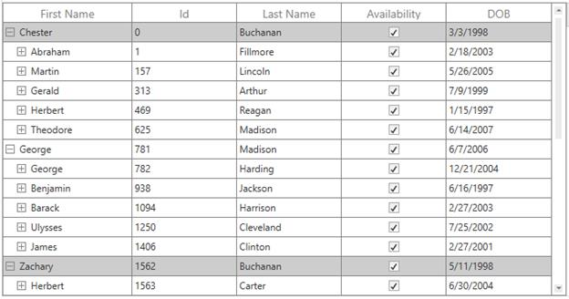
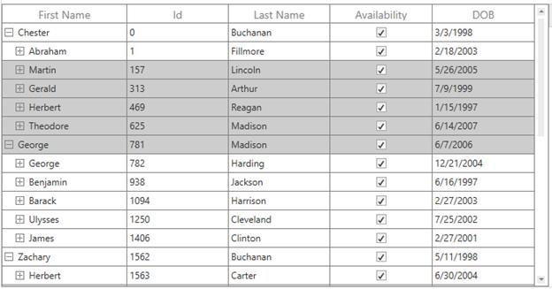
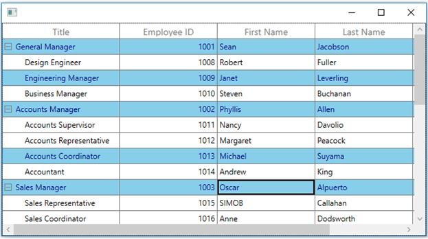
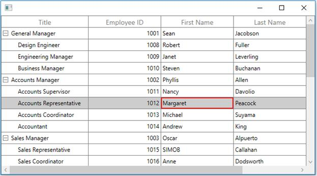

# Selection

SfTreeGrid allows you to select one or more rows. 

## Current cell navigation

Keyboard navigation through the rows is determined based on the [NavigationMode](https://help.syncfusion.com/cr/cref_files/wpf/Syncfusion.SfGrid.WPF~Syncfusion.UI.Xaml.Grid.SfGridBase~NavigationMode.html) property. [NavigationMode.Cell](https://help.syncfusion.com/cr/cref_files/wpf/Syncfusion.SfGrid.WPF~Syncfusion.UI.Xaml.Grid.NavigationMode.html) allows you to navigate between the cells in a row as well as between rows. [NavigationMode.Row](https://help.syncfusion.com/cr/cref_files/wpf/Syncfusion.SfGrid.WPF~Syncfusion.UI.Xaml.Grid.NavigationMode.html) allows you to navigate only between rows.

## Selection modes

The [SelectionMode ](https://help.syncfusion.com/cr/cref_files/wpf/Syncfusion.SfGrid.WPF~Syncfusion.UI.Xaml.Grid.SfGridBase~SelectionMode.html)property define the behavior of selection in treegrid. If the SelectionMode is [Single](https://help.syncfusion.com/cr/cref_files/wpf/Syncfusion.SfGrid.WPF~Syncfusion.UI.Xaml.Grid.GridSelectionMode.html), you can able to select single row, and if the SelectionMode is Extended or Multiple, you can able to select multiple rows, and if you want to disable the selection you need to set SelectionMode as None,



<syncfusion:SfTreeGrid Name="treeGrid"
                                       AutoExpandMode="RootNodesExpanded"
                                       AutoGenerateColumns="False" 
                                       NavigationMode="Row"
                                       ChildPropertyName="Children"
                                       SelectionMode="Single"
                                       ColumnSizer="Star" 
                                       ExpanderColumn="FirstName"
                                       ItemsSource="{Binding PersonDetails}"
                                       >



## Disable selection for rows and columns

You can disable selection and navigation on particular column by setting [GridColumn.AllowFocus](http://help.syncfusion.com/cr/cref_files/wpf/Syncfusion.SfGrid.WPF~Syncfusion.UI.Xaml.Grid.GridColumnBase~AllowFocus.html) property. You can disable selection on particular row or column by handling [CurrentCellActivating ](https://help.syncfusion.com/cr/cref_files/wpf/Syncfusion.SfGrid.WPF~Syncfusion.UI.Xaml.TreeGrid.SfTreeGrid~CurrentCellActivating_EV.html)event.

## Multiple row selection

The treegrid allows you to select multiple rows by setting [SelectionMode](https://help.syncfusion.com/cr/cref_files/wpf/Syncfusion.SfGrid.WPF~Syncfusion.UI.Xaml.Grid.SfGridBase~SelectionMode.html) property as [Extended](http://help.syncfusion.com/cr/cref_files/wpf/Syncfusion.SfGrid.WPF~Syncfusion.UI.Xaml.Grid.GridSelectionMode.html) or [Multiple](http://help.syncfusion.com/cr/cref_files/wpf/Syncfusion.SfGrid.WPF~Syncfusion.UI.Xaml.Grid.GridSelectionMode.html), where you can select multiple rows by dragging the mouse on treegrid and also using the key modifiers.

While using Extended, you can select multiple rows by pressing the key modifiers Ctrl and Shift.



<syncfusion:SfTreeGrid Name="treeGrid"
                                       AutoExpandMode="RootNodesExpanded"
                                       AutoGenerateColumns="False" 
                                       NavigationMode="Row"
                                       ChildPropertyName="Children"
                                       SelectionMode="Extended"
                                       ColumnSizer="Star" 
                                       ExpanderColumn="FirstName"
                                       ItemsSource="{Binding PersonDetails}"
                                       >



N> When the [SelectionMode](http://help.syncfusion.com/cr/cref_files/wpf/Syncfusion.SfGrid.WPF~Syncfusion.UI.Xaml.Grid.SfGridBase~SelectionMode.html) as [Multiple](http://help.syncfusion.com/cr/cref_files/wpf/Syncfusion.SfGrid.WPF~Syncfusion.UI.Xaml.Grid.GridSelectionMode.html), you can select or deselect multiple rows by clicking the respective row. Also, in multiple selection pressing navigation keys will move only the current cell and you can select or deselect by pressing space key.

## Get selected rows

The [SelectedItem ](https://help.syncfusion.com/cr/cref_files/wpf/Syncfusion.SfGrid.WPF~Syncfusion.UI.Xaml.Grid.SfGridBase~SelectedItem.html) property returns the data object of the selected row and the [SelectedIndex](https://help.syncfusion.com/cr/cref_files/wpf/Syncfusion.SfGrid.WPF~Syncfusion.UI.Xaml.Grid.SfGridBase~SelectedIndex.html) property returns the index of the SelectedItem in SfTreeGrid. SelectedItem denotes the first selected row in multiple selection.

The [CurrentItem ](https://help.syncfusion.com/cr/cref_files/wpf/Syncfusion.SfGrid.WPF~Syncfusion.UI.Xaml.TreeGrid.SfTreeGrid~CurrentItemProperty.html)returns the data object that currently has the focus and the [CurrentColumn](https://help.syncfusion.com/cr/cref_files/wpf/Syncfusion.SfGrid.WPF~Syncfusion.UI.Xaml.TreeGrid.SfTreeGrid~CurrentColumnProperty.html) denotes the [GridColumn](http://help.syncfusion.com/cr/cref_files/wpf/Syncfusion.SfGrid.WPF~Syncfusion.UI.Xaml.Grid.GridColumn.html) that currently has the focus.

The [CurrentCellInfo](http://help.syncfusion.com/cr/cref_files/wpf/Syncfusion.SfGrid.WPF~Syncfusion.UI.Xaml.Grid.SfDataGrid~CurrentCellInfo.html) returns an instance [GridCellInfo](http://help.syncfusion.com/cr/cref_files/wpf/Syncfusion.SfGrid.WPF~Syncfusion.UI.Xaml.Grid.GridCellInfo.html# "") which contains the information about the cell that currently has the focus.

### Row selection

You can gets all the selected records through [SelectedItems ](https://help.syncfusion.com/cr/cref_files/wpf/Syncfusion.SfGrid.WPF~Syncfusion.UI.Xaml.Grid.SfGridBase~SelectedItems.html)property and you can also get all selected rows information through [SfTreeGrid.SelectionController.SelectedRows](https://help.syncfusion.com/cr/cref_files/wpf/Syncfusion.SfGrid.WPF~Syncfusion.UI.Xaml.TreeGrid.TreeGridBaseSelectionController~SelectedRows.html) which is the collection of [GridRowInfo](http://help.syncfusion.com/cr/cref_files/wpf/Syncfusion.SfGrid.WPF~Syncfusion.UI.Xaml.Grid.GridRowInfo.html).

##3 CurrentItem Vs SelectedItem

Both [SelectedItem ](https://help.syncfusion.com/cr/cref_files/wpf/Syncfusion.SfGrid.WPF~Syncfusion.UI.Xaml.Grid.SfGridBase~SelectedItem.html)and [CurrentItem](https://help.syncfusion.com/cr/cref_files/wpf/Syncfusion.SfGrid.WPF~Syncfusion.UI.Xaml.TreeGrid.SfTreeGrid~CurrentItem.html) returns the same data object when there is single row is selected in treegrid. When you have selected more than one rows or cells, the record that had been selected initially is maintained in SelectedItem and the record that currently have focus is maintained in CurrentItem.

## Programmatic selection

### Process selection using properties

You can select a single row by setting [SelectedItem](https://help.syncfusion.com/cr/cref_files/wpf/Syncfusion.SfGrid.WPF~Syncfusion.UI.Xaml.Grid.SfGridBase~SelectedItem.html) property or [SelectedIndex](https://help.syncfusion.com/cr/cref_files/wpf/Syncfusion.SfGrid.WPF~Syncfusion.UI.Xaml.Grid.SfGridBase~SelectedIndex.html) property.




var recordIndex = this.treeGrid.ResolveToNodeIndex(6);
this.treeGrid.SelectedIndex = recordIndex;




var node = this.treeGrid.GetNodeAtRowIndex(6);
this.treeGrid.SelectedItem = node.Item;




In Row selection, you can select multiple rows by adding data objects to [SelectedItems ](https://help.syncfusion.com/cr/cref_files/wpf/Syncfusion.SfGrid.WPF~Syncfusion.UI.Xaml.Grid.SfGridBase~SelectedItems.html)property.



var viewModel = this.treeGrid.DataContext as ViewModel;

foreach (var order in viewModel.PersonDetails)
{
        if (order.LastName == "Buchanan")
        this.treeGrid.SelectedItems.Add(order);
}



### Process selection using methods

You can select range of rows through [SelectRows](https://help.syncfusion.com/cr/cref_files/wpf/Syncfusion.SfGrid.WPF~Syncfusion.UI.Xaml.TreeGrid.TreeGridBaseSelectionController~SelectedRows.html) method in row selection.




this.treeGrid.SelectRows(3, 7);




### Process current cell

When you set the [CurrentItem ](https://help.syncfusion.com/cr/cref_files/wpf/Syncfusion.SfGrid.WPF~Syncfusion.UI.Xaml.TreeGrid.SfTreeGrid~CurrentItem.html) to particular record, the [CurrentCell]
(http://help.syncfusion.com/cr/cref_files/wpf/Syncfusion.SfGrid.WPF~Syncfusion.UI.Xaml.Grid.GridCurrentCellManager~CurrentCell.html) will be moved to corresponding record when the [SelectionMode](http://help.syncfusion.com/cr/cref_files/wpf/Syncfusion.SfGrid.WPF~Syncfusion.UI.Xaml.Grid.SfGridBase~SelectionMode.html) is [Multiple](http://help.syncfusion.com/cr/cref_files/wpf/Syncfusion.SfGrid.WPF~Syncfusion.UI.Xaml.Grid.GridSelectionMode.html) or [Extended](http://help.syncfusion.com/cr/cref_files/wpf/Syncfusion.SfGrid.WPF~Syncfusion.UI.Xaml.Grid.GridSelectionMode.html) and the selection will added to the particular record item when the SelectionMode is [Single](http://help.syncfusion.com/cr/cref_files/wpf/Syncfusion.SfGrid.WPF~Syncfusion.UI.Xaml.Grid.GridSelectionMode.html).

You can move the [CurrentCell](http://help.syncfusion.com/cr/cref_files/wpf/Syncfusion.SfGrid.WPF~Syncfusion.UI.Xaml.Grid.GridCurrentCellManager~CurrentCell.html) to a particular rowColumnIndex by using the [MoveCurrentCell](https://help.syncfusion.com/cr/cref_files/wpf/Syncfusion.SfGrid.WPF~Syncfusion.UI.Xaml.TreeGrid.TreeGridRowSelectionController~MoveCurrentCell.html) method.




this.treeGrid.SelectionController.MoveCurrentCell(new RowColumnIndex(3, 2), false);




### Clear selection

You can clear the selection by using the [ClearSelections](http://help.syncfusion.com/cr/cref_files/wpf/Syncfusion.SfGrid.WPF~Syncfusion.UI.Xaml.Grid.SfDataGrid~ClearSelections.html) method. In Row Selection you can also remove the selection by setting null to [SelectedItem](http://help.syncfusion.com/cr/cref_files/wpf/Syncfusion.SfGrid.WPF~Syncfusion.UI.Xaml.Grid.SfGridBase~SelectedItem.html# "") or clearing the [SelectedItems](http://help.syncfusion.com/cr/cref_files/wpf/Syncfusion.SfGrid.WPF~Syncfusion.UI.Xaml.Grid.SfGridBase~SelectedItems.html) property.




this.treeGrid.SelectionController.ClearSelections(true);




## Scrolling rows and columns

### Automatic scrolling on drag selection

SfTreeGrid will scrolls rows and columns automatically when you try to perform the drag selection like in excel. You can enable or disable AutoScrolling by setting the [AutoScroller.AutoScrolling](https://help.syncfusion.com/cr/cref_files/wpf/Syncfusion.SfGrid.WPF~Syncfusion.UI.Xaml.TreeGrid.SfTreeGrid~AutoScroller.html) property.




this.treeGrid.AutoScroller.AutoScrolling = AutoScrollOrientation.Both;




### Scroll to particular row and column index

You can scroll programmatically to particular cell using [ScrollInView](https://help.syncfusion.com/cr/cref_files/wpf/Syncfusion.SfGrid.WPF~Syncfusion.UI.Xaml.TreeGrid.SfTreeGrid~ScrollInView.html) method by passing row and column index.




int rowIndex = this.treeGrid.GetLastDataRowIndex();
int columnIndex = this.treeGrid.GetLastColumnIndex();
this.treeGrid.ScrollInView(new RowColumnIndex(rowIndex, columnIndex));




### Scroll to selected item

You can scroll programmatically to the SelectedItem using the ScrollInView method.




var rowIndex = this.treeGrid.ResolveToRowIndex(this.treeGrid.SelectedItem);
var columnIndex = this.treeGrid.ResolveToStartColumnIndex();
this.treeGrid.ScrollInView(new RowColumnIndex(rowIndex, columnIndex));




## Mouse and keyboard behaviors

### Keyboard behavior

<table>
<tr>
<td>
{{'**Key or Key combinations**'| markdownify }}
</td>
<td>
{{'**Description**'| markdownify }}
</td>
</tr>
<tr>
<td>
DownArrow

</td>
<td>
Moves CurrentCell directly below the active current cell. If the CurrentCell is in last row, pressing Down arrow does nothing.
</td>
</tr>
<tr>
<td>
UpArrow

</td>
<td>
Moves the CurrentCell directly above the active current cell. If the CurrentCell is in first row, pressing Up arrow does nothing.
</td>
</tr>
<tr>
<td>
LeftArrow

</td>
<td>
Moves the current cell to previous to the active current cell. If the CurrentCell is in first cell, pressing Left arrow does nothing. If the focused row is group header, the group will be collapsed when it is in expanded state.
</td>
</tr>
<tr>
<td>
RightArrow

</td>
<td>
Moves the current cell to next to the active current cell. If the CurrentCell is in last cell, pressing Right arrow does nothing. If the focused row is group header, the group will be expanded when it is in collapsed state.
</td>
</tr>
<tr>
<td>
Home / Ctrl + LeftArrow

</td>
<td>
Moves the current cell to the first cell of the current row.
</td>
</tr>
<tr>
<td>
End / Ctrl + RightArrow

</td>
<td>
Moves the current cell to the last cell of the current row.
</td>
</tr>
<tr>
<td>
PageDown

</td>
<td>
The treegrid will be scrolled to next set of rows that are not displayed in view, including the row that are partially displayed and the current cell is set to last row.
</td>
</tr>
<tr>
<td>
PageUp

</td>
<td>
The treegrid will be scrolled to previous set of rows that are not displayed in view, including the row that are partially displayed and the current cell is set to the first row.
</td>
</tr>
<tr>
<td>
Tab

</td>
<td>
Moves the current cell to next to the active current cell. If the active current cell is the last cell of the current row, the focus will be moved to first cell of the row next to the current row. If the active current cell is the last cell of the last row, the focus will be moved to next control in the tab order of the parent container.
</td>
</tr>
<tr>
<td>
Shift + Tab

</td>
<td>
Moves the current cell to previous to the active current cell. If the active current cell is the first cell of the current row, the current cell will be moved to last cell of the row previous to the current row. If the active current cell is the first cell of the first row, the focus will be moved to previous control in the tab order of the parent container.
</td>
</tr>
<tr>
<td>
Ctrl + DownArrow

</td>
<td>
Moves the current cell to the current column of the last row.
</td>
</tr>
<tr>
<td>
Ctrl + UpArrow

</td>
<td>
Moves the current cell to the current column of the first row.
</td>
</tr>
<tr>
<td>
Ctrl + Home

</td>
<td>
Moves the current cell to the first cell of the first row.
</td>
</tr>
<tr>
<td>
Ctrl + End

</td>
<td>
Moves the current cell to the last cell of the last row.
</td>
</tr>
<tr>
<td>
Enter

</td>
<td>
If the active current cell is in edit mode, the changes will be committed and moves the current cell to below the active current cell. If the active current cell is in last row, commits changes only and retains in the same cell.
</td>
</tr>
<tr>
<td>
Ctrl + Enter

</td>
<td>
Commits only the changes when the current cell in edit mode and retains the focus in same cell.
</td>
</tr>
<tr>
<td>
F2

</td>
<td>
If the {{'[TreeGrid](https://help.syncfusion.com/cr/cref_files/wpf/Syncfusion.SfGrid.WPF~Syncfusion.UI.Xaml.Grid.SfGridBase~AllowEditing.html#"")'| markdownify }} property is true and the 
{{'[GridColumn.AllowEditing](http://help.syncfusion.com/cr/cref_files/wpf/Syncfusion.SfGrid.WPF~Syncfusion.UI.Xaml.Grid.GridColumnBase~AllowEditing.html#"")'| markdownify }} property is true for the current column, the current cell enters into edit mode.
</td>
</tr>
<tr>
<td>
Esc
</td>
<td>
If the current cell is in edit mode, reverts the changes that had been done in the current cell. If the underlying source implements the {{'[IEditableObject](https://msdn.microsoft.com/en-us/library/system.componentmodel.ieditableobject#%22%22"")'| markdownify }}, on pressing of Esc key for the second time will cancel the edit mode for entire row.
</td>
</tr>
<tr>
<td>
Ctrl + A
</td>
<td>
All rows or cells will be selected.
</td>
</tr>
</table>

### Shift key combinations

When the [SelectionMode](http://help.syncfusion.com/cr/cref_files/wpf/Syncfusion.SfGrid.WPF~Syncfusion.UI.Xaml.Grid.SfGridBase~SelectionMode.html) is set to [Extended](http://help.syncfusion.com/cr/cref_files/wpf/Syncfusion.SfGrid.WPF~Syncfusion.UI.Xaml.Grid.GridSelectionMode.html), you can select multiple rows using the navigation keys along with the Shift key. Before navigation starts, the current cell will be marked as a pressed cell and the selection will be done in all rows between the pressed cell and current cell.

<table>
<tr>
<td>
{{'**Key combinations**'| markdownify }}
</td>
</tr>
<tr>
<td>
Shift + DownArrow
</td>
</tr>
<tr>
<td>
Shift + UpArrow
</td>
</tr>
<tr>
<td>
Shift + LeftArrow
</td>
</tr>
<tr>
<td>
Shift + Home
</td>
</tr>
<tr>
<td>
Shift + End
</td>
</tr>
<tr>
<td>
Shift + PageDown
</td>
</tr>
<tr>
<td>
Shift + PageUp
</td>
</tr>
<tr>
<td>
Shift + Ctrl + DownArrow
</td>
</tr>
<tr>
<td>
Shift + Ctrl + UpArrow
</td>
</tr>
<tr>
<td>
Shift + Ctrl + RightArrow
</td>
</tr>
<tr>
<td>
Shift + Ctrl + LeftArrow
</td>
</tr>
<tr>
<td>
Shift + Ctrl + Home
</td>
</tr>
<tr>
<td>
Shift + Ctrl + End
</td>
</tr>
<tr>
<td>
Shift + Ctrl + PageDown
</td>
</tr>
<tr>
<td>
Shift + Ctrl +PageUp
</td>
</tr>
</table>

### Mouse behavior

You can enable/disable the selection when the mouse button is in pressed state by setting the AllowSelectionOnPointerPressed property.

When the [SelectionMode](http://help.syncfusion.com/cr/cref_files/wpf/Syncfusion.SfGrid.WPF~Syncfusion.UI.Xaml.Grid.SfGridBase~SelectionMode.html) is set to [Extended](http://help.syncfusion.com/cr/cref_files/wpf/Syncfusion.SfGrid.WPF~Syncfusion.UI.Xaml.Grid.GridSelectionMode.html), you can select multiple rows by clicking on any cell along with ctrl and Shift key. When you click a cell along with Ctrl key, you can select or deselect the particular row. When you click a6 cell along with Shift key, you can select the range rows from the pressed cell to the current cell.

### Customizing mouse and keyboard behaviors

You can customize mouse and keyboard behaviors by overriding the selection controller. You can refer the section Customizing Selection Behaviors to override the selection controller.

## Events

### CurrentCellActivating

[ActivationTrigger](https://help.syncfusion.com/cr/cref_files/wpf/Syncfusion.SfGrid.WPF~Syncfusion.UI.Xaml.Grid.SfGridBase~AllowEditing.html) – Returns the reason for moving the current cell.

[CurrentRowColumnIndex](https://help.syncfusion.com/cr/cref_files/wpf/Syncfusion.SfGrid.WPF~Syncfusion.UI.Xaml.Grid.CurrentCellActivatingEventArgs~CurrentRowColumnIndex.html) – [RowColumnIndex](http://help.syncfusion.com/cr/cref_files/wpf/Syncfusion.SfGrid.WPF~Syncfusion.UI.Xaml.ScrollAxis.RowColumnIndex.html) of the cell where the current cell need to move.

[PreviousRowColumnIndex](https://help.syncfusion.com/cr/cref_files/wpf/Syncfusion.SfGrid.WPF~Syncfusion.UI.Xaml.Grid.CurrentCellActivatingEventArgs~PreviousRowColumnIndex.html)– RowColumnIndex of the cell from where the current cell was move.



<syncfusion:SfTreeGrid Name="treeGrid"
                       Grid.Row="0"
                       AutoExpandMode="RootNodesExpanded"
                       AutoGenerateColumns="False"
                       ChildPropertyName="ReportsTo"
                       CurrentCellActivating="TreeGrid_CurrentCellActivating"                        
                       ItemsSource="{Binding EmployeeInfo}"
                       LiveNodeUpdateMode="AllowDataShaping"
                       Converter={StaticResource SelectionModeConverter}}">
                                                                                                          



this.treeGrid.CurrentCellActivating += TreeGrid_CurrentCellActivating;

private void TreeGrid_CurrentCellActivating(object sender, Syncfusion.UI.Xaml.Grid.CurrentCellActivatingEventArgs e)
{
           
}



You can cancel the current cell moving process within this event by setting [GridCurrentCellActivatingEventArgs.Cancel](https://help.syncfusion.com/cr/cref_files/wpf/Syncfusion.SfGrid.WPF~Syncfusion.UI.Xaml.TreeGrid.SfTreeGrid~CurrentCellActivating_EV.html) as true.



private void TreeGrid_CurrentCellActivating(object sender, Syncfusion.UI.Xaml.Grid.CurrentCellActivatingEventArgs e)
{
    var provider = this.treeGrid.View.GetPropertyAccessProvider();
    var record = this.treeGrid.GetNodeAtRowIndex(e.CurrentRowColumnIndex.RowIndex).Item;

    if (record == null)
        return;

    var column = this.treeGrid.Columns[this.treeGrid.ResolveToGridVisibleColumnIndex(e.CurrentRowColumnIndex.ColumnIndex)];
    var cellValue = provider.GetValue(record, column.MappingName);

    if (cellValue.ToString() == "1001")
        e.Cancel = true;
}



### CurrentCellActivated

The [CurrentCellActivated](https://help.syncfusion.com/cr/cref_files/wpf/Syncfusion.SfGrid.WPF~Syncfusion.UI.Xaml.TreeGrid.SfTreeGrid~CurrentCellActivated_EV.html) event will occur once the current cell is moved to corresponding cell. [CurrentCellActivatedEventArgs](https://help.syncfusion.com/cr/cref_files/wpf/Syncfusion.SfGrid.WPF~Syncfusion.UI.Xaml.Grid.CurrentCellActivatedEventArgs.html# "") has following members which provides information for CurrentCellActivated event.

[ActivationTrigger ](http://help.syncfusion.com/cr/cref_files/wpf/Syncfusion.SfGrid.WPF~Syncfusion.UI.Xaml.Grid.CurrentCellActivatedEventArgs~ActivationTrigger.html) – Returns the reason of the current cell movement.

[CurrentRowColumnIndex ](https://help.syncfusion.com/cr/cref_files/wpf/Syncfusion.SfGrid.WPF~Syncfusion.UI.Xaml.Grid.CurrentCellActivatedEventArgs~CurrentRowColumnIndex.html) – RowColumnIndex of the cell where the current cell was moved.

[PreviousRowColumnIndex ](http://help.syncfusion.com/cr/cref_files/wpf/Syncfusion.SfGrid.WPF~Syncfusion.UI.Xaml.Grid.CurrentCellActivatedEventArgs~PreviousRowColumnIndex.html) – RowColumnIndex of the cell from where the current cell has been moved.

<table>
<tr>
<td>
<syncfusion:SfTreeGrid Name="treeGrid"
                       Grid.Row="0"
                       AutoExpandMode="RootNodesExpanded"
                       AutoGenerateColumns="False"
                       ChildPropertyName="ReportsTo"
                       CurrentCellActivated="TreeGrid_CurrentCellActivated"                        
                       ItemsSource="{Binding EmployeeInfo}"
                       LiveNodeUpdateMode="AllowDataShaping"
                       Converter={StaticResource SelectionModeConverter}}">

</td>
</tr>
<tr>
<td>

this.treeGrid.CurrentCellActivated += TreeGrid_CurrentCellActivated;
private void TreeGrid_CurrentCellActivated(object sender, Syncfusion.UI.Xaml.Grid.CurrentCellActivatedEventArgs e)
{

}

</td>
</tr>
</table>

### SelectionChanging

[SelectionChanging](http://help.syncfusion.com/cr/cref_files/wpf/Syncfusion.SfGrid.WPF~Syncfusion.UI.Xaml.Grid.CurrentCellActivatedEventArgs~PreviousRowColumnIndex.html) event occurs before processing the selection to particular row or cell. This event will be triggered only to the keyboard and mouse interactions. [GridSelectionChangingEventArgs ](https://help.syncfusion.com/cr/cref_files/wpf/Syncfusion.SfGrid.WPF~Syncfusion.UI.Xaml.Grid.GridSelectionChangingEventArgs.html)has the following members which provides the information for SelectionChanging event.

[AddedItems](https://help.syncfusion.com/cr/cref_files/wpf/Syncfusion.SfGrid.WPF~Syncfusion.UI.Xaml.Grid.GridSelectionChangingEventArgs~AddedItems.html) – Collection of [GridRowInfo](http://help.syncfusion.com/cr/cref_files/wpf/Syncfusion.SfGrid.WPF~Syncfusion.UI.Xaml.Grid.GridRowInfo.html) or [GridCellInfo](http://help.syncfusion.com/cr/cref_files/wpf/Syncfusion.SfGrid.WPF~Syncfusion.UI.Xaml.Grid.GridCellInfo.html) where the selection going to process.

[RemovedItems ](https://help.syncfusion.com/cr/cref_files/wpf/Syncfusion.SfGrid.WPF~Syncfusion.UI.Xaml.Grid.GridSelectionChangingEventArgs~RemovedItems.html)– Collection of GridRowInfo or GridCellInfo where the selection going to remove.



<syncfusion:SfTreeGrid Name="treeGrid"
                       Grid.Row="0"
                       AutoExpandMode="RootNodesExpanded"
                       AutoGenerateColumns="False"
                       ChildPropertyName="ReportsTo"
                       SelectionChanging="TreeGrid_SelectionChanging"
                       ItemsSource="{Binding EmployeeInfo}"
                       LiveNodeUpdateMode="AllowDataShaping"
                       Converter={StaticResource SelectionModeConverter}}">




this.treeGrid.SelectionChanging += TreeGrid_SelectionChanging;

private void TreeGrid_SelectionChanging(object sender, Syncfusion.UI.Xaml.Grid.GridSelectionChangingEventArgs e)
{
            
}



### SelectionChanged

The [SelectionChanged](https://help.syncfusion.com/cr/cref_files/wpf/Syncfusion.SfGrid.WPF~Syncfusion.UI.Xaml.TreeGrid.SfTreeGrid~SelectionChanged_EV.html) event will occurs once the selection process has been completed for particular row or cell in treegrid. [GridSelectionChangedEventArgs](https://help.syncfusion.com/cr/cref_files/wpf/Syncfusion.SfGrid.WPF~Syncfusion.UI.Xaml.Grid.GridSelectionChangedEventArgs.html) has following members which provides information for SelectionChanged event.

[AddedItems](https://help.syncfusion.com/cr/cref_files/wpf/Syncfusion.SfGrid.WPF~Syncfusion.UI.Xaml.Grid.GridSelectionChangedEventArgs~AddedItems.html) – Collection of [GridRowInfo](http://help.syncfusion.com/cr/cref_files/wpf/Syncfusion.SfGrid.WPF~Syncfusion.UI.Xaml.Grid.GridRowInfo.html) or [GridCellInfo](http://help.syncfusion.com/cr/cref_files/wpf/Syncfusion.SfGrid.WPF~Syncfusion.UI.Xaml.Grid.GridCellInfo.html# "") where the selection has been processed.

[RemovedItems](https://help.syncfusion.com/cr/cref_files/wpf/Syncfusion.SfGrid.WPF~Syncfusion.UI.Xaml.Grid.GridSelectionChangedEventArgs~RemovedItems.html) – Collection of GridRowInfo or GridCellInfo from where the selection has been removed.



<syncfusion:SfTreeGrid Name="treeGrid"
                       Grid.Row="0"
                       AutoExpandMode="RootNodesExpanded"
                       AutoGenerateColumns="False"
                       ChildPropertyName="ReportsTo"
                       SelectionChanged="TreeGrid_SelectionChanged"
                       ItemsSource="{Binding EmployeeInfo}"
                       LiveNodeUpdateMode="AllowDataShaping"
                       Converter={StaticResource SelectionModeConverter}}">




this.treeGrid.SelectionChanged += TreeGrid_SelectionChanged;

private void TreeGrid_SelectionChanged(object sender, Syncfusion.UI.Xaml.Grid.GridSelectionChangedEventArgs e)
{
           
}



## Appearance

### Changing selection background and foreground

You can change the selection background and foreground using [SelectionBackGround](https://help.syncfusion.com/cr/cref_files/wpf/Syncfusion.SfGrid.WPF~Syncfusion.UI.Xaml.TreeGrid.SfTreeGrid~SelectionBackgroundProperty.html) and [SelectionForeGround](https://help.syncfusion.com/cr/cref_files/wpf/Syncfusion.SfGrid.WPF~Syncfusion.UI.Xaml.TreeGrid.SfTreeGrid~SelectionForegroundProperty.html) properties.



<syncfusion:SfTreeGrid Name="treeGrid"
                                           Grid.Row="0"
                                           AutoExpandMode="RootNodesExpanded"
                                           AutoGenerateColumns="False"
                                           SelectionMode="Multiple"
                                           ChildPropertyName="ReportsTo"
                                           SelectionChanged="TreeGrid_SelectionChanged"
                                           ItemsSource="{Binding EmployeeInfo}"
                                           SelectionBackground="SkyBlue"                                                    
                                           SelectionForeground="DarkBlue"
                                         >



### Changing current cell border style

You can change the current cell border thickness and border color using [CurrentCellBorderThickness](https://help.syncfusion.com/cr/cref_files/wpf/Syncfusion.SfGrid.WPF~Syncfusion.UI.Xaml.Grid.SfGridBase~CurrentCellBorderThickness.html) and [CurrentCellBorderBrush](https://help.syncfusion.com/cr/cref_files/wpf/Syncfusion.SfGrid.WPF~Syncfusion.UI.Xaml.Grid.SfGridBase~CurrentCellBorderBrush.html) property.



<syncfusion:SfTreeGrid Name="treeGrid"
                                           Grid.Row="0"
                                           AutoExpandMode="RootNodesExpanded"
                                           AutoGenerateColumns="False"
                                           SelectionMode="Multiple"
                                           ChildPropertyName="ReportsTo"
                                           SelectionChanged="TreeGrid_SelectionChanged"
                                           ItemsSource="{Binding EmployeeInfo}"
                                           LiveNodeUpdateMode="AllowDataShaping"
                                           ParentPropertyName="ID"
                                           SelectedIndex="0"
                                           CurrentCellBorderBrush="Red"
                                           CurrentCellBorderThickness="1.6"
                                         >



### Customizing row selection border

You can customize the row selection by editing the control template of TreeGridRowControl.







## Customizing selection behaviors

The treegrid processes the selection operations in selection controller. Below are the built-in selection controllers,
[GridSelectionController ](https://help.syncfusion.com/cr/cref_files/wpf/Syncfusion.SfGrid.WPF~Syncfusion.UI.Xaml.TreeGrid.SfTreeGrid~SelectionController.html# "")– Process selection operations when selection unit as row.
You can customize the default row selection behaviors by overriding GridSelectionController class and set it to SfTreeGrid.SelectionController.



this.treeGrid.SelectionController = new GridSelectionControllerExt(this.treeGrid);
public class GridSelectionControllerExt : TreeGridRowSelectionController
{

    public GridSelectionControllerExt(SfTreeGrid treeGrid) : base(treeGrid)
    {
    }
}



### Changing enter key behavior

By default, while pressing Enter key, the current cell will be moved to next focused cell in the same column. You can change the Enter key behavior by overriding [ProcessKeyDown](https://help.syncfusion.com/cr/cref_files/wpf/Syncfusion.SfGrid.WPF~Syncfusion.UI.Xaml.TreeGrid.TreeGridRowSelectionController~ProcessKeyDown.html) method in selection controller. In this method you have to create new [KeyEventArgs](https://msdn.microsoft.com/en-us/library/system.windows.input.keyeventargs) which refers the Tab key and processes the Tab key action.



public class GridSelectionControllerExt : TreeGridRowSelectionController
{
    public GridSelectionControllerExt(SfTreeGrid treeGrid) : base(treeGrid)
    {

    }
    protected override void ProcessKeyDown(KeyEventArgs args)
    {
        if (args.Key == Key.Enter)
        {

            //Creates new KeyEventArgs to refer the Tab key.
            KeyEventArgs arguments = new KeyEventArgs(args.KeyboardDevice, args.InputSource, args.Timestamp, Key.Tab) { RoutedEvent = args.RoutedEvent };

            //Base ProcessKeyDown is invoked to process Tab key operations.
            base.ProcessKeyDown(arguments);
            args.Handled = arguments.Handled;
            return;
        }
        base.ProcessKeyDown(args);
    }
}



### Scroll and select the record programmatically

You can scroll to record programmatically using [ScrollInView](https://help.syncfusion.com/cr/cref_files/wpf/Syncfusion.SfGrid.WPF~Syncfusion.UI.Xaml.TreeGrid.SfTreeGrid~ScrollInView.html) method by passing the row index of the record. You can get the row index of the record by using [ResolveToRowIndex ](https://help.syncfusion.com/cr/cref_files/wpf/Syncfusion.SfGrid.WPF~Syncfusion.UI.Xaml.TreeGrid.TreeGridIndexResolver~ResolveToRowIndex.html# "")extension method present in `Syncfusion.UI.Xaml.TreeGrid.Helpers`.

You can select the record programmatically by setting [SelectedItem](https://help.syncfusion.com/cr/cref_files/wpf/Syncfusion.SfGrid.WPF~Syncfusion.UI.Xaml.Grid.SfGridBase~SelectedItem.html) property in treegrid.



private void Treegrid_Loaded(object sender, System.Windows.RoutedEventArgs e)
{
    var selectedItem = (this.treegrid.DataContext as ViewModel).SelectedItem;
    var rowindex = this.treegrid.ResolveToRowIndex(selectedItem);
    var columnindex = this.treegrid.ResolveToStartColumnIndex();
    //Make the row in to available on the view. 
    this.treegrid.ScrollInView(new RowColumnIndex(rowindex, columnindex));
    //Set the SelectedItem in SfTreeGrid.
    this.treegrid.SelectedItem = selectedItem;
}



You can download the sample [here](http://www.syncfusion.com/downloads/support/directtrac/general/ze/SelectRecordDemo1131431553.zip).

### Prevent the selection while pressing right click

You can prevent the selection when right clicking in treegrid by customizing the [SelectionController](https://help.syncfusion.com/cr/cref_files/wpf/Syncfusion.SfGrid.WPF~Syncfusion.UI.Xaml.TreeGrid.SfTreeGrid~SelectionController.html) and overriding the [ProcessPointerPressed](https://help.syncfusion.com/cr/cref_files/wpf/Syncfusion.SfGrid.WPF~Syncfusion.UI.Xaml.TreeGrid.TreeGridRowSelectionController~ProcessPointerPressed.html).



protected override void ProcessPointerPressed(MouseButtonEventArgs args, RowColumnIndex rowColumnIndex)
{
    if (args.ChangedButton == MouseButton.Right)
    {
        args.Handled = true;
    }
    else
        base.ProcessPointerPressed(args, rowColumnIndex);
}



You can download the sample [here](http://www.syncfusion.com/downloads/support/directtrac/general/ze/PreventSelectionDemo-1777393957.zip).

### Change the checkbox column values based on row selection

In treegrid, you can able to select multiple rows using [SelectionMode](https://help.syncfusion.com/cr/cref_files/wpf/Syncfusion.SfGrid.WPF~Syncfusion.UI.Xaml.Grid.SfGridBase~SelectionMode.html) property. You can process the CheckBoxSelection using TreeGridCheckBoxColumn and a boolean property called `IsSelected` in Model. You can also select all the rows in treegrid by defining the CheckBox in header cell of GridCheckBoxColumn using `[GridColumn.HeaderTemplate](https://help.syncfusion.com/cr/cref_files/wpf/Syncfusion.SfGrid.WPF~Syncfusion.UI.Xaml.TreeGrid.SfTreeGrid~HeaderTemplateProperty.html)`.



public static class Commands
{
    static Commands()
    {
        CommandManager.RegisterClassCommandBinding(typeof(CheckBox), new CommandBinding(CheckAndUnCheck, OnCheckUnCheckCommand, OnCanExecuteCheckAndUnCheck));
    }

    public static RoutedCommand CheckAndUnCheck = new RoutedCommand("CheckAndUnCheck", typeof(CheckBox));

    private static void OnCheckUnCheckCommand(object sender, ExecutedRoutedEventArgs args)
    {
        var treegrid = (args.Parameter as SfTreeGrid);
        var viewmodel = (treegrid.DataContext as ViewModel);
        var checkbox = (sender as CheckBox).IsChecked;
        if (viewmodel != null)
        {
            if (checkbox == true)
            {
                treegrid.SelectAll();
                foreach (var collection in viewmodel.EmployeeInfo)
                {
                    if (collection.IsSelected == false)
                        collection.IsSelected = true;
                }
            }
            else if (checkbox == false)
            {
                treegrid.ClearSelections(false);
                foreach (var collection in viewmodel.EmployeeInfo)
                {  
                    if (collection.IsSelected == true)
                        collection.IsSelected = false;
                }
            }
        }
    }

    private static void OnCanExecuteCheckAndUnCheck(object sender, CanExecuteRoutedEventArgs args)
    {
        args.CanExecute = true;
    }     
}


You can download the sample [here](http://www.syncfusion.com/downloads/support/directtrac/general/ze/CheckboxSelectionDemo2117356646.zip).

### Select the rows based on cell value

In treegrid, you can select the rows based on cell value by adding corresponding records to SelectedItems. You can get the cell value of the particular cell using View.GetPropertyAccess provider method.



private void Button_Click(object sender, RoutedEventArgs e)
{
    if (treeGrid.View != null)
        reflector = treeGrid.View.GetPropertyAccessProvider();
    else
        reflector = null;

    var totalRowIndex = treeGrid.View.Nodes.Count;
    var totalColumnIndex = treeGrid.Columns.Count;

    for (int recordIndex = 0; recordIndex < totalRowIndex; recordIndex++)
    {
        for (int colindex = 0; colindex < totalColumnIndex; colindex++)
        {
            var record = this.treeGrid.View.Nodes[recordIndex];
            var mappingName = treeGrid.Columns[colindex].MappingName;
            //Get the cell value based on mappingName.
            var currentCellValue = reflector.GetValue(record.Item, mappingName);
            if (currentCellValue == "Steven")
            {
                object node = treeGrid.View.Nodes[recordIndex];
                //selected rows should be added here.
                treeGrid.SelectedItems.Add((node as TreeNode).Item);
            }
        }
    }
}



### Search and select the record

You can search and select a record in treegrid based on the searched text by using the TextChanged event of TextBox.



private void TextBox_TextChanged(object sender, System.Windows.Controls.TextChangedEventArgs e)
{
    var textBox = sender as TextBox;
    var treeGrid = this.AssociatedObject.treeGrid;
    if (textBox.Text == "")
        treeGrid.SelectedItems.Clear();

    for (int i = 0; i < treeGrid.View.Nodes.Count; i++)
    {
        if (Provider == null)
            Provider = treeGrid.View.GetPropertyAccessProvider();

        if (treeGrid.View.Nodes[i].HasChildNodes && treeGrid.View.Nodes[i].ChildNodes.Count == 0)
        {
            treeGrid.BeginInit();
            treeGrid.ExpandNode(treeGrid.View.Nodes[i]);
            treeGrid.CollapseNode(treeGrid.View.Nodes[i]);
            treeGrid.EndInit();
        }
        else if (treeGrid.View.Nodes[i].HasChildNodes)
        {                    
            dataRow = (treeGrid.View.Nodes[i].Item as EmployeeInfo);
            FindMatchText(dataRow);
            GetChildNodes(treeGrid.View.Nodes[i]);
        }
        else
        {
            dataRow=(treeGrid.View.Nodes[i].Item as EmployeeInfo);
            FindMatchText(dataRow);
        }
    }
}



You can download the sample [here](http://www.syncfusion.com/downloads/support/directtrac/general/ze/SfTreeGridDemo1429156186.zip).

### Read cell values from selected items

You can able to get the cell values of [SelectedItems](https://help.syncfusion.com/cr/cref_files/wpf/Syncfusion.SfGrid.WPF~Syncfusion.UI.Xaml.Grid.SfGridBase~SelectedItems.html) by using [SfTreeGrid.SelectedItems](https://help.syncfusion.com/cr/cref_files/wpf/Syncfusion.SfGrid.WPF~Syncfusion.UI.Xaml.Grid.SfGridBase~SelectedItems.html# "") and internal reflector which reflects the field value from data object based on field name.



private void Button_Click(object sender, RoutedEventArgs e)
{
    listBox.Items.Clear();
    // Get the selected items of SfTreeGrid
    var reflector = this.treeGrid.View.GetPropertyAccessProvider();
    foreach (var row in this.treeGrid.SelectedItems)
    {
        foreach (var column in treeGrid.Columns)
        {
            //Get the value from data object based on MappingName 
            var cellvalue = reflector.GetValue(row, column.MappingName);
            //Returns the display value of the cell from data object based on MappingName 
            //var displayValue = reflector.GetFormattedValue(row, column.MappingName);
            listBox.Items.Add(cellvalue.ToString());
        }
    }
}



### Show the selection of row/cell when setting the background of SfTreeGrid

`Row`/`Cell` selection border is behind the grid cell content. So, when you apply the background for row , the selection is not displayed in `UI`. You can overcome this by setting the opacity in TreeGridCell.







### Set the current cell on particular row when treegrid loaded 

You can set the current cell in treegrid by using the [treeGrid.SelectionController.MoveCurrentCell](https://help.syncfusion.com/cr/cref_files/wpf/Syncfusion.SfGrid.WPF~Syncfusion.UI.Xaml.TreeGrid.TreeGridRowSelectionController~MoveCurrentCell.html) method,



private void TreeGrid_Loaded(object sender, RoutedEventArgs e)
{
    var viewModel = this.treeGrid.DataContext as ViewModel;
    //find the RowIndex for particular record
    var RowIndex = this.treeGrid.ResolveToRowIndex(viewModel.EmployeeInfo[5]);
    // find the ColumnIndex for that row.
    var ColumnIndex = this.treeGrid.ResolveToScrollColumnIndex(2);
    // CurrentCell is set if MappingName is EmployeeID
    if (this.treeGrid.Columns[ColumnIndex].MappingName == "FirstName")
        this.treeGrid.SelectionController.MoveCurrentCell(new RowColumnIndex(RowIndex, ColumnIndex));
}


