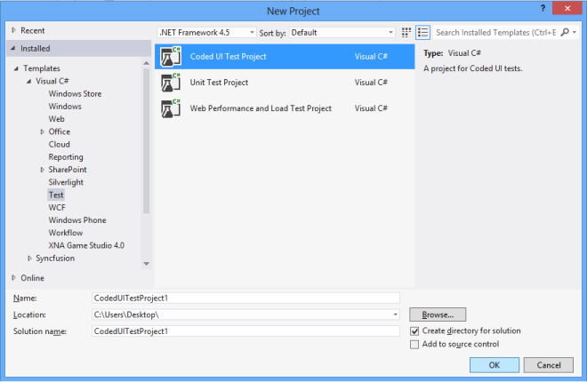
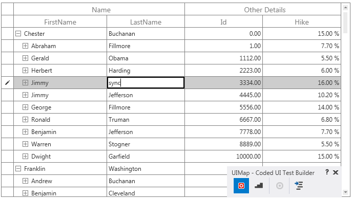
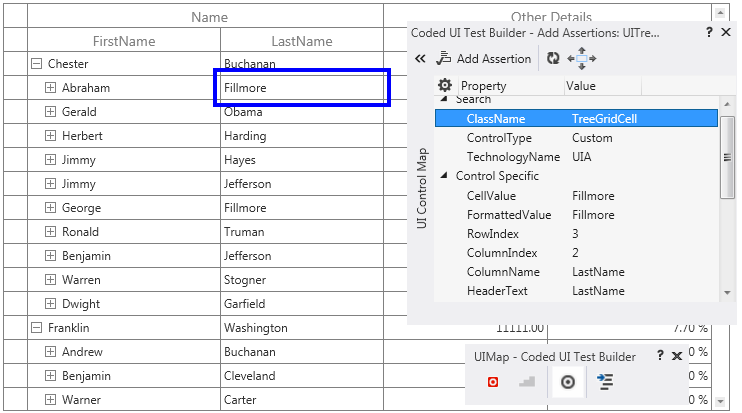

# UI Automation

### Requirements and Configuration

To test SfTreeGrid control with CUITs, build the Extension Project and place it in the mentioned location. You can get the extension project from the below location.

<table>
<tr>
<td>
SfTreeGrid
</td>
<td>
http://www.syncfusion.com/downloads/support/directtrac/general/ze/CodedUI-1271691562.zip
</td>
</tr>
</table>

1.	Open the extension project and build it.
2.	You can get the below tabulated assembly from bin folder.

<table>
<tr>
<td>
SfGrid.WPF 
</td>
<td>
Syncfusion.VisualStudio.TestTools.UITest.SfGridExtension.dll
</td>
</tr>
</table>

SfGridExtension assembly must be placed into the following directory based on your visual studio version.
For Visual Studio 2010: 
C:\Program Files (x86)\Common Files\Microsoft Shared\VSTT\10.0\UITestExtensionPackages

For Visual Studio 2012: 
C:\Program Files (x86)\Common Files\Microsoft Shared\VSTT\11.0\UITestExtensionPackages

For Visual Studio 2013: 
C:\Program Files (x86)\Common Files\Microsoft Shared\VSTT\13.0\UITestExtensionPackages

For Visual Studio 2015: 
C:\Program Files (x86)\Common Files\Microsoft Shared\VSTT\14.0\UITestExtensionPackages

For Visual Studio 2017: 
C:\Program Files (x86)\Common Files\Microsoft Shared\VSTT\15.0\UITestExtensionPackages

N> Syncfusion.VisualStudio.TestTools.UITest.SfGridExtension.dll need to be installed in GAC location. Please refer the MSDN link for_ [GAC](https://msdn.microsoft.com/en-us/library/ex0ss12c(v=vs.80).aspx) _installation.

### Steps to working with Coded UI

This topic shows how to create a CodedUITest project and test the tree grid application.
1.	Create a new WPF application or open an existing WPF application with tree grid and enable Coded UI Test in tree grid. To enable CUITs, you need to set AutomationPeerHelper.EnableCodedUI as True and access the AutomationPeerHelper class from Syncfusion.UI.Xaml.Grid namespace as shown in the following code example,




using Syncfusion.UI.Xaml.Grid;

public MainWindow()
{
	 InitializeComponent();
	 AutomationPeerHelper.EnableCodedUI = true;
}




2. Build the application and launch the .exe file from the bin folder.          
3. Create a Coded UI Test Project as shown in the following screenshot.               							

   

   Add New Project
   {:.caption}
4. After you create a new Coded UI project, a CUIT file is added automatically and the Generate Code dialog box appears. In this, choose Record actions, edit UI map or add assertions.

   

   Generate Code for Coded UI Test
   {:.caption}
5. Now the Coded UI project Visual Studio gets minimized and CodedUITestBuilder appears in the bottom right corner of your window. You can record the actions by clicking Start Recording in CodedUITestBuilder.

   

   CodedUITestBuilder
   {:.caption}
6. You can also open the CodedUITestBuilder from existing Coded UI project by right clicking on the CodedUITestMethod1 in CUIT file and clicking the Generate Code For Coded UI Test as shown in the following screenshot. You can see the same CodedUITestBuilder in the bottom right corner of the window.

   

   CodedUITestMethod
   {:.caption}
7. Now you can drag the Crosshairs on to the UI elements of your WPF SfTreeGrid application and it shows the available properties of the inner UI elements in SfTreeGrid.
8. You can record the actions made on UI elements by clicking Record button on the CodedUITest builder. For example you can record the action of changing the cell value in SfTreeGrid. Click the Pause button to finish the record.

   

   CodedUITest
   {:.caption}
9. Once the record is completed, click the GenerateCode icon in CodedUITestBuilder for generate a test method. Then close the CodedUITestBuilder and you can see the generated code for cell value changed action as follows.




public void RecordedMethod1()
{
     public void RecordedMethod2()
   {
    #region Variable Declarations
    WpfText uIHardingText = this.UIWpfWindow.UITreeGridRowControlCustom.UITreeGridCellCustom.UIHardingText;
    WpfEdit uIItemEdit = this.UIWpfWindow.UITreeGridRowControlCustom.UITreeGridCellCustom.UIItemEdit;
    WpfText uIJeffedarsonText = this.UIWpfWindow.UITreeGridRowControlCustom1.UITreeGridCellCustom.UIJeffersonText;
   #endregion
    // Double-Click 'Harding' label
    Mouse.DoubleClick(uIHardingText, new Point(75, 5));
    // Type 'sync' in text box
    uIItemEdit.Text = this.RecordedMethod2Params.UIItemEditText;
    // Click 'Jefferson' label
    Mouse.Click(uIJeffersonText, new Point(140, 6));
}
}




10. You can also create an assertion to check the modified cell value. Drag the crosshair to the modified cell, and the Assertion window appears. The properties for control (Cell) is now listed in the Assertion dialog box. You can add assertion by clicking the Generate Code button in CodedUITestBuilder.

    

    Assertion window
    {:.caption}
11. After all tests and assertion are created, right-click on the Test method and click Run Tests to run the test as follows.

    

    Run Test
	{:.caption}

###  Properties 

<table>
<tr>
<td>
**UI Elements**
</td>
<td>
**Properties**
</td>
</tr>
<tr>
<td>
TreeGrid
</td>
<td>
RowCount
ColumnCount
SelectionMode
SelectionUnit
SelectionIndex
SelectedItemCount

</td>
</tr>
<tr>
<td>
TreeGridCell
</td>
<td>
CellValue
FormattedValue
RowIndex
ColumnIndex
ColumnName

</td>
</tr>
<tr>
<td>
TreeGridHeaderCell
</td>
<td>
MappingName
SortDirection
SortNumberVisibility

</td>
</tr>
<tr>
<td>
TreeGridRowHeaderCell
</td>
<td>
RowErrorMessage
RowIndex
State

</td>
</tr>
<tr>
<td>
TreeGridStackedHeaderCell
</td>
<td>
Default Properties  
</td>
</tr>
<tr>
<td>
TreeGridExpanderCell
</td>
<td>
Default Properties  
</td>
</tr>
</table>

<table>
<tr>
<td>
**Automation peer class name**
</td>
<td>
**Control name in code generation**
</td>
<td>
**Property provider class name**
</td>
</tr>
<tr>
<td>
SfTreeGridAutomationPeer
</td>
<td>
WpfSfTreeGrid
</td>
<td>
SfTreeGridPropertyProvider
</td>
</tr>
<tr>
<td>
TreeGridCellAutomationPeer
</td>
<td>
WpfSfTreeGridCell
</td>
<td>
SfTreeGridCellPropertyProvider
</td>
</tr>
<tr>
<td>
TreeGridHeaderCellAutomationPeer
</td>
<td>
WpfSfTreeGridHeaderCell
</td>
<td>
SfTreeGridHeaderCellPropertyProvider
</td>
</tr>
<tr>
<td>
TreeGridRowHeaderCellAutomationPeer
</td>
<td>
WpfSfTreeGridRowHeaderCell
</td>
<td>
SfTreeGridRowHeaderCellPropertyProvider
</td>
</tr>
<tr>
<td>
TreeGridStackedHeaderCellAutomationPeer
</td>
<td>
WpfSfTreeGridStackedHeaderCell
</td>
<td>
SfTreeGridStackedHeaderCellPropertyProvider
</td>
</tr>
<tr>
<td>
TreeGridExpanderCellAutomationPeer
</td>
<td>
WpfTreeGridExpanderCell
</td>
<td>
SfTreeGridExpanderCellPropertyProvider
</td>
</tr>
</table>

