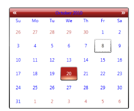

### Override Syncfusion Themes

All Syncfusion styles can be overridden by a common Naming Convention. A unique key is given to each and every style, so that you can override the styles using the BasedOn property.

Naming Convention of a key

VisualStyle-ControlName-Style 

Example: ShinyRedCalendarEditStyle

The following steps explain how to override the Syncfusion Themes.

1. Add the corresponding resource dictionary in the sample.

[XAML]

&lt;ResourceDictionary&gt;

       &lt;ResourceDictionary.MergedDictionaries&gt;

           &lt;ResourceDictionary Source="/Syncfusion.Shared.WPF;Component/Controls/Calendar/themes/ShinyRedStyle.xaml"/&gt;

       &lt;/ResourceDictionary.MergedDictionaries&gt;

&lt;/ResourceDictionary&gt;

2. Define the new style using the BasedOn property. 

The following code snippet overrides the Syncfusion style for the Calendar Control.

[XAML]

&lt;Grid&gt;

        &lt;Grid.Resources&gt;

            &lt;Style x:Key="CalendarEditStyle" TargetType="syncfusion:CalendarEdit" BasedOn="{StaticResource ShinyRedCalendarEditStyle}" &gt;

                &lt;Setter Property="Foreground" Value="Blue"/&gt;

                &lt;Setter Property="HeaderForeground" Value="Blue"/&gt;

            &lt;/Style&gt;

        &lt;/Grid.Resources&gt;

        &lt;syncfusion:CalendarEdit Name="calendar" Style="{StaticResource CalendarEditStyle}"&gt;&lt;/syncfusion:CalendarEdit&gt;        

&lt;/Grid&gt;

The output is displayed as shown below.

{:.image }

