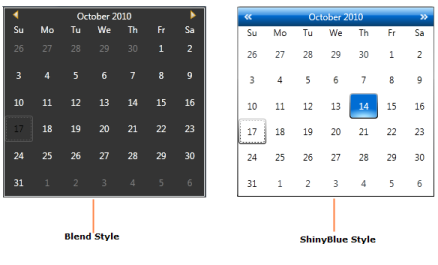

### Switch between Skins at Run-time

Themes can be dynamically switched.

Example 1:

You can use the Syncfusion Skin Picker Control to switch between the skins. Just add the Skin Picker Control to your application as shown below.

[XAML]

&lt;syncfusion:SkinPicker Height="60"/&gt;

{:.image }

Example 2:

You can switch between the skins at run-time by using the ComboBox Selection Changed event. 

Below is the code snippet to explain how to switch between the skins at run-time by using the ComboBox SelectionChanged event.

[XAML]

&lt;Grid Name="grid"&gt;        

        &lt;Grid.ColumnDefinitions&gt;

            &lt;ColumnDefinition Width="*"/&gt;

            &lt;ColumnDefinition Width="*"/&gt;

        &lt;/Grid.ColumnDefinitions&gt;

        &lt;ComboBox Name="themecombobox" Grid.Column="0" SelectionChanged="ComboBox_SelectionChanged" Width="150" Height="30"&gt;

            &lt;ComboBoxItem&gt; Blend &lt;/ComboBoxItem&gt;

            &lt;ComboBoxItem&gt; ShinyBlue &lt;/ComboBoxItem&gt;

        &lt;/ComboBox&gt;

        &lt;syncfusion:CalendarEdit Name="calendar" Grid.Column="1"&gt;&lt;/syncfusion:CalendarEdit&gt;        

&lt;/Grid&gt;

On ComboBox SelectionChanged event, particular VisualStyle should be set to the control. 

The following code snippet explains how to set the switch between the skins.

[C#]

Private void ComboBox_SelectionChanged(object sender, SelectionChangedEventArgs e)

        {

            if (themecombobox.SelectedIndex == 0)

            {

                SkinStorage.SetVisualStyle(calendar, "ShinyBlue");

            }

            Else if (themecombobox.SelectedIndex == 1)

            {

                SkinStorage.SetVisualStyle(calendar, "Blend");

            }

        }

The output is displayed as shown below.

{:.image }

