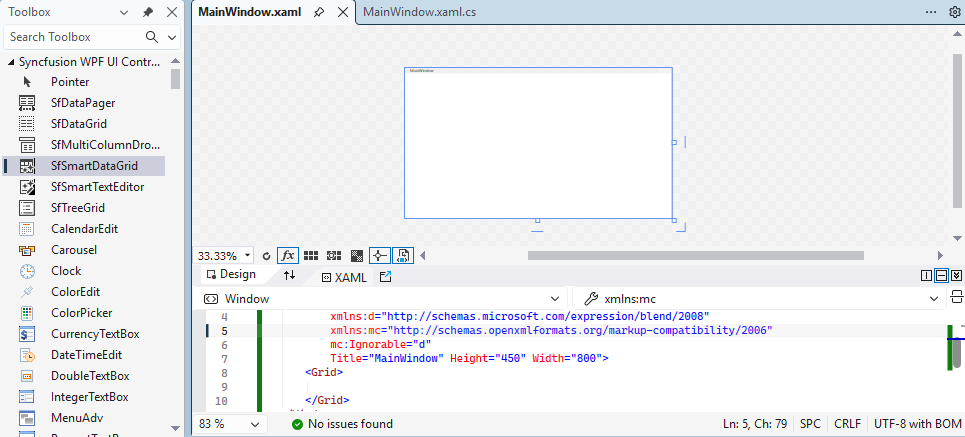
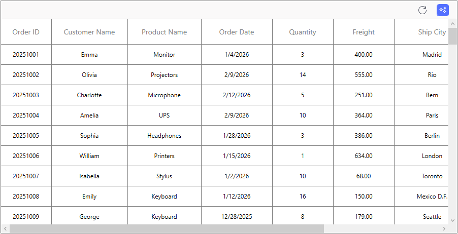

# Getting Started with WPF SfSmartDataGrid (SfSmartDataGrid)

This section provides a quick overview for working with the [WPF SfSmartDataGrid](https://www.syncfusion.com/wpf-controls/smart-datagrid) (SfSmartDataGrid) for WPF. Walk through the entire process of creating a real world of this control.

## Assembly deployment

The following list of assemblies needs to be added as reference to use SfSmartDataGrid control in any application,

<table>
<tr>
<th>
Required assemblies
</th>
<th>
Description
</th>
</tr>
<tr>
<td>
Syncfusion.Data.WPF
</td>
<td>
Syncfusion.Data.WPF assembly contains fundamental and base classes for {{'[CollectionViewAdv](https://help.syncfusion.com/cr/wpf/Syncfusion.Data.CollectionViewAdv.html)'| markdownify }} which is responsible for data processing operations handled in SfSmartDataGrid.
</td>
</tr>
<tr>
<td>
Syncfusion.SfGrid.WPF
</td>
<td>
Syncfusion.SfGrid.WPF assembly contains the core grid engine and UI components for the WPF data grid. It provides the `Syncfusion.UI.Xaml.Grid` namespace and implements essential features such as virtualization, row/column generation, selection, editing, sorting, filtering, grouping, and performance optimizations for large data sets. Use this assembly when you need fine-grained control over grid behavior, column types, cell templates, and advanced grid interactions.
</td>
</tr>
<tr>
<td>
Syncfusion.SfSmartComponents.WPF
</td>
<td>
Syncfusion.SfSmartComponents.WPF assembly contains the Smart extensions and higher-level controls that enable AI-assisted and smart behaviors for data grids and related components. It exposes the `Syncfusion.UI.Xaml.SmartComponents` namespace and includes `SfSmartDataGrid` (smart features on top of the core grid), suggestions and natural-language action hooks, and helper services for integrating AI-driven sorting, filtering, grouping, and highlighting. Include this assembly when you want Smart/AI capabilities (for example, `EnableSmartActions`, `Suggestions`, or integration with Syncfusion® AI services).
</td>
</tr>
<tr>
<td>
Syncfusion.SfChat.WPF
</td>
<td>
Syncfusion.SfChat.WPF assembly contains UI controls and services for building chat and messaging experiences in WPF applications. It provides chat windows, message templates, typing indicators, message grouping, and utilities for loading and persisting message history. This assembly is useful when integrating conversational interfaces, help/chat widgets, or bot-driven assistants alongside data-grid scenarios.
</td>
</tr>
<tr>
<td>
Syncfusion.Shared.WPF
</td>
<td>
Syncfusion.Shared.WPF contains various editor controls (such as IntegerTextBox, DoubleTextBox and etc) which are used in SfSmartDataGrid. 
</td>
</tr>
</table>

## Creating simple application with SfSmartDataGrid
In this walk-through you will create a WPF application that uses the Syncfusion® WPF DataGrid (`SfSmartDataGrid`) control. The steps below correspond to the seven key topics needed to add and bind a SfSmartDataGrid in a WPF project.

1. [Create a new WPF project](#create-a-new-wpf-project)
2. [Install required Syncfusion® NuGet packages](#install-the-syncfusion-wpf-nuget-packages)
3. [Add the control via Designer](#adding-control-via-designer)
4. [Add the control manually in XAML](#adding-control-manually-in-xaml)
5. [Add the control manually in C#](#adding-control-manually-in-c)
6. [Create the data model](#creating-data-model-for-sample-application)
7. [Bind data](#binding-to-data)
8. [Register the AI Service](#register-the-ai-service)
9. [Running the Application](#running-the-application)
### Create a new WPF project

Create new WPF Project in Visual Studio to display SfSmartDataGrid with data objects.

<a id="install-the-syncfusion-wpf-nuget-packages"></a>
### Install the Syncfusion® WPF NuGet packages

1. In **Solution Explorer**, right-click the project and choose **Manage NuGet Packages**.
2. Search for Syncfusion.SfSmartComponents.Wpf and install the latest version.
3. Ensure the necessary dependencies are installed correctly, and the project is restored.

### Adding control via Designer

SfSmartDataGrid control can be added to the application by dragging it from Toolbox and dropping it in Designer view. The required assembly references will be added automatically.
    

### Adding control manually in XAML

In order to add control manually in XAML, do the below steps,

1. Add the below required assembly references to the project,
	* Syncfusion.Data.WPF 
	* Syncfusion.SfGrid.WPF
	* Syncfusion.Shared.WPF
    * Syncfusion.SfChat.WPF
    * Syncfusion.SfSmartComponents.WPF
2. Import Syncfusion<sup>®</sup> WPF schema **http://schemas.syncfusion.com/wpf** or SfSmartDataGrid control namespace **Syncfusion.UI.Xaml.SmartComponents** in XAML page.
3. Declare SfSmartDataGrid control in XAML page.




<Window xmlns="http://schemas.microsoft.com/winfx/2006/xaml/presentation"
        xmlns:x="http://schemas.microsoft.com/winfx/2006/xaml"
        xmlns:syncfusion="http://schemas.syncfusion.com/wpf" 
        x:Class="WpfApplication1.MainWindow"
        Title="MainWindow" Height="350" Width="525">
    <Grid>
        <syncfusion:SfSmartDataGrid  x:Name="smartDataGrid"/>
    </Grid>
</Window>



{{ codesnippet1 | OrderList_Indent_Level_1 }}

### Adding control manually in C\#

In order to add control manually in C#, do the below steps,

1. Add the below required assembly references to the project,
	* Syncfusion.Data.WPF 
	* Syncfusion.SfGrid.WPF
	* Syncfusion.Shared.WPF
    * Syncfusion.SfChat.WPF
    * Syncfusion.SfSmartComponents.WPF
2. Import SfSmartDataGrid namespace **Syncfusion.UI.Xaml.SmartComponents** .
3. Create SfSmartDataGrid control instance and add it to the Page.




using Syncfusion.UI.Xaml.SmartComponents;
namespace WpfApplication1
{ 
    public partial class MainWindow : Window
    {
        public MainWindow()
        {
            InitializeComponent();
            SfSmartDataGrid smartDataGrid = new SfSmartDataGrid();
            Root_Grid.Children.Add(smartDataGrid);
        }
    }
}



{{ codesnippet2 | OrderList_Indent_Level_1 }}

### Creating Data Model for sample application

SfSmartDataGrid is a data-bound control. So before create binding to the control, you must create data model for Application.

1. Create data object class named **OrderInfo** and declare properties as shown below,




public partial class OrderInfo : INotifyPropertyChanged
{ 
    private int _orderID;
    private string _customerName = string.Empty;
    private string _productName = string.Empty;
    private DateTime _orderDate;
    private int _quantity;
    private double _freight;
    private string _shipCountry = string.Empty;
    private string _shipCity = string.Empty;
    private string _paymentStatus = string.Empty;

    public event PropertyChangedEventHandler PropertyChanged;

    protected bool SetProperty<T>(ref T storage, T value, [CallerMemberName] string propertyName = null)
    {
        if (Equals(storage, value))
            return false;
        storage = value;
        PropertyChanged?.Invoke(this, new PropertyChangedEventArgs(propertyName));
        return true;
    }

    public int OrderID
    {
        get => _orderID;
        set => SetProperty(ref _orderID, value);
    }

    public string CustomerName
    {
        get => _customerName;
        set => SetProperty(ref _customerName, value);
    }

    public string ProductName
    {
        get => _productName;
        set => SetProperty(ref _productName, value);
    }

    public DateTime OrderDate
    {
        get => _orderDate;
        set => SetProperty(ref _orderDate, value);
    }

    public int Quantity
    {
        get => _quantity;
        set => SetProperty(ref _quantity, value);
    }

    public double Freight
    {
        get => _freight;
        set => SetProperty(ref _freight, value);
    }

    public string ShipCountry
    {
        get => _shipCountry;
        set => SetProperty(ref _shipCountry, value);
    }

    public string ShipCity
    {
        get => _shipCity;
        set => SetProperty(ref _shipCity, value);
    }

    public string PaymentStatus
    {
        get => _paymentStatus;
        set => SetProperty(ref _paymentStatus, value);
    }

    public OrderInfo() { }

    public OrderInfo(int orderId,
                     string customerName,
                     string productName,
                     DateTime orderDate,
                     int quantity,
                     double freight,
                     string shipCountry,
                     string shipCity,
                     string paymentStatus)
    {
        _orderID = orderId;
        _customerName = customerName;
        _productName = productName;
        _orderDate = orderDate;
        _quantity = quantity;
        _freight = freight;
        _shipCountry = shipCountry;
        _shipCity = shipCity;
        _paymentStatus = paymentStatus;
    }
}



{{ codesnippet3 | OrderList_Indent_Level_1 }}


N> If you want your data object (OrderInfo class) to automatically reflect property changes, then the object must implement **INotifyPropertyChanged** interface.
 
2. Create a **ViewModel** class with Orders property and Orders property is initialized with several data objects in constructor.


 

public class ViewModel : INotifyPropertyChanged
{ 
    public ObservableCollection<OrderInfo> OrderInfoCollection { get; set; }

    private Author currentUser;

    public Author CurrentUser
    {
        get
        {
            return this.currentUser;
        }
        set
        {
            this.currentUser = value;
            RaisePropertyChanged("CurrentUser");
        }
    }

    public ObservableCollection<string> AiSuggestions { get; } = new ObservableCollection<string>
    {
        "Which orders have a payment status of Not Paid?",
        "What are the top 10 orders with the highest freight cost?",
        "Which customers have placed the most orders?",
        "What are the orders shipped to Brazil?",
        "What is the total quantity of products ordered across all orders?",
    };

    public event PropertyChangedEventHandler PropertyChanged;
    public void RaisePropertyChanged(string propName)
    {
        PropertyChanged?.Invoke(this, new PropertyChangedEventArgs(propName));
    }

    public ViewModel()
    {
        this.CurrentUser = new Author { Name = "John" };
        OrderInfoCollection = new ObservableCollection<OrderInfo>();
        GenerateOrders();
    }

    private Random random = new Random();
    private static readonly string[] Names = new[]
    {
        "Emma", "Olivia", "Charlotte", "Amelia", "Sophia",
        "William", "Isabella", "Emily", "George", "Grace",
        "Lily","Ava","Chloe","Ella","Mia","James","Sophie",
        "Isla","Henry","Lucy"
    };

    private static readonly string[] Countries = new[]
    {
        "Spain","Brazil","Switzerland","France","Germany","UK","Canada","Mexico","USA","Italy"
    };

    public string[] ElectronicsProducts = new string[]
    {
        "Keyboard", "Mouse", "Trackpad", "Stylus", "Scanner", "Webcam", "Microphone", "Monitor", "Speakers", "Headphones", "Printers", "Projectors", "External Drive", "UPS"
    };

    private static readonly string[] Cities = new[]
    {
        "Madrid","Rio","Bern","Paris","Berlin","London","Toronto","Mexico D.F.","Seattle","Rome"
    };

    private static readonly string[] PaymentStatuses = new[] { "Paid", "Not Paid" };

    private void GenerateOrders()
    {
        var rnd = new Random(42);
        int baseOrderId = 20251001;

        for (int i = 0; i < 100; i++)
        {
            int orderId = baseOrderId + i;
            var name = Names[i % Names.Length];
            string productName = ElectronicsProducts[random.Next(ElectronicsProducts.Length)];
            DateTime orderDate = DateTime.Today.AddDays(-rnd.Next(1, 90));

            // Quantity realistic
            int quantity = rnd.Next(1, 20);

            // Freight based on product type
            int freight;
            if (productName == "Mouse" || productName == "Stylus" || productName == "Trackpad")
                freight = rnd.Next(50, 150);
            else if (productName == "Keyboard" || productName == "Webcam" || productName == "Microphone")
                freight = rnd.Next(150, 350);
            else
                freight = rnd.Next(350, 750);

            // Country and city mapping
            var country = Countries[i % Countries.Length];
            var city = Cities[i % Cities.Length];

            // Payment status with realistic ratio
            var status = rnd.NextDouble() < 0.7 ? "Paid" : "Not Paid";

            OrderInfoCollection.Add(new OrderInfo(
                orderId: orderId,
                customerName: name,
                productName: productName,
                orderDate: orderDate,
                quantity: quantity,
                freight: freight,
                shipCountry: country,
                shipCity: city,
                paymentStatus: status));
        }
    }
}



{{ codesnippet4 | OrderList_Indent_Level_1 }}

### Binding to Data

To bind the SfSmartDataGrid to data, set the [SfSmartDataGrid.ItemsSource](https://help.syncfusion.com/cr/wpf/Syncfusion.UI.Xaml.Grid.SfDataGrid.html#Syncfusion_UI_Xaml_Grid_SfDataGrid_ItemsSource) property to an IEnumerable implementation. Each row in SfSmartDataGrid is bound to an object in data source and each column in SfSmartDataGrid bound to a property in data object. 
 
Bind the collection created in previous step to `SfSmartDataGrid.ItemsSource` property in XAML by setting ViewModel as `DataContext`.



<Window xmlns="http://schemas.microsoft.com/winfx/2006/xaml/presentation"
        xmlns:x="http://schemas.microsoft.com/winfx/2006/xaml"
        xmlns:syncfusion="http://schemas.syncfusion.com/wpf" 
        x:Class="WpfApplication1.MainWindow"
        xmlns:local="clr-namespace:WpfApplication1"
        Title="MainWindow" Height="350" Width="525">
		
    <Window.DataContext>
        <local:ViewModel/>
    </Window.DataContext>

    <Grid x:Name="Root_Grid">
        <syncfusion:SfSmartDataGrid x:Name="SmartGrid" ItemsSource="{Binding OrderInfoCollection}" AutoGenerateColumns="False" CurrentUser="{Binding CurrentUser}" Suggestions="{Binding AiSuggestions}" ColumnSizer="Star">
            <syncfusion:SfSmartDataGrid.Columns>
                <syncfusion:GridNumericColumn MappingName="OrderID" HeaderText="Order ID" NumberDecimalDigits="0" TextAlignment="Center"/>
                <syncfusion:GridTextColumn MappingName="CustomerName" HeaderText="Customer Name" TextAlignment="Center"/>

                <syncfusion:GridTextColumn MappingName="ProductName" HeaderText="Product Name" TextAlignment="Center"/>

                <syncfusion:GridDateTimeColumn  MappingName="OrderDate" HeaderText="Order Date" TextAlignment="Center">
                </syncfusion:GridDateTimeColumn>

                <syncfusion:GridNumericColumn  MappingName="Quantity" NumberDecimalDigits="0" TextAlignment="Center">
                </syncfusion:GridNumericColumn>

                <syncfusion:GridNumericColumn MappingName="Freight" TextAlignment="Center">
                </syncfusion:GridNumericColumn>

                <syncfusion:GridTextColumn MappingName="ShipCity" HeaderText="Ship City" TextAlignment="Center"/>

                <syncfusion:GridTextColumn MappingName="ShipCountry" HeaderText="Ship Country" TextAlignment="Center"/>

                <syncfusion:GridTextColumn MappingName="PaymentStatus" HeaderText="Payment Status" TextAlignment="Center"/>
            </syncfusion:SfSmartDataGrid.Columns>
        </syncfusion:SfSmartDataGrid>
    </Grid>
	
</Window>


ViewModel viewModel = new ViewModel();
dataGrid.ItemsSource = viewModel.Orders;



### Register the AI Service

To configure the AI services, you must give the `azureApiKey` in the `App.xaml.cs` file.

```csharp
using Azure.AI.OpenAI;
using Microsoft.Extensions.AI;
using Microsoft.Extensions.DependencyInjection;
using Syncfusion.UI.Xaml.SmartComponents;
using System.ClientModel;
using System.Windows;
namespace WpfApplication1
{
    /// <summary>
    /// Interaction logic for App.xaml
    /// </summary>
    public partial class App : Application
    {
        public App()
        {
            string azureApiKey = "<MENTION-YOUR-KEY>";
            Uri azureEndpoint = new Uri("<MENTION-YOUR-URL>");
            string deploymentName = "<MENTION-YOUR-DEPLOYMENT-NAME>";

            AzureOpenAIClient azureClient = new AzureOpenAIClient(azureEndpoint, new ApiKeyCredential(azureApiKey));
            IChatClient azureChatClient = azureClient.GetChatClient(deploymentName).AsIChatClient();
            SyncfusionAIExtension.Services.AddSingleton<IChatClient>(azureChatClient);
            SyncfusionAIExtension.ConfigureSyncfusionAIServices();
        }
	}
}
```

### Running the Application

Press **F5** to build and run the application. Once compiled, the smart datagrid will be displayed with the data provided, and AI features will be available after configuration.

Here is the result of the previous codes,



## Theme

SfSmartDataGrid supports various built-in themes. Refer to the below links to apply themes for the SfSmartDataGrid,

  * [Apply theme using SfSkinManager](https://help.syncfusion.com/wpf/themes/skin-manager)
	
  * [Create a custom theme using ThemeStudio](https://help.syncfusion.com/wpf/themes/theme-studio#creating-custom-theme)

  
