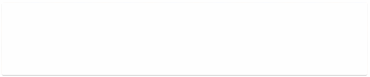
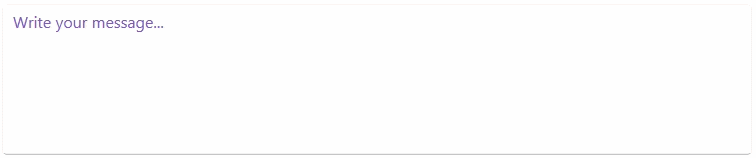

# Customization in WPF AI-Powered Text Editor (SfSmartTextEditor)
This section explains how to change the AI-Powered Text Editor’s appearance and suggestion behavior. You can set text styles, placeholder options, and customize how suggestions are shown.

## Text customization
Set or bind the smart text editor’s text using the `Text` property. You can use this to preloaded content or bind it to a field in your view model for data binding.




<smarttexteditor:SfSmartTextEditor Text="Thank you for contacting us." />




var smarttexteditor = new SfSmartTextEditor
{
    Text = "Thank you for contacting us."
};




## Text style customization

You can change the text style and font using the `Style` property to make the editor look the way you want.




<Window
    xmlns="http://schemas.microsoft.com/dotnet/2021/maui"
    xmlns:x="http://schemas.microsoft.com/winfx/2009/xaml"
    xmlns:smarttexteditor="clr-namespace:Syncfusion.UI.Xaml.SmartComponents;assembly=Syncfusion.SfSmartComponents.Wpf">

    <smarttexteditor:SfSmartTextEditor>
        <smarttexteditor:SfSmartTextEditor.Style>
            
        </smarttexteditor:SfSmartTextEditor.Style>
    </smarttexteditor:SfSmartTextEditor>
</Window>




## Placeholder text and color customization

Add a helpful placeholder to guide users and use `PlaceholderStyle` to make the placeholder look the way you want.




<smartTextEditor:SfSmartTextEditor x:Name="smartTextEditor" 
                                   Placeholder="Write your message...">
    <smartTextEditor:SfSmartTextEditor.PlaceholderStyle>
        
    </smartTextEditor:SfSmartTextEditor.PlaceholderStyle>
</smartTextEditor:SfSmartTextEditor>



## Suggestion text color

Customize the color of the suggestion text using the `SuggestionInlineStyle` property to match your theme and improves readability.




<smartTextEditor:SfSmartTextEditor>
    <smartTextEditor:SfSmartTextEditor.SuggestionInlineStyle>
        
    </smartTextEditor:SfSmartTextEditor.SuggestionInlineStyle>
</smartTextEditor:SfSmartTextEditor>




## Suggestion popup background
Change the background color of the suggestion popup using the `SuggestionPopupStyle` property in Popup mode to align with your app's design.




<smartTextEditor:SfSmartTextEditor SuggestionDisplayMode="Popup">
    <smartTextEditor:SfSmartTextEditor.SuggestionPopupStyle>
        
    </smartTextEditor:SfSmartTextEditor.SuggestionPopupStyle>
</smartTextEditor:SfSmartTextEditor>




## Maximum input length
Set a limit on the number of characters the user can enter in the smart text editor using the `MaxLength` property.




<smarttexteditor:SfSmartTextEditor
    MaxLength="500" />




var smarttexteditor = new SfSmartTextEditor
{
    MaxLength = 500
};


