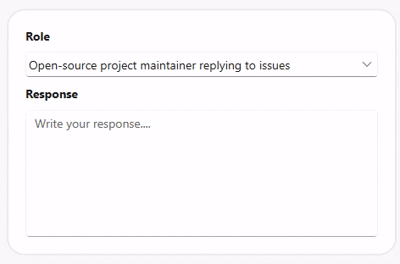

# Overview of WPF Smart Text Editor

Syncfusion [WPF AI-Powered Text Editor](https://www.syncfusion.com/wpf-controls/smart-text-editor) (SfSmartTextEditor) is a multiline input control that uses predictive suggestions to speed up typing. It can integrate with an AI inference service for context-aware completions, enables inline and popup suggestion display, and reverts to your custom phrase list in the event that AI is not available. The control offers command/event hooks for text changes, full text style, and customizable placeholders.

## Key features

* **Suggestion display modes**: Customization of suggestions is possible in both inline and popup modes.

* **AI powered suggestions**: IChatInferenceService provides clever, context-aware completions.

* **Custom phrase library**: Preserves backup phrases in case AI recommendations aren't available.

* **Maximum length validation**: To guarantee accurate input control, character restrictions are enforced.

* **Keyboard integration**: Makes it possible to accept ideas quickly by utilizing the Tab or Right Arrow keys.

* **Gesture support**: Allows touch users to tap or click recommendations in the pop-up for quick input.

* **Placeholder text**: Enables placeholders to be configured with customizable color styling.

* **Customization**: Enables users to fully customize the user interface by controlling fonts, colors, sizes, and styles.