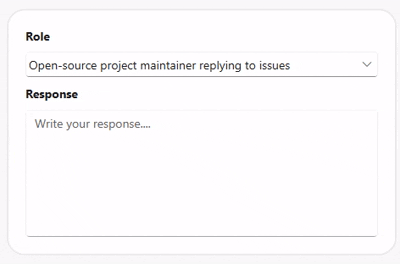

# Overview of WPF Smart Text Editor

Syncfusion [WPF AI-Powered Text Editor](https://www.syncfusion.com/wpf-controls/smart-text-editor) (SfSmartTextEditor) is a multiline input control that uses predictive suggestions to speed up typing. It can integrate with an AI inference service for context-aware completions, enables inline and popup suggestion display, and reverts to your custom phrase list in the event that AI is not available. The control offers command/event hooks for text changes, full text style, and customizable placeholders.

## Key features

Features with a dedicated documentation page are linked below.

* **Suggestion display modes** (see [Suggestion display modes](suggestion-display-mode.md)): Customize suggestions using either inline or popup modes.

* **AI powered suggestions**: The WPF Smart Text Editor provides context-aware completions through a chat client (for example, `IChatClient` from `Microsoft.Extensions.AI`).

* **Custom phrase library**: The custom phrase library preserves backup phrases for offline use when AI recommendations aren't available.

* **Maximum length validation**: The `MaxLength` property enforces a character limit to keep input within the allowed range (see [Maximum input length](customization.md#maximum-input-length)).

* **Keyboard integration**: Allows you to accept suggestions quickly by using the Tab or Right Arrow keys.

* **Gesture support**: Allows touch users to tap or click recommendations in the popup for quick input.

* **Placeholder text**: The `Placeholder` and `PlaceholderStyle` properties allow configuration of a placeholder with customizable color styling (see [Placeholder text and color customization](customization.md#placeholder-text-and-color-customization)).

* **Customization**: Enables users to fully customize the user interface by controlling fonts, colors, sizes, and styles (see [Customization in WPF Smart Text Editor](customization.md)).

* **Commands**: `TextChangedCommand` is raised whenever the text in the editor changes (see [Commands in WPF Smart Text Editor](commands.md)).

## Next steps

- [Getting started with WPF Smart Text Editor](getting-started.md) — Add the control to your project and configure an AI service.
- [Commands in WPF Smart Text Editor](commands.md) — Handle text-change events through the `TextChangedCommand`.
- [Customization in WPF Smart Text Editor](customization.md) — Style the editor and customize the suggestion display.
- [Suggestion display modes](suggestion-display-mode.md) — Switch between inline and popup suggestions.

N> For the complete list of properties, methods, and events, see the [SfSmartTextEditor API reference](https://help.syncfusion.com/cr/wpf/Syncfusion.UI.Xaml.SmartComponents.html).