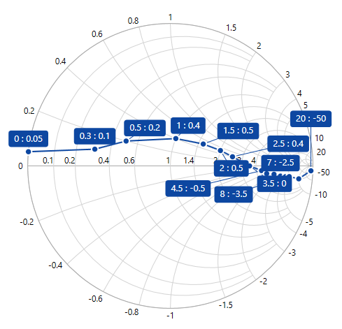

# Appearance

## SmithChart Palette

The Smith chart displays different series in different color by using *Palette* property of **ColorModel**. By default, Metro palette color has been applied.





<syncfusion:SfSmithChart x:Name="SmithChart">
            <syncfusion:SfSmithChart.ColorModel>
                <syncfusion:SmithChartColorModel Palette="BlueChrome"></syncfusion:SmithChartColorModel>
            </syncfusion:SfSmithChart.ColorModel>
 </syncfusion:SfSmithChart>



 

SfSmithChart chart = new SfSmithChart();
chart.ColorModel = new SmithChartColorModel();
chart.ColorModel.Palette = ColorPalette.BlueChrome;


    


**Series Palette**

The palette color to each data points of specific series can be defined by using *Palette* property of **ColorModel** in the Series.





<syncfusion:SfSmithChart x:Name="SmithChart">
   <syncfusion:LineSeries>
       <syncfusion:LineSeries.ColorModel>
           <syncfusion:SmithChartColorModel Palette="Metro">
       </syncfusion:LineSeries.ColorModel>
   </syncfusion:LineSeries>
 </syncfusion:SfSmithChart>



 

LineSeries series = new LineSeries(); 
series.ColorModel = new SmithChartColorModel();
series.ColorModel.Palette = ColorPalette.Metro;
chart.Series.Add(series);


    


## Chart Area Customization

Chart and chart area (circle plotting area) can be customized by using the below properties in SmithChart.





<syncfusion:SfSmithChart x:Name="SmithChart" Background="LightSteelBlue" BorderBrush="CadetBlue" BorderThickness="4"
                          ChartAreaBackground="AliceBlue" ChartAreaBorderBrush="SkyBlue" ChartAreaBorderThickness="2"> 
 </syncfusion:SfSmithChart>



 

chart.Background = new SolidColorBrush(Colors.LightSteelBlue);
chart.BorderBrush = new SolidColorBrush(Colors.CadetBlue);
chart.BorderThickness = new Thickness(4);
chart.ChartAreaBackground = new SolidColorBrush(Colors.AliceBlue);
chart.ChartAreaBorderBrush = new SolidColorBrush(Colors.SkyBlue);
chart.ChartAreaBorderThickness = new Thickness(2);


    


## Circle Radius

To change the diameter of the Smith chart circle with respect to the plot area, use the Radius property. It ranges from 0.1 to 1 and the default value is 0.95.





<syncfusion:SfSmithChart x:Name="SmithChart" Radius="0.5" ChartAreaBorderBrush="CadetBlue">
 
</syncfusion:SfSmithChart>



 

SfSmithChart chart = new SfSmithChart();
//Change the area circle radius value
chart.Radius = 0.5;
chart.ChartAreaBorderBrush = new SolidColorBrush(Colors.CadetBlue);
this.Grid1.Children.Add(chart);


    


