# Axes

Typically, SmithChart  has been used two axes that are used to measure and categorize the data. 

1. Horizontal Axis (Resistance)
2. Radial Axis (Reactance)

## Horizontal Axis

Horizontal axis scale is used to measure normalized resistance value.

The following topics explain in detail about the axis and its parts.

### MajorGridlines

By default, major gridlines are automatically added to the Axis. SfSmithChart supports the customization of major gridline. The visibility of the major gridlines can be controlled by using the **ShowMajorGridlines** property.





<syncfusion:SfSmithChart>
     <syncfusion:SfSmithChart.HorizontalAxis>
         <syncfusion:HorizontalAxis ShowMajorGridlines="False">
         </syncfusion:HorizontalAxis>
     </syncfusion:SfSmithChart.HorizontalAxis>
 </syncfusion:SfSmithChart>





//Customizing horizontal(Resistance) axis to the chart
chart.HorizontalAxis = new HorizontalAxis();
chart.HorizontalAxis.ShowMajorGridlines = false;





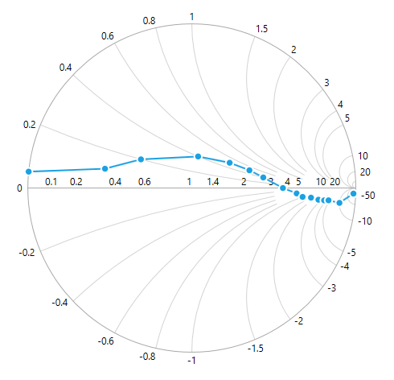

**MajorGridlineStyle**

SfSmithChart provides support to customize the style of the major gridlines by defining the *MajorGridlineStyle* property as shown in the below code snippet.





<syncfusion:SfSmithChart x:Name="SmithChart">
    <syncfusion:SfSmithChart.Resources>
        
    </syncfusion:SfSmithChart.Resources>
        <syncfusion:SfSmithChart.HorizontalAxis>
        <syncfusion:HorizontalAxis MajorGridlineStyle="{StaticResource lineStyle}">
        </syncfusion:HorizontalAxis>
   </syncfusion:SfSmithChart.HorizontalAxis>
</syncfusion:SfSmithChart>





chart.HorizontalAxis.MajorGridlineStyle = this.Grid1.Resources["lineStyle"] as Style;





### MinorGridlines

By default, minor gridlines are not added to the Axis. The visibility of the minor gridlines can be controlled by using the `ShowMinorGridlines` property.





<syncfusion:SfSmithChart>
     <syncfusion:SfSmithChart.HorizontalAxis>
         <syncfusion:HorizontalAxis ShowMinorGridlines="True">
         </syncfusion:HorizontalAxis>
     </syncfusion:SfSmithChart.HorizontalAxis>
 </syncfusion:SfSmithChart>



 

//Customizing horizontal(Resistance) axis to the chart 
chart.HorizontalAxis = new HorizontalAxis();
chart.HorizontalAxis.ShowMinorGridlines = true;


    


**MinorGridlinesCount**

Minor gridlines can be added by defining *MinorGridlinesCount* property. By default, this value is  eight. It means, every 100 pixels it renders maximum eight minor gridlines.





<syncfusion:SfSmithChart>
     <syncfusion:SfSmithChart.HorizontalAxis>
         <syncfusion:HorizontalAxis ShowMinorGridlines="True" MinorGridlinesCount="12">
         </syncfusion:HorizontalAxis>
     </syncfusion:SfSmithChart.HorizontalAxis>
 </syncfusion:SfSmithChart>





//Customizing horizontal(Resistance) axis to the chart 
chart.HorizontalAxis = new HorizontalAxis();
chart.HorizontalAxis.ShowMinorGridlines = true;
chart.HorizontalAxis.MinorGridlinesCount = 12;


    


**MinorGridlineStyle**

SfSmithChart provides support to customize the style of the minor gridlines by defining the *MinorGridlineStyle* property as shown in the below code snippet.





<syncfusion:SfSmithChart x:Name="SmithChart">
    <syncfusion:SfSmithChart.Resources>
        
    </syncfusion:SfSmithChart.Resources>
        <syncfusion:SfSmithChart.HorizontalAxis>
        <syncfusion:HorizontalAxis ShowMinorGridlines="True" MinorGridlinesCount="12" MinorGridlineStyle="{StaticResource lineStyle}">
        </syncfusion:HorizontalAxis>
   </syncfusion:SfSmithChart.HorizontalAxis>
</syncfusion:SfSmithChart>



 

chart.HorizontalAxis.MinorGridlineStyle = this.Grid1.Resources["lineStyle"] as Style;





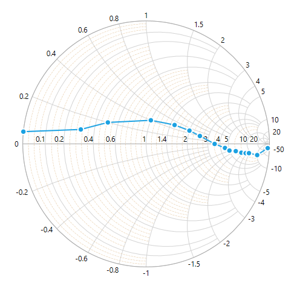

## AxisLine

SfSmithChart provides support to customize the style of the axis line by defining the *AxisLineStyle* property and change the visibility by using *ShowAxisLine* property as shown in the below code snippet.





<syncfusion:SfSmithChart x:Name="SmithChart">
    <syncfusion:SfSmithChart.Resources>
        
    </syncfusion:SfSmithChart.Resources>
        <syncfusion:SfSmithChart.HorizontalAxis>
        <syncfusion:HorizontalAxis ShowAxisLine="True" AxisLineStyle="{StaticResource lineStyle}">
        </syncfusion:HorizontalAxis>
   </syncfusion:SfSmithChart.HorizontalAxis>
</syncfusion:SfSmithChart>



 

chart.HorizontalAxis.AxisLineStyle = this.Grid1.Resources["lineStyle"] as Style;


    


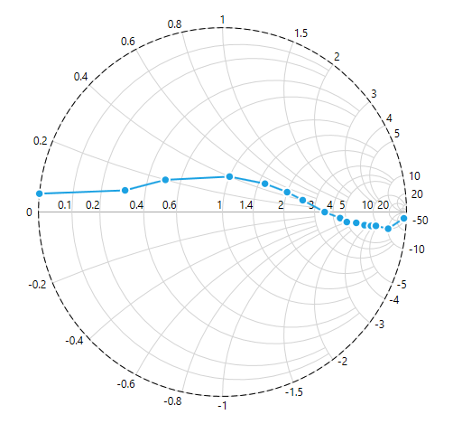

### LabelPlacement

The *LabelPlacement* property is used to position the axis label either inside or outside of the chart plotting area. By default, LabelsPlacement is **Outside**.





<syncfusion:SfSmithChart x:Name="SmithChart">
        <syncfusion:SfSmithChart.HorizontalAxis>
        <syncfusion:HorizontalAxis LabelPlacement="Inside">
        </syncfusion:HorizontalAxis>
   </syncfusion:SfSmithChart.HorizontalAxis>
</syncfusion:SfSmithChart>



 

//Positioning the horizontal axis labels to bottom of AxisLine
chart.HorizontalAxis.LabelPlacement = LabelPlacement.Inside;


    


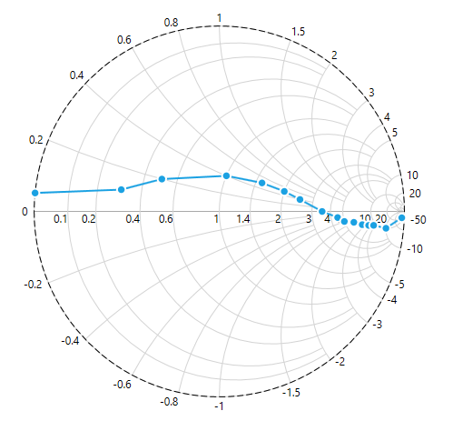

### LabelIntersectAction

When the Axis labels overlap with each other based on the chart dimensions and label size, use the *LabelIntersectAction* property of the axis to avoid overlapping. The default value of the LabelIntersectAction is **Hide**.





<syncfusion:SfSmithChart x:Name="SmithChart">
        <syncfusion:SfSmithChart.HorizontalAxis>
        <syncfusion:HorizontalAxis LabelIntersectAction="None">
        </syncfusion:HorizontalAxis>
   </syncfusion:SfSmithChart.HorizontalAxis>
</syncfusion:SfSmithChart>





//Set axis label intersect action
chart.HorizontalAxis.LabelIntersectAction = LabelIntersectActions.None;


    


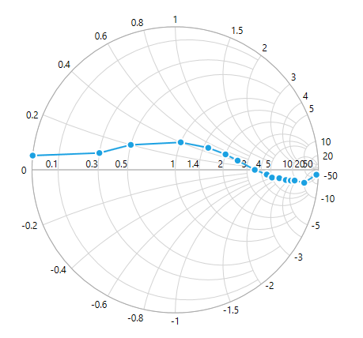

## Radial Axis

Radial axis scale is used to measure the normalized reactance values.

### MajorGridlines

By default, major gridlines are automatically added to the Axis. SfSmithChart supports customization of major gridline. The visibility of the major gridlines can be controlled by using the *ShowMajorGridlines* property.





<syncfusion:SfSmithChart>
     <syncfusion:SfSmithChart.RadialAxis>
         <syncfusion:RadialAxis ShowMajorGridlines="False">
         </syncfusion:RadialAxis >
     </syncfusion:SfSmithChart.RadialAxis >
 </syncfusion:SfSmithChart>



 

//Customizing radial(Reactance) axis to the chart 
chart.RadialAxis = new RadialAxis();
chart.RadialAxis.ShowMajorGridlines = false;


    


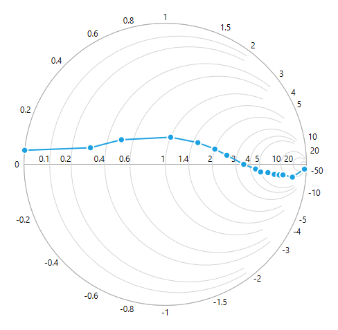

**MajorGridlineStyle**

SfSmithChart provides support to customize the style of the major gridlines by defining the *MajorGridlineStyle* property as shown in the below code snippet.





<syncfusion:SfSmithChart x:Name="SmithChart">
    <syncfusion:SfSmithChart.Resources>
        
    </syncfusion:SfSmithChart.Resources>
        <syncfusion:SfSmithChart.RadialAxis>
        <syncfusion:RadialAxis MajorGridlineStyle="{StaticResource lineStyle}">
        </syncfusion:RadialAxis >
   </syncfusion:SfSmithChart.RadialAxis>
</syncfusion:SfSmithChart>



 

chart.RadialAxis.MajorGridlineStyle = this.Grid1.Resources["lineStyle"] as Style;


    


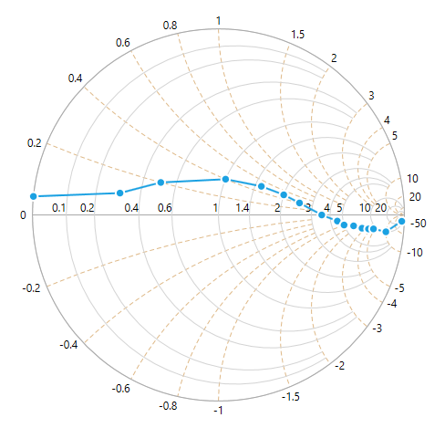

### MinorGridlines

By default, minor gridlines are not added to the Axis. The visibility of the minor gridlines can be controlled by using the *ShowMinorGridlines* property.





<syncfusion:SfSmithChart>
     <syncfusion:SfSmithChart.RadialAxis>
         <syncfusion:RadialAxis ShowMinorGridlines="True">
         </syncfusion:RadialAxis>
     </syncfusion:SfSmithChart.RadialAxis>
 </syncfusion:SfSmithChart>



 

//Customizing radial(Reactance) axis to the chart 
chart.RadialAxis = new RadialAxis();
chart.RadialAxis.ShowMinorGridlines = true;


    


**MinorGridlinesCount**

Minor gridlines can be added by defining *MinorGridlinesCount* property. By default, this value is  eight. It means, every 100 pixels it renders maximum eight minor gridlines.





<syncfusion:SfSmithChart>
     <syncfusion:SfSmithChart.RadialAxis>
         <syncfusion:RadialAxis ShowMinorGridlines="True" MinorGridlinesCount="12">
         </syncfusion:RadialAxis>
     </syncfusion:SfSmithChart.RadialAxis>
 </syncfusion:SfSmithChart>



 

//Customizing radial(Reactance) axis to the chart 
chart.RadialAxis = new RadialAxis();
chart.RadialAxis.ShowMinorGridlines = true;
chart.RadialAxis.MinorGridlinesCount = 12;


    


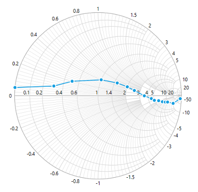

**MinorGridlineStyle**

SfSmithChart provides support to customize the style of the minor gridlines by defining the *MinorGridlineStyle* property as shown in the below code snippet.





<syncfusion:SfSmithChart x:Name="SmithChart">
    <syncfusion:SfSmithChart.Resources>
        
    </syncfusion:SfSmithChart.Resources>
        <syncfusion:SfSmithChart.RadialAxis>
        <syncfusion:RadialAxis ShowMinorGridlines="True" MinorGridlinesCount="12" MinorGridlineStyle="{StaticResource lineStyle}">
        </syncfusion:RadialAxis>
   </syncfusion:SfSmithChart.RadialAxis>
</syncfusion:SfSmithChart>



 

chart.RadialAxis.MinorGridlineStyle = this.Grid1.Resources["lineStyle"] as Style;


    


### AxisLine

SfSmithChart provides support to customize the style of the axis line by defining the *AxisLineStyle* property and change the visibility by using *ShowAxisLine* property as shown in the below code snippet.





<syncfusion:SfSmithChart x:Name="SmithChart">
    <syncfusion:SfSmithChart.Resources>
        
    </syncfusion:SfSmithChart.Resources>
        <syncfusion:SfSmithChart.RadialAxis>
        <syncfusion:RadialAxis ShowAxisLine="True" AxisLineStyle="{StaticResource lineStyle}">
        </syncfusion:RadialAxis>
   </syncfusion:SfSmithChart.RadialAxis>
</syncfusion:SfSmithChart>



 

chart.RadialAxis.AxisLineStyle = this.Grid1.Resources["lineStyle"] as Style;


    


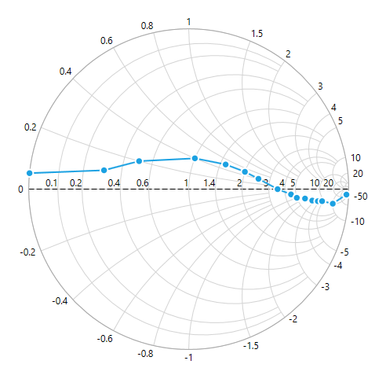

### LabelPlacement

The *LabelPlacement* property is used to position the axis label either inside or outside of the chart plotting area. By default, LabelsPlacement is **Outside**.





<syncfusion:SfSmithChart x:Name="SmithChart">
        <syncfusion:SfSmithChart.RadialAxis>
        <syncfusion:RadialAxis LabelPlacement="Inside">
        </syncfusion:RadialAxis>
   </syncfusion:SfSmithChart.RadialAxis>
</syncfusion:SfSmithChart>





//Positioning the radial axis labels to inside of Circle
chart.RadialAxis.LabelPlacement = LabelPlacement.Inside;


    


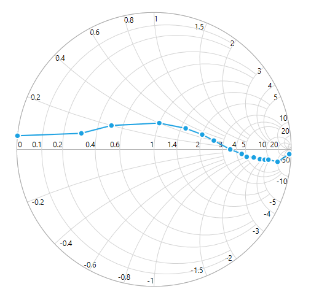

### LabelIntersectAction

When the Axis labels overlap with each other based on the chart dimensions and label size, use the *LabelIntersectAction* property of the axis to avoid overlapping. The default value of the LabelIntersectAction is **Hide**.





<syncfusion:SfSmithChart x:Name="SmithChart">
        <syncfusion:SfSmithChart.RadialAxis>
        <syncfusion:RadialAxis LabelIntersectAction="None">
        </syncfusion:RadialAxis>
   </syncfusion:SfSmithChart.RadialAxis>
</syncfusion:SfSmithChart>



 

//Set axis label intersect action
chart.RadialAxis.LabelIntersectAction = LabelIntersectActions.None;


    


## Events

* `LabelCreated`– Occurs when the label is created.

 

//Axis label created event hooked for RadialAxis
chart.RadialAxis.LabelCreated += RadialAxis_LabelCreated;

  //Event called for every label created in the axis.
  void RadialAxis_LabelCreated(object sender, EventArgs e)
  {
      var axisLabel = e as ChartAxisLabelEventArgs;

      //Customizing the specific label text and color
      if (axisLabel.Label.Text == "1")
      {
          axisLabel.Label.Text = "One";
          axisLabel.Label.Foreground = new SolidColorBrush(Colors.Red);
      }
  }



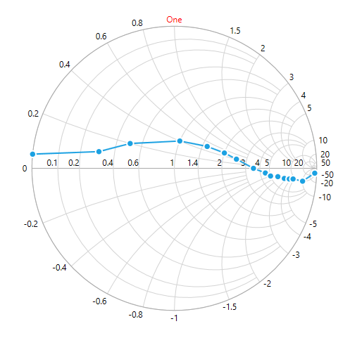