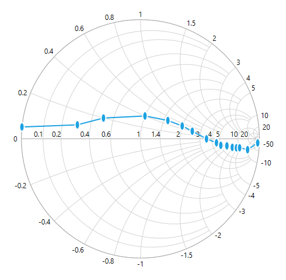
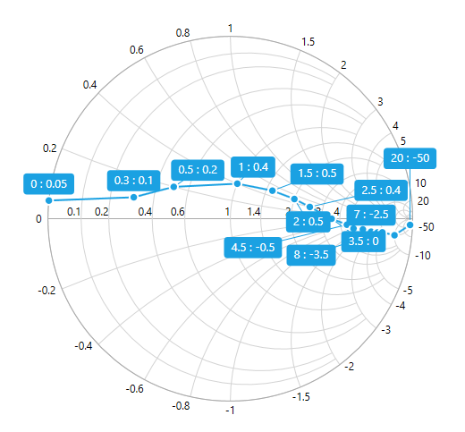
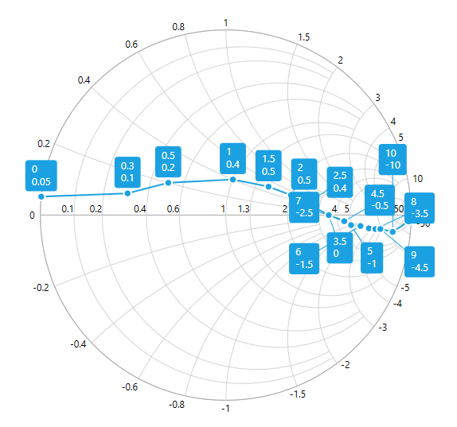

# Data Markers

Data markers are used to provide information about data point to the user. You can add a shape and label to adorn each data point.

## Add Shapes

Shapes can be added to line series to indicate each data point and it also can be added to the chart by enabling the `ShowMarker` option of the *Series* property. There are different shapes can be added to the chart by using the `MarkerType` option such as rectangle, circle, diamond, etc.

The following code example explains how to enable series marker and add shapes,





<syncfusion:SfSmithChart x:Name="SmithChart">
     <syncfusion:LineSeries ShowMarker="True" MarkerType="Circle">
     </syncfusion:LineSeries>
 </syncfusion:SfSmithChart>



 

LineSeries series = new LineSeries();
series.ShowMarker = true;
series.MarkerType = MarkerType.Circle;
chart.Series.Add(series);


    


## Customizing Marker

The markers interior, stroke, and size can be customized as demonstrated in the below code snippet.





<syncfusion:SfSmithChart x:Name="SmithChart">
     <syncfusion:LineSeries ShowMarker="True" MarkerType="Circle" MarkerHeight="12" MarkerWidth="12" MarkerInterior="Red" MarkerStroke="Yellow">
     </syncfusion:LineSeries>
 </syncfusion:SfSmithChart>



 

LineSeries series = new LineSeries();
series.ShowMarker = true;
series.MarkerType = MarkerType.Circle;
series.MarkerHeight = 12;
series.MarkerWidth = 12;
series.MarkerInterior = new SolidColorBrush(Colors.Red);
series.MarkerStroke = new SolidColorBrush(Colors.Yellow);
chart.Series.Add(series);


    


**MarkerTemplate**

Apart from the shapes, custom shapes also can be added to mark the data point by using the `MarkerTemplate` property.  To add custom shapes, define the *MarkerType* as **Custom**.

The following code example illustrates  how to add custom shapes,





<syncfusion:SfSmithChart x:Name="SmithChart">
   <syncfusion:SfSmithChart.Resources>
       <DataTemplate x:Key="Ellipse">
           <Ellipse Stretch="Fill" Fill="{Binding Interior}" Stroke="{Binding Stroke}" StrokeThickness="2" Width="10" Height="17" />
       </DataTemplate>
   </syncfusion:SfSmithChart.Resources>
   <syncfusion:LineSeries ShowMarker="True" MarkerType="Custom" MarkerTemplate="{StaticResource Ellipse}">
   </syncfusion:LineSeries>
 </syncfusion:SfSmithChart>



 

LineSeries series = new LineSeries();
series.ShowMarker = true;
series.MarkerType = MarkerType.Custom;
series.MarkerTemplate = this.Grid1.Resources["Ellipse"] as DataTemplate;
chart.Series.Add(series);


    


## Add Labels

Data label can be added to a chart series by setting the `ShowLabel` property as True in the series **DataLabel** option. By default, the data labels are displayed on top of the data point and it can be automatically adjusted its position when collide with another label.





<syncfusion:SfSmithChart x:Name="SmithChart">
   <syncfusion:LineSeries ItemsSource="{Binding Data}" ResistancePath="Resistance" ReactancePath="Reactance">
     <syncfusion:LineSeries.DataLabel>
         <syncfusion:DataLabel ShowLabel="True"></syncfusion:DataLabel>
     </syncfusion:LineSeries.DataLabel>
    </syncfusion:LineSeries>
 </syncfusion:SfSmithChart>



 

LineSeries series = new LineSeries();
series.DataLabel.ShowLabel = true;
chart.Series.Add(series);


    


N> The position changed data label will be connected by using connector line and the label will be hidden if there is no place to position it around the data point.

The following screenshot illustrates how the data labels can be positioned.

**LabelStyle**

The style for the data label can be defined by using *LabelStyle* property of **DataLabel**.





<syncfusion:SfSmithChart x:Name="SmithChart">
 <syncfusion:SfSmithChart.Resources>
   
  </syncfusion:SfSmithChart.Resources>
  <syncfusion:LineSeries>
     <syncfusion:LineSeries.DataLabel>
         <syncfusion:DataLabel ShowLabel="True" LabelStyle="{StaticResource labelStyle}">
         </syncfusion:DataLabel>
     </syncfusion:LineSeries.DataLabel>
    </syncfusion:LineSeries>
 </syncfusion:SfSmithChart>



 

LineSeries series = new LineSeries();
series.DataLabel.ShowLabel = true;
series.DataLabel.LabelStyle = this.Grid1.Resources["labelStyle"] as Style;
chart.Series.Add(series);


    


**LabelTemplate**

The label content can be formatted and customized by  using *LabelTemplate* property of **DataLabel**.  The following code example illustrates how the label content can be formatted and customized.





<syncfusion:SfSmithChart x:Name="SmithChart">
 <syncfusion:SfSmithChart.Resources>
     <DataTemplate x:Key="labelTemplate">
         <Border CornerRadius="4" Background="{Binding Background}" BorderThickness="1" Padding="8,4,8,4" BorderBrush="{Binding BorderBrush}">
             <Grid>
                 <Grid.RowDefinitions>
                     <RowDefinition/>
                     <RowDefinition/>
                 </Grid.RowDefinitions>
                 <TextBlock Grid.Row="0" Text="{Binding Resistance}" Style="{Binding LabelStyle}"/>
                 <TextBlock Grid.Row="1" Text="{Binding Reactance}"  Style="{Binding LabelStyle}"/>
             </Grid>
         </Border>
     </DataTemplate>
 </syncfusion:SfSmithChart.Resources>
     <syncfusion:LineSeries ShowMarker="True" ItemsSource="{Binding Data}" ResistancePath="Resistance" ReactancePath="Reactance">
     <syncfusion:LineSeries.DataLabel>
         <syncfusion:DataLabel ShowLabel="True" LabelTemplate="{StaticResource labelTemplate}"></syncfusion:DataLabel>
     </syncfusion:LineSeries.DataLabel>
    </syncfusion:LineSeries>
 </syncfusion:SfSmithChart>



 

LineSeries series = new LineSeries();
series.DataLabel.ShowLabel = true;
series.DataLabel.LabelTemplate = this.Grid1.Resources["labelTemplate"] as DataTemplate;
chart.Series.Add(series);


    


