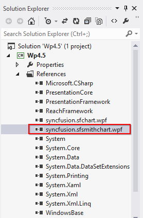
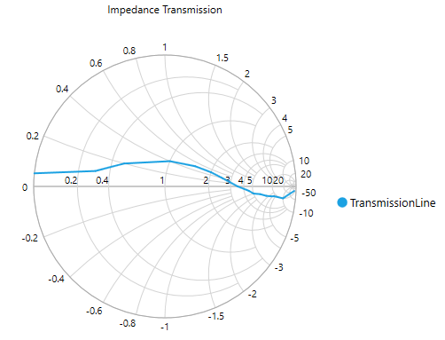

# Getting Started with WPF Smith Chart (SfSmithChart)

This section explains the steps required to build the application with SfSmithChart.

## Steps

1. Create new WPF project using Visual Studio. For more [details](https://msdn.microsoft.com/en-IN/library/bb546958(v=vs.90)).
2. Add the SfSmithChart assembly to your application. 
3. Initialize smith chart control.
4. Add header to the smith chart control.
5. Add series to the smith chart control.
6. Add legends for the series.
   
These steps are explained below in both XAML and code behind.

## Create a simple smith chart from XAML

### Adding assembly reference

1. Open the Add Reference window in your project.
2. Choose Windows > Extensions > Syncfusion.SfSmithChart.WPF.

3. Select the .NET Framework version with respect  to your application. The version can be identified as below:

<table>
<tr>
<td>
XX.X450.0.X
</td> 
 <td>4.5 Framework
 </td>
 </tr>
<tr>
<td>XX.X451.0.X
</td>
<td>4.5.1 Framework
</td>
</tr>
<tr>
<td>XX.X460.0.X
</td>
<td>4.6 Framework
</td>
</tr>
</table>

4. Add the following namespace in your XAML window.


xmlns:syncfusion="clr-namespace:Syncfusion.UI.Xaml.SmithChart;assembly=Syncfusion.SfSmithChart.WPF"


### Add SfSmithChart from Toolbox

Drag and drop the SfSmithChart control from the Toolbox into your application.

Now, the Syncfusion.SfSmithChart.WPF reference has been added to the application references and the xmlns namespace code has been generated in MainWindow.xaml as below.

In this section, the data in the following table is used for demonstration.

**Impedance** **Transmission** **of** **SmithChart**

<table>
<tr>
<th>
Resistance
</th>
<th>
Reactance
</th>
</tr>
<tr>
<td>
0
</td>
<td>
0.05
</td>
</tr>
<tr>
<td>
0.3
</td>
<td>
0.1
</td>
</tr>
<tr>
<td>
0.5
</td>
<td>
0.2
</td>
</tr>
<tr>
<td>
1.0
</td>
<td>
0.4
</td>
</tr>
<tr>
<td>
1.5
</td>
<td>
0.5
</td>
</tr>
<tr>
<td>
2.0
</td>
<td>
0.5
</td>
</tr>
<tr>
<td>
2.5
</td>
<td>
0.4
</td>
</tr>
<tr>
<td>
3.5
</td>
<td>
0.0
</td>
</tr>
<tr>
<td>
4.5
</td>
<td>
-0.5
</td>
</tr>
<tr>
<td>
5.0
</td>
<td>
-1.0
</td>
</tr>
<tr>
<td>
6.0
</td>
<td>
-1.5
</td>
</tr>
<tr>
<td>
7.0
</td>
<td>
-2.5
</td>
</tr>
<tr>
<td>
8.0
</td>
<td>
-3.5
</td>
</tr>
<tr>
<td>
9.0
</td>
<td>
-4.5
</td>
</tr>
<tr>
<td>
10
</td>
<td>
-10
</td>
</tr>
<tr>
<td>
20
</td>
<td>
-50
</td>
</tr>
</table>

Before proceeding with the smith chart, create data model with the above details as follows.


    public class TransmissionData
    {
        public double Resistance { get; set; }

        public double Reactance { get; set; }
    }


Create a collection property in MainWindow class as below:


    public partial class MainWindow : Window
    {
        public MainWindow()
        {
            InitializeComponent();
        }

        public ObservableCollection<TransmissionData> Data { get; set; } 
    }


Add the values to this TraceData property with the values illustrated in the above table.



    public MainWindow()
    { 
        InitializeComponent();

        Data = new ObservableCollection<TransmissionData>();

        Data.Add(new TransmissionData() { Resistance = 0, Reactance = 0.05 });
        Data.Add(new TransmissionData() { Resistance = 0.3, Reactance = 0.1 });
        Data.Add(new TransmissionData() { Resistance = 0.5, Reactance = 0.2 });
        Data.Add(new TransmissionData() { Resistance = 1.0, Reactance = 0.4 });
        Data.Add(new TransmissionData() { Resistance = 1.5, Reactance = 0.5 });
        Data.Add(new TransmissionData() { Resistance = 2.0, Reactance = 0.5 });
        Data.Add(new TransmissionData() { Resistance = 2.5, Reactance = 0.4 });
        Data.Add(new TransmissionData() { Resistance = 3.5, Reactance = 0.0 });
        Data.Add(new TransmissionData() { Resistance = 4.5, Reactance = -0.5 });
        Data.Add(new TransmissionData() { Resistance = 5, Reactance = -1.0 });
        Data.Add(new TransmissionData() { Resistance = 6, Reactance = -1.5 });
        Data.Add(new TransmissionData() { Resistance = 7, Reactance = -2.5 });
        Data.Add(new TransmissionData() { Resistance = 8, Reactance = -3.5 });
        Data.Add(new TransmissionData() { Resistance = 9, Reactance = -4.5 });
        Data.Add(new TransmissionData() { Resistance = 10, Reactance = -10 });
        Data.Add(new TransmissionData() { Resistance = 20, Reactance = -50 });
    }  
      


### Initialize the smith chart 

To to initialize the smith chart,  use the following class Syncfusion.UI.Xaml.SfSmithChart.



<syncfusion:SfSmithChart>

</syncfusion:SfSmithChart>



### Add header to smith chart

The header of the smith chart acts as the title and it is used to identify the purpose of the smith chart. 

Specify **Impedance Transmission** as header in the below code example.



    <Grid>

        <syncfusion:SfSmithChart Header="Impedance Transmission" Height="400" Width="500">
            
        </syncfusion:SfSmithChart>

    </Grid>



### Adding Axes

The following code example illustrates how to add and customize the resistance (Horizontal) and reactance (Radial) axes in the SfSmithChart.



    <syncfusion:SfSmithChart.HorizontalAxis>
        <syncfusion:HorizontalAxis FontSize="11" FontFamily="Segoe UI"></syncfusion:HorizontalAxis>
    </syncfusion:SfSmithChart.HorizontalAxis>
    <syncfusion:SfSmithChart.RadialAxis>
        <syncfusion:RadialAxis FontSize="11" FontFamily="Segoe UI"></syncfusion:RadialAxis>
    </syncfusion:SfSmithChart.RadialAxis>



### Adding series 

You can plot the line on smith chart map by adding line series.

You  should initialize the series for representing the **Transmission Data**.


    <syncfusion:LineSeries>                
    </syncfusion:LineSeries>		


After the series has been added, you  should add ItemSource, ResistancePath, and ReactancePath APIs to populate the data in smith chart.

* `ItemsSource` - It is a property to hold the data source, the data source or data collection can be bound with ItemsSource. 
* `ResistancePath` - It is a string property, used to map properties. It needs to be bound  with Resistance Axis (or HorizontalAxis). It is like a value member path in ListBox.
* `ReactancePath` - It is a string property, used to map properties. It needs to be bound with the Reactance Axis (Or RadialAxis). It is like a value member path in ListBox.
* `Label` - This property gives names for the series, which in turn mapped to the Legend.


        
    <syncfusion:LineSeries ResistancePath="Resistance" ReactancePath="Reactance" ItemsSource="{Binding Data}" Label="TransmissionLine">                
    </syncfusion:LineSeries>
		


### Add legends to the smith chart

The following code example illustrates how to add the syntax [`legends`]() in smith chart.



    <syncfusion:SfSmithChart.Legend>
        <syncfusion:SmithChartLegend>
		</syncfusion:SmithChartLegend>
    </syncfusion:SfSmithChart.Legend>



Now, the SmithChart has been prepared to demonstrate  the studies related to Transmission Line of Impedance. 

The following code example  illustrates the complete code for creating a smith chart.





        <syncfusion:SfSmithChart Header="Impedance Transmission" Height="400" Width="500">
            <!--Initialize the series for SfSmithChart-->
            <syncfusion:LineSeries ResistancePath="Resistance" ReactancePath="Reactance" ItemsSource="{Binding Data}" Label="TransmissionLine">                
            </syncfusion:LineSeries>
            <!--Initialize the resistance axis for SfSmithChart-->
            <syncfusion:SfSmithChart.HorizontalAxis>
                <syncfusion:HorizontalAxis FontSize="11"></syncfusion:HorizontalAxis>
            </syncfusion:SfSmithChart.HorizontalAxis>
            <!--Initialize the reactance axis for SfSmithChart-->
            <syncfusion:SfSmithChart.RadialAxis>
                <syncfusion:RadialAxis FontSize="11"></syncfusion:RadialAxis>
            </syncfusion:SfSmithChart.RadialAxis>
            <!--Adding Legend to the SfSmithChart-->
            <syncfusion:SfSmithChart.Legend>
                <syncfusion:SmithChartLegend></syncfusion:SmithChartLegend>
            </syncfusion:SfSmithChart.Legend>
        </syncfusion:SfSmithChart>





    public partial class MainWindow : Window
    {
        public ObservableCollection<TransmissionData> Data { get; set; } 
        public MainWindow()
        {
            this.DataContext = this;
            InitializeComponent();

            Data = new ObservableCollection<TransmissionData>();

            Data.Add(new TransmissionData() { Resistance = 0, Reactance = 0.05 });
            Data.Add(new TransmissionData() { Resistance = 0.3, Reactance = 0.1 });
            Data.Add(new TransmissionData() { Resistance = 0.5, Reactance = 0.2 });
            Data.Add(new TransmissionData() { Resistance = 1.0, Reactance = 0.4 });
            Data.Add(new TransmissionData() { Resistance = 1.5, Reactance = 0.5 });
            Data.Add(new TransmissionData() { Resistance = 2.0, Reactance = 0.5 });
            Data.Add(new TransmissionData() { Resistance = 2.5, Reactance = 0.4 });
            Data.Add(new TransmissionData() { Resistance = 3.5, Reactance = 0.0 });
            Data.Add(new TransmissionData() { Resistance = 4.5, Reactance = -0.5 });
            Data.Add(new TransmissionData() { Resistance = 5, Reactance = -1.0 });
            Data.Add(new TransmissionData() { Resistance = 6, Reactance = -1.5 });
            Data.Add(new TransmissionData() { Resistance = 7, Reactance = -2.5 });
            Data.Add(new TransmissionData() { Resistance = 8, Reactance = -3.5 });
            Data.Add(new TransmissionData() { Resistance = 9, Reactance = -4.5 });
            Data.Add(new TransmissionData() { Resistance = 10, Reactance = -10 });
            Data.Add(new TransmissionData() { Resistance = 20, Reactance = -50 });
        }
    }
  

    public class TransmissionData
    {
        public double Resistance { get; set; }

        public double Reactance { get; set; }
    }


    

    
    
The following smith chart is created as the result of above codes.

## Create a simple smith chart from code behind (C#)

Some developers prefer code behind as the first approach for development to create things dynamically. This section explains the steps required to create SfSmithChart from code behind.

### Adding assembly reference

1. Open the Add Reference window in your project.
2. Choose Windows > Extensions >Syncfusion.SfSmithChart.WPF
3. Add the following namespace in your C# file, MainWindow.xaml.cs.



using Syncfusion.UI.Xaml.SmithChart;



### Initialize the chart

To initialize the chart, create an instance for the SfSmithChart as below.



SfSmithChart chart = new SfSmithChart();



### Adding header to the smith chart

The header of the SmithChart acts as the title and it is used to identify the purpose of the smith chart.



chart.Header = "Impedance Transmission";



### Adding Axes

The following code example illustrates how to add and customize the resistance (Horizontal) and reactance (Radial) axes to the SfSmithChart.



    //Customizing horizontal(Resistance) axis to the smith chart 
    chart.HorizontalAxis = new HorizontalAxis();
    chart.HorizontalAxis.FontSize = 11;
	chart.HorizontalAxis.FontFamily = new FontFamily("Segoe UI");

    //Customizing radial(Reactance) axis to the smith chart 
    chart.RadialAxis = new RadialAxis();
    chart.RadialAxis.FontSize = 11;
	chart.RadialAxis.FontFamily = new FontFamily("Segoe UI");



### Adding series

You can plot the line on smith chart map by adding line series.

You  should initialize the series for representing the **Transmission Data**.



LineSeries series = new LineSeries();



After the series has been added, you  should add ItemSource, ResistancePath and, ReactancePath APIs to populate the data in smith chart.

* `ItemsSource` - It is a property to hold the data source, the data source or data collection can be bound with ItemsSource. 
* `ResistancePath` - It is a string property, used to map properties. It needs to be bound  with Resistance Axis (or HorizontalAxis). It is like a value member path in ListBox.
* `ReactancePath` - It is a string property, used to map properties. It needs to be bound with the Reactance Axis (Or RadialAxis). It is like a value member path in ListBox.
* `Label` - This property gives names for the series, which in turn mapped to the Legend.



    LineSeries series = new LineSeries();
    series.ItemsSource = Data;
    series.ResistancePath = "Resistance";
    series.ReactancePath = "Reactance";
	series.Label = "TransmissionLine";
	chart.Series.Add(series);



### Adding legends to the chart

The following code examples illustrates how to add [`legends`]() to your smith chart.



    SmithChartLegend legend = new SmithChartLegend();

    chart.Legend = legend;



Now, the SmithChart has been prepared to demonstrate the studies related to Transmission Line of Impedance. 

The following code example  illustrates the complete code for creating a smith chart.



        SfSmithChart chart = new SfSmithChart();

        chart.Header = "Impedance Transmission";
        
        //Customizing horizontal(Resistance) axis to the smith chart 
        chart.HorizontalAxis = new HorizontalAxis();
        chart.HorizontalAxis.FontSize = 11;
        chart.HorizontalAxis.FontFamily = new FontFamily("Segoe UI");

        //Customizing radial(Reactance) axis to the smith chart 
        chart.RadialAxis = new RadialAxis();
        chart.RadialAxis.FontSize = 11;
        chart.RadialAxis.FontFamily = new FontFamily("Segoe UI");

        //Adding series to SmithChart
        LineSeries series = new LineSeries();
        series.ItemsSource = Data;
        series.ResistancePath = "Resistance";
        series.ReactancePath = "Reactance";
        series.Label = "TransmissionLine";

        chart.Series.Add(series);

        //Adding legend to the SmithChart
        SmithChartLegend legend = new SmithChartLegend();
        chart.Legend = legend;

        this.DataContext = this;

        //Setting SmithChart as a Content for the Grid in Page
        this.Grid1.Children.Add(chart);



The following output is displayed as the result of above code example.

## Theme

Smith chart supports various built-in themes. Refer to the below links to apply themes for the Smith chart,

  * [Apply theme using SfSkinManager](https://help.syncfusion.com/wpf/themes/skin-manager)
	
  * [Create a custom theme using ThemeStudio](https://help.syncfusion.com/wpf/themes/theme-studio#creating-custom-theme)

