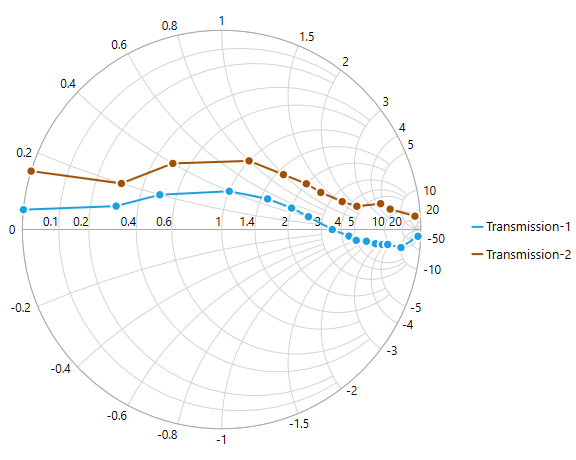
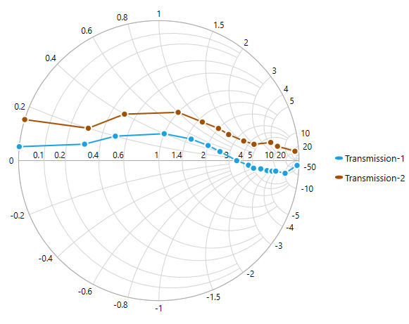
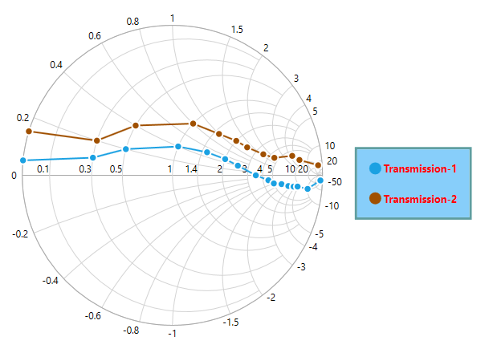
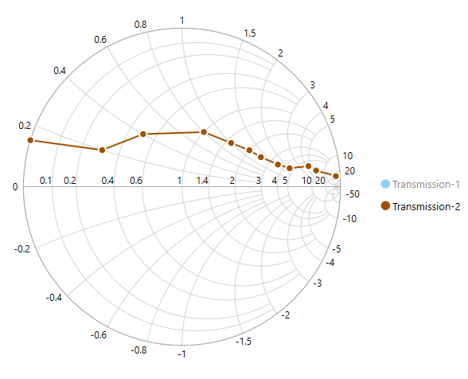

# Legend

The legend contains the list of chart series that appear in a SmithChart. It can be defined by using the following code example.

N> Add name to `Label` property of **Series**, which in turn mapped to the Legend.





<syncfusion:SfSmithChart x:Name="SmithChart">
   <syncfusion:LineSeries Label="Transmission-1" ShowMarker="True" ResistancePath="Resistance" ReactancePath="Reactance" ItemsSource="{Binding Data1}">                
   </syncfusion:LineSeries>
   <syncfusion:LineSeries Label="Transmission-2" ShowMarker="True" ResistancePath="Resistance" ReactancePath="Reactance" ItemsSource="{Binding Data2}">
   </syncfusion:LineSeries>
   
   <!--Adding Legend to SmithChart-->
   <syncfusion:SfSmithChart.Legend>
       <syncfusion:SmithChartLegend></syncfusion:SmithChartLegend>
   </syncfusion:SfSmithChart.Legend> 
</syncfusion:SfSmithChart>



 

SfSmithChart chart = new SfSmithChart();

//Create line series1
 LineSeries series1 = new LineSeries();
//Display the legend text for the series.
 series1.Label = "Transmission-1";
 series1.ItemsSource = Data1;
 series1.ResistancePath = "Resistance";
 series1.ReactancePath = "Reactance";
 series1.ShowMarker = true;
 chart.Series.Add(series1);

 //Create line series2
 LineSeries series2 = new LineSeries();
//Display the legend text for the series.
 series2.Label = "Transmission-2";
 series2.ItemsSource = Data2;
 series2.ResistancePath = "Resistance";
 series2.ReactancePath = "Reactance";
 series2.ShowMarker = true;
 chart.Series.Add(series2);

//Adding legend to the SmithChart
 SmithChartLegend legend = new SmithChartLegend();
 chart.Legend = legend;

this.Grid1.Children.Add(chart);


    


## Positioning the Legend

**Docking**

Legends can be docked at left, right, and top or bottom around the chart area by using *DockPosition* property. 

By default, the Smith chart Legend is docked at the Right of the chart.

To display the legend at the bottom, set the *DockPosition* as Bottom as in below code snippet.





<syncfusion:SfSmithChart x:Name="SmithChart">
     <!--Adding Legend to SmithChart-->
   <syncfusion:SfSmithChart.Legend>
       <syncfusion:SmithChartLegend DockPosition="Bottom">
       </syncfusion:SmithChartLegend>
   </syncfusion:SfSmithChart.Legend>
</syncfusion:SfSmithChart>



 

//Adding legend to the SmithChart
SmithChartLegend legend = new SmithChartLegend();
legend.DockPosition = ChartDock.Bottom;
chart.Legend = legend;


    


**Floating Legends**

To position the legend at any arbitrary location inside the chart, set *DockPosition* as **Floating** and provide its relative position by using *OffsetX* and *OffsetY* properties.

Offset specifies x or y distance from origin.





<syncfusion:SfSmithChart x:Name="SmithChart">
  <!--Adding legend to SmithChart-->
  <syncfusion:SfSmithChart.Legend>
    <syncfusion:SmithChartLegend DockPosition="Floating" OffsetX="200" OffsetY="120">
    </syncfusion:SmithChartLegend>
   </syncfusion:SfSmithChart.Legend>
</syncfusion:SfSmithChart>



 

//Adding legend to the SmithChart
SmithChartLegend legend = new SmithChartLegend();
legend.DockPosition = ChartDock.Floating;
legend.OffsetX = 200;
legend.OffsetY = 120;
chart.Legend = legend;


    


## Legend Icon

Represents the symbol associated with each legend item. By default, the legend icon is Circle.

Legend Icon can be customized by using the `LegendIcon` property in Smith chart legend as in the below code snippet:





<syncfusion:SfSmithChart x:Name="SmithChart">
  <!--Adding legend to SmithChart-->
  <syncfusion:SfSmithChart.Legend>
    <syncfusion:SmithChartLegend LegendIcon="HorizontalLine">
    </syncfusion:SmithChartLegend>
   </syncfusion:SfSmithChart.Legend>
</syncfusion:SfSmithChart>



 

//Adding legend to the SmithChart
SmithChartLegend legend = new SmithChartLegend();
legend.LegendIcon = SmithChartLegendIcon.HorizontalLine;
chart.Legend = legend;


    


**Custom Legend Icon**

Custom icon for the legend can be added by using **LegendIconTemplate** property in Smith chart Legend as in below code example.





<syncfusion:SfSmithChart x:Name="SmithChart">    
 <syncfusion:SfSmithChart.Resources>
        <DataTemplate x:Key="Ellipse">
            <Ellipse Stretch="Fill" Fill="{Binding Interior}" Width="12" Height="5" />
        </DataTemplate>
    </syncfusion:SfSmithChart.Resources>
    <!--Adding custom legend icon to SmithChart-->
    <syncfusion:SfSmithChart.Legend>
        <syncfusion:SmithChartLegend LegendIcon="Custom" LegendIconTemplate="{StaticResource Ellipse}">
    </syncfusion:SmithChartLegend>
   </syncfusion:SfSmithChart.Legend>
</syncfusion:SfSmithChart>



 

SmithChartLegend legend = new SmithChartLegend();
//Adding custom legend icon to SmithChart
legend.LegendIcon = SmithChartLegendIcon.Custom;
legend.LegendIconTemplate = this.Grid1.Resources["Ellipse"] as DataTemplate;
chart.Legend = legend;


    


## Customizing Legend

The following code example illustrates the customization of legend icon and text.





<syncfusion:SfSmithChart x:Name="SmithChart"> 
  <syncfusion:SfSmithChart.Legend>
        <syncfusion:SmithChartLegend IconHeight="15" IconWidth="15" ItemMargin="10"
                                     FontWeight="Bold" Foreground="Red" FontSize="13"
                                     Background="LightGray" BorderBrush="CadetBlue"
                                     BorderThickness="3">
   </syncfusion:SfSmithChart.Legend>
</syncfusion:SfSmithChart>



 

//Adding legend to the Smith chart
 SmithChartLegend legend = new SmithChartLegend();
 
 //Customizing the Smith chart legend icon
 legend.IconHeight = 15;
 legend.IconWidth = 15;
 legend.ItemMargin = new Thickness(10);
 
 //Customizing legend text
 legend.Foreground = new SolidColorBrush(Colors.Red);
 legend.FontSize = 13;
 legend.FontWeight = FontWeights.Bold;
 
 legend.Background = new SolidColorBrush(Colors.LightSkyBlue);
 legend.BorderBrush = new SolidColorBrush(Colors.CadetBlue);
 legend.BorderThickness = new Thickness(3);
 chart.Legend = legend;


    


## VisibilityOnLegend

To limit the number of series to be displayed in chart, use *VisibilityOnLegend* property as shown in the below code example.





<syncfusion:SfSmithChart x:Name="SmithChart">
   <syncfusion:LineSeries VisibilityOnLegend="False" Label="Transmission-1" ShowMarker="True" ResistancePath="Resistance" ReactancePath="Reactance" ItemsSource="{Binding Data1}">
   </syncfusion:LineSeries>
   <syncfusion:LineSeries Label="Transmission-2" ShowMarker="True" ResistancePath="Resistance" ReactancePath="Reactance" ItemsSource="{Binding Data2}">
   </syncfusion:LineSeries>
   <syncfusion:SfSmithChart.Legend>
        <syncfusion:SmithChartLegend IconHeight="15" IconWidth="15" 
                                     FontWeight="Bold" Foreground="Red" FontSize="13"
                                     Background="LightGray" BorderBrush="CadetBlue"
                                     BorderThickness="3">
        </syncfusion:SmithChartLegend>
   </syncfusion:SfSmithChart.Legend>
</syncfusion:SfSmithChart>



 

//Create line series1
LineSeries series1 = new LineSeries();
series1.Label = "Transmission-1";
//Remove the LegendItem from legend collections.
series1.VisibilityOnLegend = false;
chart.Series.Add(series1);

//Create line series2
LineSeries series2 = new LineSeries();
series2.Label = "Transmission-2";
chart.Series.Add(series2);

//Adding legend to the SmithChart
SmithChartLegend legend = new SmithChartLegend();
chart.Legend = legend;


    


## Series Visibility

To hide the series segment programmatically, set *IsSeriesVisible* property as False for the specific series. After  the property has been set, the legend item for the specific series will be displayed with shade. 

Now, you can show/hide the series segment on chart by clicking on the particular legend item.





<syncfusion:SfSmithChart x:Name="SmithChart">
   <syncfusion:LineSeries IsSeriesVisible="False" Label="Transmission-1" ShowMarker="True" ResistancePath="Resistance" ReactancePath="Reactance" ItemsSource="{Binding Data1}">                
   </syncfusion:LineSeries>
   <syncfusion:LineSeries Label="Transmission-2" ShowMarker="True" ResistancePath="Resistance" ReactancePath="Reactance" ItemsSource="{Binding Data2}">
   </syncfusion:LineSeries>
   <syncfusion:SfSmithChart.Legend>
        <syncfusion:SmithChartLegend>
        </syncfusion:SmithChartLegend>
   </syncfusion:SfSmithChart.Legend>
</syncfusion:SfSmithChart>



 

//Create line series1
LineSeries series1 = new LineSeries();
series1.Label = "Transmission-1";
//Hide the series visibility in Chart.
series1.IsSeriesVisible = false;
chart.Series.Add(series1);

//Create line series2
LineSeries series2 = new LineSeries();
series2.Label = "Transmission-2";
chart.Series.Add(series2);

//Adding legend to the SmithChart
SmithChartLegend legend = new SmithChartLegend();
chart.Legend = legend;


    


