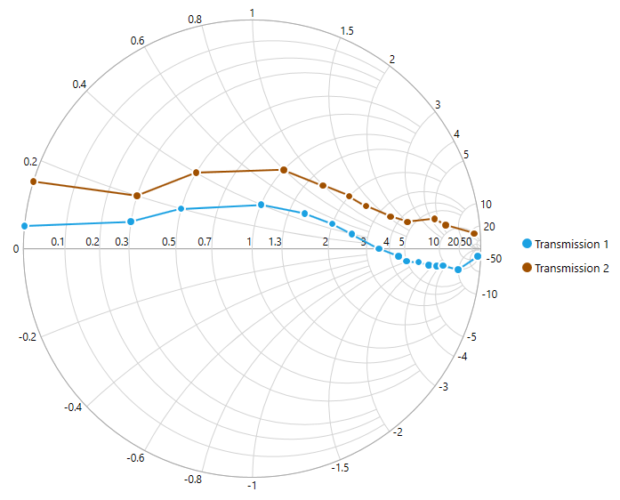

# About Syncfusion® WPF Smith Chart control

The Smith chart is one of the most useful data visualization tools for high-frequency circuit applications. It contains two sets of circles to plot the parameters of transmission lines.

SfSmithChart provides a perfect way to visualize data with a high level of user interactivity that focuses on development, productivity, and simplicity of use. 

    

## Key features

* Visualization of the impedance and admittance of a transmission line.
* Representation of data with line series and various types of markers.
* Data label support for better readability.
* Interactive tooltip support.
* Interactive legend.
* Customizable colors.
* Allows mapping the data from the specified path by achieving the [data binding]() concept.
 

