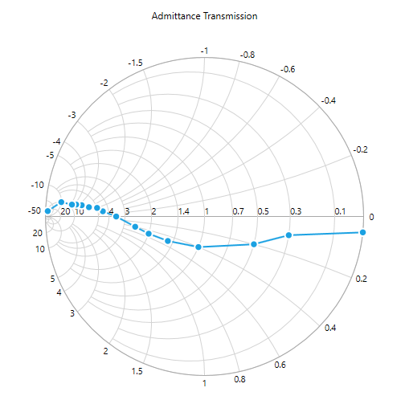

# RenderingType

SfSmithChart  plots the transmission line in two different ways by using `RenderingType` property. The two  ways are given below.

## Impedance

In impedance smith chart, normalized resistance circles and normalized reactance curves are drawn from right to left.  Axis label ranges are start from left to right.

Impedance is the default rendering type of SmithChart.





<syncfusion:SfSmithChart RenderingType="Impedance">
            
</syncfusion:SfSmithChart>



 

SfSmithChart chart = new SfSmithChart();
chart.RenderingType = RenderingType.Impedance;


    


## Admittance

In Admittance smith chart, normalized resistance circles and normalized reactance curves are drawn from left to right.  Axis label ranges are start from right to left.





<syncfusion:SfSmithChart RenderingType="Admittance">
            
</syncfusion:SfSmithChart>



 

SfSmithChart chart = new SfSmithChart();
chart.RenderingType = RenderingType.Admittance;


    


