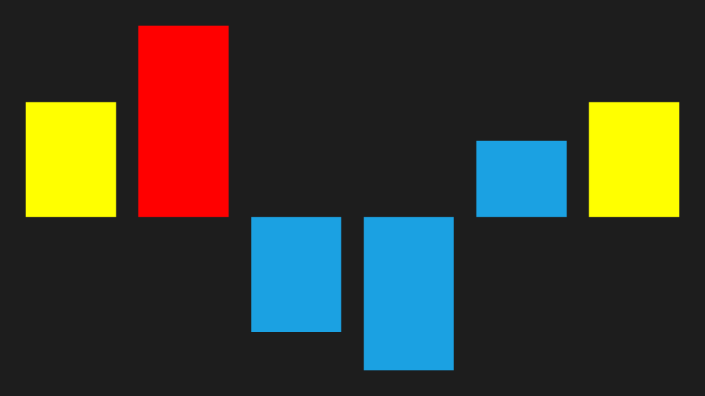

# Customize segment brush

We can able to customize the first, last, negative, high and low point brushes as like markers in area and line sparkline.





<Syncfusion:SfColumnSparkline ItemsSource="{Binding UsersList}" YBindingPath="NoOfUsers" >

            <Syncfusion:SfColumnSparkline.SegmentTemplateSelector>

                <Syncfusion:SegmentTemplateSelector FirstPointBrush="Yellow" LastPointBrush="Yellow" HighPointBrush="Red"/>

            </Syncfusion:SfColumnSparkline.SegmentTemplateSelector>

        </Syncfusion:SfColumnSparkline>
		




SfColumnSparkline sparkline = new SfColumnSparkline()
{

    ItemsSource = new SparkViewModel().UsersList,

    YBindingPath = "NoOfUsers"

};

SegmentTemplateSelector selector = new SegmentTemplateSelector()
{

    FirstPointBrush = new SolidColorBrush(Colors.Yellow),

    LastPointBrush = new SolidColorBrush(Colors.Yellow),

    HighPointBrush = new SolidColorBrush(Colors.Red)

};

sparkline.SegmentTemplateSelector = selector;





Following is the snapshot for customize segment,

