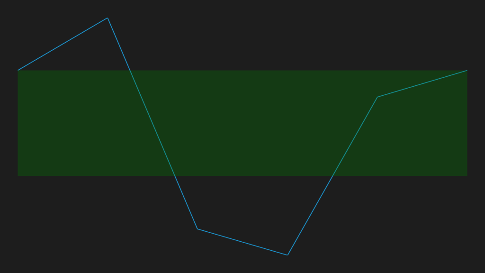

# Range Band in WPF Sparkline (SfSparkline)

Range band feature used to highlight the particular mentioned range along Y axis.





<Syncfusion:SfLineSparkline 

			ItemsSource="{Binding UsersList}" 

			BandRangeStart="2000”

			BandRangeEnd="-1000” RangeBandBrush="Green”

			YBindingPath="NoOfUsers">

</Syncfusion:SfLineSparkline >





SfLineSparkline sparkline = new SfLineSparkline()
{

	ItemsSource = new SparkViewModel().UsersList,

	YBindingPath = "NoOfUsers",

	BandRangeStart = 2000,

	BandRangeEnd = -1000,

	RangeBandBrush = new SolidColorBrush(Colors.Green)

};





Following is the snapshot for range band,

