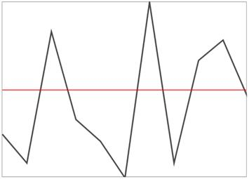
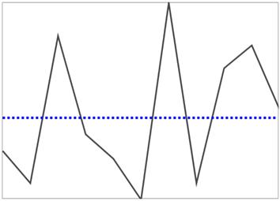

# ShowHide Axis in WPF Sparkline (SfSparkline)

Following code used to enable the axis and this feature applicable for all the sparkline except WinLoss sparkline, also you can style the axis by AxisStyle property and position the axis by AxisOrigin property.





<Syncfusion:SfLineSparkline ShowAxis="True" ItemsSource="{Binding UsersList}" YBindingPath="NoOfUsers" >

</Syncfusion:SfLineSparkline>





SfLineSparkline sparkline = new SfLineSparkline()
{

    ItemsSource = new SparkViewModel().UsersList,

    YBindingPath = "NoOfUsers",

    ShowAxis = true

};





Following is the snapshot for axis visibility,

**Axis Origin**





<Syncfusion:SfLineSparkline Height="250" Width="350" Interior="#4a4a4a"  

BorderBrush="DarkGray" BorderThickness="1"

ShowAxis="True" 

AxisOrigin="2" ItemsSource="{Binding UsersList}" 

YBindingPath="NoOfUsers">

</Syncfusion:SfLineSparkline >





SfLineSparkline sparkline = new SfLineSparkline()
{

    ItemsSource = new SparkViewModel().UsersList,

    YBindingPath = "NoOfUsers",

    ShowAxis = true,

    AxisOrigin = 2,

    Interior = new SolidColorBrush(Color.FromRgb(0x4a, 0x4a, 0x4a)),

    BorderBrush = new SolidColorBrush(Colors.DarkGray),

    BorderThickness = new Thickness(1)

};





**Axis LineStyle**





<Grid.Resources>

    

</Grid.Resources>

<Syncfusion:SfLineSparkline Height="250" Width="350" Interior="#4a4a4a"   

BorderBrush="DarkGray"  BorderThickness="1"

ShowAxis="True" AxisStyle="{StaticResource lineStyle2}"   

AxisOrigin="1" ItemsSource="{Binding UsersList}"   

YBindingPath="NoOfUsers">

</Syncfusion:SfLineSparkline >





SfLineSparkline sparkline = new SfLineSparkline()
{

    ItemsSource = new SparkViewModel().UsersList,

    YBindingPath = "NoOfUsers",

    ShowAxis = true,

    AxisOrigin = 1,

    AxisStyle = grid.Resources["lineStyle2"] as Style,

    Interior = new SolidColorBrush(Color.FromRgb(0x4a, 0x4a, 0x4a)),

    BorderBrush = new SolidColorBrush(Colors.DarkGray),

    BorderThickness = new Thickness(1)

};





