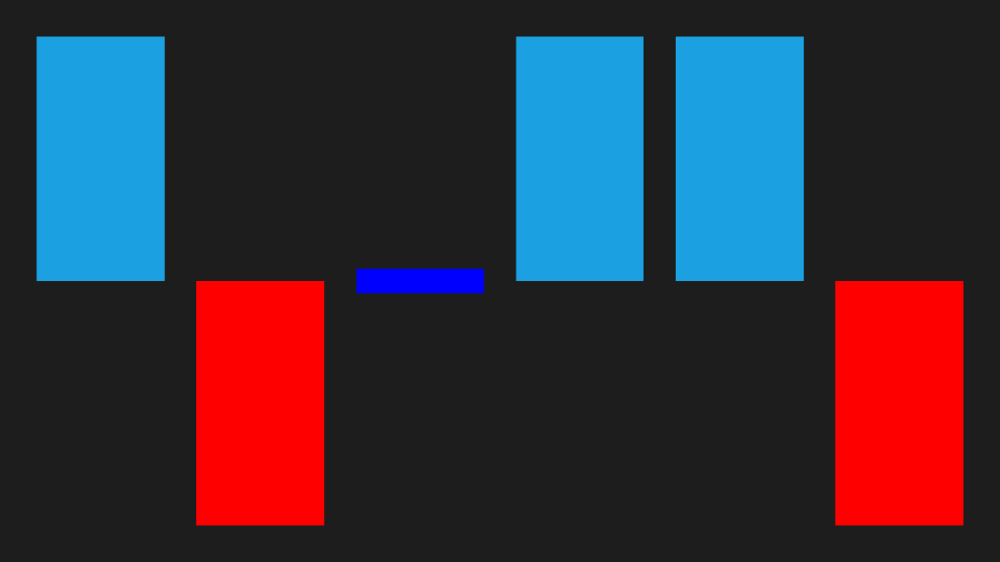

# Sparkline Types in WPF Sparkline (SfSparkline)

## Line Sparkline

Line sparkline rendered using polyline and the following code is used to create line sparkline,





<Grid.DataContext>

	<local:UsersViewModel/>

</Grid.DataContext>

<Syncfusion:SfLineSparkline ItemsSource="{Binding UsersList}" YBindingPath="NoOfUsers">

</Syncfusion:SfLineSparkline >





SfLineSparkline sparkline = new SfLineSparkline()
{

	ItemsSource = new SparkViewModel().UsersList,

	YBindingPath = "NoOfUsers"

};





The following illustrates the result of the above code sample,

## Column Sparkline

Column sparkline used to visualize the raw data as a rectangle and following code is used to create column sparkline,





<Syncfusion:SfColumnSparkline ItemsSource="{Binding UsersList}" YBindingPath="NoOfUsers" >

</Syncfusion:SfColumnSparkline>





SfColumnSparkline sparkline = new SfColumnSparkline()
{

	ItemsSource = new SparkViewModel().UsersList,

	YBindingPath = "NoOfUsers"

};





Following is the snapshot for Column Sparkline,

## Area sparkline

Following code is used to create area sparkline and all the line sparkline features are applicable for area sparkline,





<Syncfusion:SfAreaSparkline ItemsSource="{Binding UsersList}"  YBindingPath="NoOfUsers">

</Syncfusion:SfAreaSparkline >





SfAreaSparkline sparkline = new SfAreaSparkline()
{

	ItemsSource = new SparkViewModel().UsersList,

	YBindingPath = "NoOfUsers"

};





Following is the snapshot for area sparkline,

## WinLoss Sparkline

WinLoss sparkline render as a column segment and it show the positive, negative and neutral values.





<Page.DataContext>

	<local:MatchDetailsViewModel/>

</Page.DataContext>

<Syncfusion:SfWinLossSparkline x:Name="sparkline" ItemsSource="{Binding Match}" YBindingPath="Result" >

</Syncfusion:SfWinLossSparkline>





SfWinLossSparkline sparkline = new SfWinLossSparkline()
{

	ItemsSource = new SparkViewModel().Match,

	YBindingPath = "Result"

};

public class MatchDetailsModel

{

	public double Result { get; set; }

	public string Status { get; set; }

}

public class MatchDetailsViewModel

{

	public MatchDetailsViewModel()

	{

		this.Match = new ObservableCollection<MatchDetailsModel>();

		this.Match.Add(new MatchDetailsModel() { Result = 1, Status = "Win" });

		this.Match.Add(new MatchDetailsModel() { Result = -1, Status = "Loss" });

		this.Match.Add(new MatchDetailsModel() { Result = 0, Status = "Draw" });

		this.Match.Add(new MatchDetailsModel() { Result = 1, Status = "Win" });

		this.Match.Add(new MatchDetailsModel() { Result = 1, Status = "Win" });

		this.Match.Add(new MatchDetailsModel() { Result = -1, Status = "Loss" });

	}

	public ObservableCollection<MatchDetailsModel> Match { get; set; }

}





Execute the above code to render the following output.

