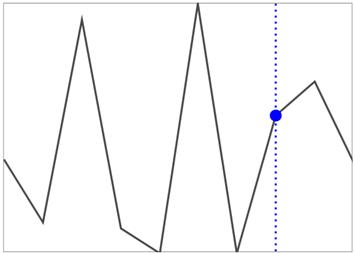

# Trackball in WPF Sparkline

The track ball is used to indicate the value point on mouse move. This feature is applicable for line and area sparklines.





<Syncfusion:SfLineSparkline 
    ItemsSource="{Binding UsersList}" 
    ShowTrackBall="True"
    YBindingPath="NoOfUsers">
</Syncfusion:SfLineSparkline>
  




SfLineSparkline sparkline = new SfLineSparkline()
{
    ItemsSource = new UsersViewModel().UsersList,
    YBindingPath = "NoOfUsers",
    ShowTrackBall = true
};





The following is a snapshot of the track ball.

**Customizing the track ball**

**Customizing the track ball**

You can customize the default appearance of the track ball by using the `TrackBallStyle` property. 

The following code shows how to apply the style for the track ball line.





<Grid.Resources>
    

    
</Grid.Resources>

<Syncfusion:SfLineSparkline
    Height="250"
    Width="350"
    Interior="#4a4a4a"
    BorderBrush="DarkGray"
    BorderThickness="1"
    ItemsSource="{Binding UsersList}"
    ShowTrackBall="True"
    TrackBallStyle="{StaticResource lineStyle1}"
    LineStyle="{StaticResource lineStyle2}"
    YBindingPath="NoOfUsers">
</Syncfusion:SfLineSparkline>





SfLineSparkline sparkline = new SfLineSparkline()
{
    ItemsSource = new UsersViewModel().UsersList,
    YBindingPath = "NoOfUsers",
    ShowTrackBall = true,
    Interior = new SolidColorBrush(Color.FromRgb(0x4a, 0x4a, 0x4a)),
    BorderBrush = new SolidColorBrush(Colors.DarkGray),
    BorderThickness = new Thickness(1),
    TrackBallStyle = this.Resources["lineStyle1"] as Style,
    LineStyle = this.Resources["lineStyle2"] as Style
};





