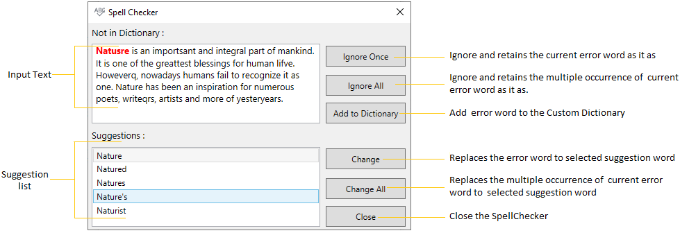
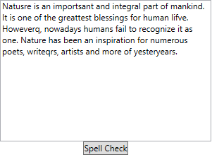
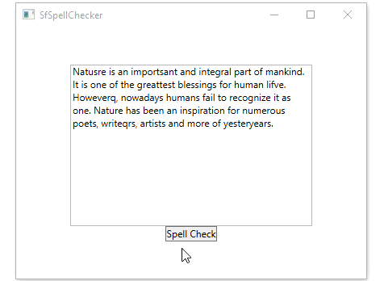
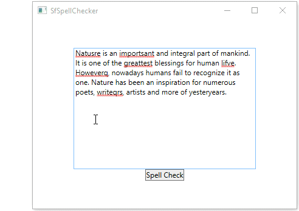
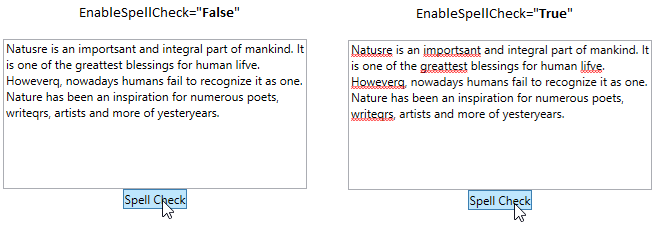
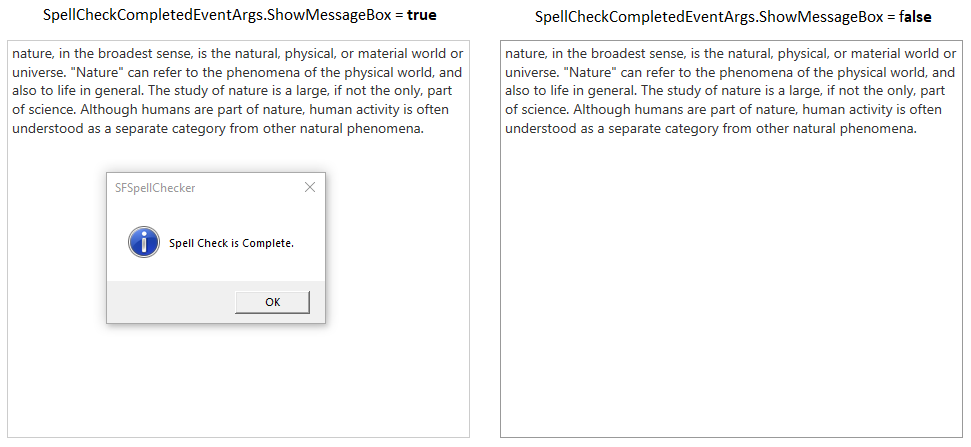
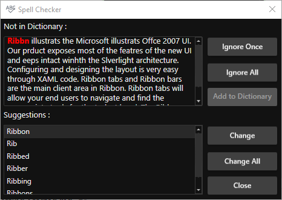

---
layout: post
title: Getting Started with WPF SfSpellChecker | Syncfusion®
description: Learn how to get started with the Syncfusion WPF SfSpellChecker control, its elements, and more details.
platform: wpf
control: SfSpellChecker
documentation: ug
--- 

# Getting Started with WPF SpellChecker

This section explains how to create a [WPF SpellChecker](https://www.syncfusion.com/wpf-controls/spellchecker) and spell check the text.

## Control Structure

## Assembly deployment

Refer to the [control dependencies](https://help.syncfusion.com/wpf/control-dependencies#sfspellchecker) section to get the list of assemblies or NuGet packages that need to be added as a reference to use the control in any application.

You can find more details about installing the NuGet package in a WPF application in the following link:

[How to install nuget packages](https://help.syncfusion.com/wpf/installation/install-nuget-packages)

## Adding WPF SpellChecker to an application

Spell-checking operations can be performed on text-editor controls through `WPF SpellChecker` in a WPF application.

You can add the `WPF SpellChecker` to an application by following these steps:

1. Create a WPF project in Visual Studio and include the following assembly:

    * Syncfusion.SfSpellChecker.WPF

2. Add a `TextBox` control and set the [SfSpellChecker.SpellChecker](https://help.syncfusion.com/cr/wpf/Syncfusion.Windows.Controls.SfSpellChecker.html#Syncfusion_Windows_Controls_SfSpellChecker_SpellCheckerProperty) attached property to perform spell check.

N> The `syncfusion:` prefix used below requires `xmlns:syncfusion="http://schemas.syncfusion.com/wpf"` to be declared on the root `<Window>` element.





<Window x:Class="SpellCheckerSample.MainWindow"
        xmlns="http://schemas.microsoft.com/winfx/2006/xaml/presentation"
        xmlns:x="http://schemas.microsoft.com/winfx/2006/xaml"
        xmlns:syncfusion="http://schemas.syncfusion.com/wpf"
        Title="MainWindow" Height="450" Width="800">
    <Grid>
        <StackPanel>
            <TextBox
                Text="Natusre is an importsant and integral part of mankind. It is one of the greattest blessings for human lifve. Howeverq, nowadays humans fail to recognize it as one. Nature has been an inspiration for numerous poets, writeqrs, artists and more of yesteryears."
                Name="textbox"
                TextWrapping="Wrap">
                <!--Adding SpellChecker to the TextBox-->
                <syncfusion:SfSpellChecker.SpellChecker>
                    <syncfusion:SfSpellChecker
                        x:Name="spellChecker"
                        EnableSpellCheck="True"/>
                </syncfusion:SfSpellChecker.SpellChecker>
            </TextBox>
            <Button
                Content="Spell Check"
                Click="SpellCheck_ButtonClick"
                HorizontalAlignment="Center"/>
        </StackPanel>
    </Grid>
</Window>




//Creating a spell checker instance
SfSpellChecker spellChecker = new SfSpellChecker();

//Enabling the spell check (default is true)
spellChecker.EnableSpellCheck = true;

//Assigning a spellchecker to the TextBox
SfSpellChecker.SetSpellChecker(textbox, spellChecker);




{{ codesnippet1 | OrderList_Indent_Level_1 }}

3. If you want to open the `WPF SpellChecker` while clicking on the `Spell Check button`, call the [PerformSpellCheckUsingDialog](https://help.syncfusion.com/cr/wpf/Syncfusion.Windows.Controls.SfSpellChecker.html#Syncfusion_Windows_Controls_SfSpellChecker_PerformSpellCheckUsingDialog_Syncfusion_Windows_Controls_IEditorProperties_) method inside the `SpellCheck ButtonClick` method.





//Call SpellCheck method to open SpellCheck on button click
private void SpellCheck_ButtonClick(object sender, RoutedEventArgs e) {
    spellChecker.PerformSpellCheckUsingDialog();
}




{{ codesnippet2 | OrderList_Indent_Level_1 }}

N> View [Sample](https://github.com/SyncfusionExamples/WPF-SpellChecker-examples/tree/master/Samples/SfSpellChecker) in GitHub

## Fix spelling mistakes using spell check dialog

1. Open a `WPF SpellChecker` by clicking the **Spell Check** button; it opens as a pop-up containing a `TextSpellEditor`.

2. Error words are highlighted with a red foreground.

3. Replace an error word with a suggested word by double-clicking the suggestion in the list, or by selecting it and pressing the **Change** button.

N> View [Sample](https://github.com/SyncfusionExamples/WPF-SpellChecker-examples/tree/master/Samples/SfSpellChecker) in GitHub

## Fix spelling mistakes using context menu

You can correct misspelled words by choosing the correct option from the suggestions listed in the context menu. You can get the suggestions by right-clicking the error word. Error words are differentiated by a red underline. You can disable context-menu suggestions by setting the `EnableContextMenu` property to `false`. The default value of `EnableContextMenu` is `true`.




<Grid>
    <StackPanel>
        <TextBox
            Text="Natusre is an importsant and integral part of mankind. It is one of the greattest blessings for human lifve. Howeverq, nowadays humans fail to recognize it as one. Nature has been an inspiration for numerous poets, writeqrs, artists and more of yesteryears."
            Name="textbox"
            TextWrapping="Wrap"
            VerticalContentAlignment="Top">
            <!--Adding SpellChecker to the TextBox-->
            <syncfusion:SfSpellChecker.SpellChecker>
                <syncfusion:SfSpellChecker
                    x:Name="spellChecker"
                    EnableContextMenu="True"
                    EnableSpellCheck="True"/>
            </syncfusion:SfSpellChecker.SpellChecker>
        </TextBox>
        <Button
            Content="Spell Check"
            Click="SpellCheck_ButtonClick"
            HorizontalAlignment="Center"/>
    </StackPanel>
</Grid>




//Enable Contextmenu to spellcheck
spellChecker.EnableContextMenu = true;
spellChecker.EnableSpellCheck = true;







//Call SpellCheck method to open SpellCheck on button click
private void SpellCheck_ButtonClick(object sender, RoutedEventArgs e) {
    spellChecker.PerformSpellCheckUsingDialog();
}




N> View [Sample](https://github.com/SyncfusionExamples/WPF-SpellChecker-examples/tree/master/Samples/SfSpellChecker) in GitHub

## Disable spell checking

If you want to disable the spell check operation, use the `EnableSpellCheck` property value as `false`.If the `EnableSpellCheck` property value is `false`, you will not be able to use both the context menu and SpellCheck dialogue to perform spell checking operations. The default value of `EnableSpellCheck` property is `true`.




<Grid>
    <StackPanel>
        <TextBox
            Text="Natusre is an importsant and integral part of mankind. It is one of the greattest blessings for human lifve. Howeverq, nowadays humans fail to recognize it as one. Nature has been an inspiration for numerous poets, writeqrs, artists and more of yesteryears."
            Name="textbox"
            TextWrapping="Wrap">
            <!--Adding SpellChecker to the TextBox-->
            <syncfusion:SfSpellChecker.SpellChecker>
                <syncfusion:SfSpellChecker
                    x:Name="spellChecker"
                    EnableSpellCheck="False"/>
            </syncfusion:SfSpellChecker.SpellChecker>
        </TextBox>
        <Button
            Content="Spell Check"
            Click="SpellCheck_ButtonClick"
            HorizontalAlignment="Center"/>
    </StackPanel>
</Grid>




//Restrict the  spell check operation
spellChecker.EnableSpellCheck = false;







//Call SpellCheck method to open SpellCheck on button click
private void SpellCheck_ButtonClick(object sender, RoutedEventArgs e) {
    spellChecker.PerformSpellCheckUsingDialog();
}




N> View [Sample](https://github.com/SyncfusionExamples/WPF-SpellChecker-examples/tree/master/Samples/SfSpellChecker) in GitHub

## Get suggestions for misspelled word

You can get the suggestion list by passing the error word in the below methods.

* [GetSuggestions](https://help.syncfusion.com/cr/wpf/Syncfusion.Windows.Controls.SfSpellChecker.html#Syncfusion_Windows_Controls_SfSpellChecker_GetSuggestions_System_String_) - Returns a list of suggestion words for an error word.
* [GetPhoneticWords](https://help.syncfusion.com/cr/wpf/Syncfusion.Windows.Controls.SfSpellChecker.html#Syncfusion_Windows_Controls_SfSpellChecker_GetPhoneticWords_System_String_) - Returns a list of phonetic words for an error word.
* [GetAnagrams](https://help.syncfusion.com/cr/wpf/Syncfusion.Windows.Controls.SfSpellChecker.html#Syncfusion_Windows_Controls_SfSpellChecker_GetAnagrams_System_String_) - Returns a list of anagram words for an error word.




//Get a list of suggestion words for an error word
List<string> suggestions = spellChecker.GetSuggestions("Natusre");

//Get a list of phonetic words for an error word
List<string> phoneticWords = spellChecker.GetPhoneticWords("Natusre");

//Get a list of anagram words for an error word
List<string> anagramWords = spellChecker.GetAnagrams("Natusre");




## Ignore SpellCheck for particular types of text

If you want to ignore the error words such a format like email id's and link addresses, HTML tags, combination of words and numbers, combination of upper and lower case words, use the respective property value as `true` from the following table,

Property | Description | Example
--- | --- | --- 
IgnoreEmailAddress  | Specifies whether or not to ignore email address during Spell Check. The Default value is False. | Ex: john@abc.com
IgnoreHtmlTags | Specifies whether or not to ignore HTML tags during Spell Check. The Default value is False. | Ex: < html></ html>
IgnoreUrl | Specifies whether or not to ignore Internet address during Spell Check. The Default value is False. | Ex: https://help.syncfusion.com
IgnoreMixedCaseWords | Specifies whether or not to ignore mixed case words during Spell Check. The Default value is False. | Ex: AbCDeFH
IgnoreUpperCaseWords | Specifies whether or not to ignore uppercase words during Spell Check. The Default value is False. | Ex: ABCDE >
IgnoreAlphaNumericWords | Specifies whether or not to Spell Check numbers or words with numbers during Spell Check. The Default value is False.  | Ex: A*&%#9ACe&981




<Grid>
    <StackPanel>
        <TextBox 
            Text="Natusre is an importsant and integral part of mankind. It is one of the greattest blessings for human lifve. Howeverq, nowadays humans fail to recognize it as one. Nature has been an inspiration for numerous poets, writeqrs, artists and more of yesteryears."
            Name="textbox"
            TextWrapping="Wrap">

            <!--Adding Spellchecker to the TextBox-->
            <syncfusion:SfSpellChecker.SpellChecker>
                <syncfusion:SfSpellChecker 
                    x:Name="spellChecker"
                    EnableContextMenu="True"
                    EnableSpellCheck="True"
                    IgnoreUrl="True"
                    IgnoreUpperCaseWords="True"
                    IgnoreAlphaNumericWords="True"
                    IgnoreEmailAddress="True"
                    IgnoreMixedCaseWords="True"
                    IgnoreHtmlTags="True"/>
            </syncfusion:SfSpellChecker.SpellChecker>
        </TextBox>
        <Button 
            Content="Spell Check"
            Click="SpellCheck_ButtonClick"                
            HorizontalAlignment="Center"/>
    </StackPanel>
</Grid>




spellChecker.IgnoreUrl = true;
spellChecker.IgnoreUpperCaseWords = true;
spellChecker.IgnoreAlphaNumericWords = true;
spellChecker.IgnoreEmailAddress = true;
spellChecker.IgnoreMixedCaseWords = true;
spellChecker.IgnoreHtmlTags = true;  







//Call SpellCheck method to open SpellCheck on button click
private void SpellCheck_ButtonClick(object sender, RoutedEventArgs e) {
    spellChecker.PerformSpellCheckUsingDialog();
}




## WPF SpellChecker for any language(culture) 

You can spell check any language(culture) by adding the respective culture to the [SfSpellChecker.Culture](https://help.syncfusion.com/cr/wpf/Syncfusion.Windows.Controls.SfSpellChecker.html#Syncfusion_Windows_Controls_SfSpellChecker_Culture) property and add the dictionaries which contains the basic word file and grammar file to the [SfSpellChecker.Dictionaries](https://help.syncfusion.com/cr/wpf/Syncfusion.Windows.Controls.SfSpellChecker.html#Syncfusion_Windows_Controls_SfSpellChecker_Dictionaries) collection.

The following dictionary types are used for spell-checking,

 * Hunspell
 * Ispell
 * OpenOffice

 N> Refer the [Load your own dictionaries for any language](https://help.syncfusion.com/wpf/spellchecker/custom-dictionary-support#load-your-own-dictionaries-for-any-language) page to know more about how to add and use the Dictionary for any culture to an application.

## Add custom words to dictionary

If you want to add words that is not available in existing dictionary, you can add it using `CustomDictionary`. This dictionary does not has a grammar file, it accepts only dictionary file that contains a list of words. Users can also add words to this custom dictionary by clicking `Add to Dictionary` button available in dialog or context menu.

N> Refer the [Adding Custom Dictionary](https://help.syncfusion.com/wpf/spellchecker/custom-dictionary-support#adding-custom-dictionary) page to know more about how to add and use the custom dictionary to an application.

## Event to notify when spell check is completed

By default, when the spell check is completed, it will be notified by using the message box that showing the `Spell check is completed` message. If you want to restrict that message box, you can handle the [SpellCheckCompleted](https://help.syncfusion.com/cr/wpf/Syncfusion.Windows.Controls.SfSpellChecker.html) event and set the [SpellCheckCompletedEventArgs.ShowMessageBox](https://help.syncfusion.com/cr/wpf/Syncfusion.Windows.Controls.SpellCheckCompletedEventArgs.html#Syncfusion_Windows_Controls_SpellCheckCompletedEventArgs_ShowMessageBox) to `false`.




<Grid>
    <StackPanel>
        <TextBox 
            Text="Natusre is an importsant and integral part of mankind. It is one of the greattest blessings for human lifve. Howeverq, nowadays humans fail to recognize it as one. Nature has been an inspiration for numerous poets, writeqrs, artists and more of yesteryears."
            Name="textbox"
            TextWrapping="Wrap">
            <!--Adding SpellChecker to the TextBox-->
            <syncfusion:SfSpellChecker.SpellChecker>
                <syncfusion:SfSpellChecker
                    x:Name="spellChecker"
                    SpellCheckCompleted="SpellChecker_SpellCheckCompleted"
                    EnableContextMenu="True"
                    EnableSpellCheck="True"/>
            </syncfusion:SfSpellChecker.SpellChecker>
        </TextBox>
        <Button
            Content="Spell Check"
            Click="SpellCheck_ButtonClick"
            HorizontalAlignment="Center"/>
    </StackPanel>
</Grid>




spellChecker.SpellCheckCompleted += SpellChecker_SpellCheckCompleted;







//Call SpellCheck method to open SpellCheck on button click
private void SpellCheck_ButtonClick(object sender, RoutedEventArgs e) {
    spellChecker.PerformSpellCheckUsingDialog();
}

private void SpellChecker_SpellCheckCompleted(object sender, SpellCheckCompletedEventArgs e) {
    //Suppress the completion message box
    e.ShowMessageBox = false;
}




N> View [Sample](https://github.com/SyncfusionExamples/WPF-SpellChecker-examples/tree/master/Samples/SfSpellChecker) in GitHub

## Theme

The WPF SpellChecker supports various built-in themes. Refer to the below links to apply themes,

  * [Apply theme using SfSkinManager](https://help.syncfusion.com/wpf/themes/skin-manager)
	
  * [Create a custom theme using ThemeStudio](https://help.syncfusion.com/wpf/themes/theme-studio#creating-custom-theme)

