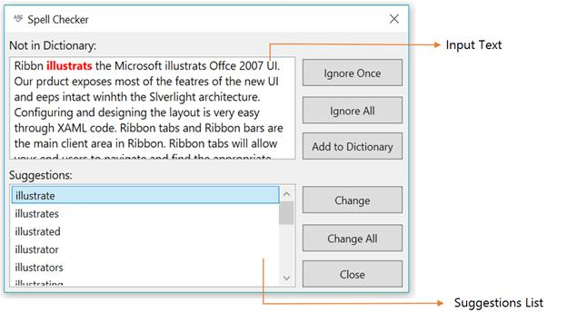

# About Syncfusion® WPF SfSpellChecker Control

[SfSpellChecker](https://help.syncfusion.com/cr/wpf/Syncfusion.Windows.Controls.SfSpellChecker.html) control provides a simple and intuitive interface to check for spelling errors in text-editor controls. You can perform spell-checking on a text editor, and it provides suggestions for misspelled words through both a dialog and a context menu. You can use spell-checking for any language (culture) input text, and add custom dictionary support.

## Control structure

## Features

* Supports context-menu suggestions.
* Supports spell-checking for any language (culture).
* Supports custom dictionaries to provide suggestions.
* Provides built-in options to Ignore, Ignore All, Replace, and Replace All for error words in the SpellChecker dialog.
* Supports ignoring emails, URLs, numbers, mixed-case, and upper-case words during spell check.
* Highlights the error words in the text.
