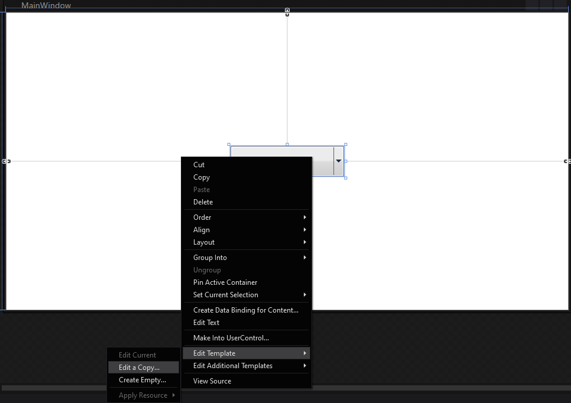
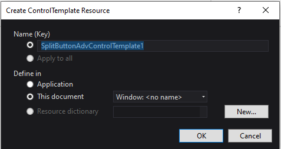

# Blendability

The button controls can be modified by using the Expression Blend.

To modify the button control:

* Open Sample in the Expression Blend. 
* Right click the button control and choose Edit Template option as below:

  

* The Create Style Resource window will appear as shown below. Click OK to create a new style for button control.

  

* All the resources will be displayed on the resources pane on the right side of design area. These resources can be edited to create a new Style.

  

