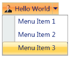
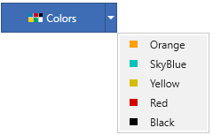
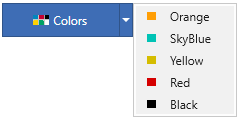
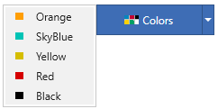
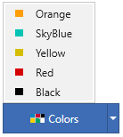
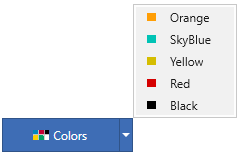

# Dropdown Direction in WPF Split Button

Dropdown direction is used to change the position of the popup being loaded while pressing dropdown arrow. The direction can be changed using the [DropDirection](https://help.syncfusion.com/cr/wpf/Syncfusion.Windows.Tools.Controls.DropDownButtonAdv.html#Syncfusion_Windows_Tools_Controls_DropDownButtonAdv_DropDirection) enumeration.

The [DropDirection](https://help.syncfusion.com/cr/wpf/Syncfusion.Windows.Tools.Controls.DropDownButtonAdv.html#Syncfusion_Windows_Tools_Controls_DropDownButtonAdv_DropDirection) enumeration comprises of following values: 

* Left
* Right
* BottomLeft
* BottomRight
* TopLeft
* TopRight

N> The default value is **BottomLeft**.




<syncfusion:SplitButtonAdv DropDirection="BottomLeft" SmallIcon="images\colors.png" Label="Colors">
    <syncfusion:DropDownMenuGroup>
        <syncfusion:DropDownMenuItem HorizontalAlignment="Left" Header="Orange">
            <syncfusion:DropDownMenuItem.Icon>
                <Image Source="images\orange.png"/>
            </syncfusion:DropDownMenuItem.Icon>
        </syncfusion:DropDownMenuItem>
        <syncfusion:DropDownMenuItem HorizontalAlignment="Left" Header="SkyBlue">
            <syncfusion:DropDownMenuItem.Icon>
                <Image Source="images\skyblue.png"/>
            </syncfusion:DropDownMenuItem.Icon>
        </syncfusion:DropDownMenuItem>
        <syncfusion:DropDownMenuItem HorizontalAlignment="Left" Header="Yellow">
            <syncfusion:DropDownMenuItem.Icon>
                <Image Source="images\yellow.png"/>
            </syncfusion:DropDownMenuItem.Icon>
        </syncfusion:DropDownMenuItem>
        <syncfusion:DropDownMenuItem HorizontalAlignment="Left" Header="Red">
            <syncfusion:DropDownMenuItem.Icon   >
                <Image Source="images\red.png"/>
            </syncfusion:DropDownMenuItem.Icon>
        </syncfusion:DropDownMenuItem>
        <syncfusion:DropDownMenuItem HorizontalAlignment="Left" Header="Black">
            <syncfusion:DropDownMenuItem.Icon>
                <Image Source="images\black.png"/>
            </syncfusion:DropDownMenuItem.Icon>
        </syncfusion:DropDownMenuItem>
    </syncfusion:DropDownMenuGroup>
</syncfusion:SplitButtonAdv>
    



SplitButtonAdv splitbutton = new SplitButtonAdv();
splitbutton.Label = "Colors";
splitbutton.DropDirection = DropDirection.BottomLeft;
splitbutton.SmallIcon = new BitmapImage(new Uri("images\colors.png"));
DropDownMenuGroup menu = new DropDownMenuGroup();
DropDownMenuItem Item1 = new DropDownMenuItem() { Header="Orange", Icon=new BitmapImage(new Uri("images\orange.png")), HorizontalAlignment="Left"};
DropDownMenuItem Item2 = new DropDownMenuItem() { Header ="Skyblue", Icon=new BitmapImage(new Uri("images\skyblue.png")), HorizontalAlignment="Left"};
DropDownMenuItem Item3 = new DropDownMenuItem() { Header ="Yellow", Icon=new BitmapImage(new Uri("images\yellow.png")), HorizontalAlignment="Left"};
DropDownMenuItem Item4 = new DropDownMenuItem() { Header ="Red", Icon=new BitmapImage(new Uri("images\red.png")), HorizontalAlignment="Left"};
DropDownMenuItem Item5 = new DropDownMenuItem() { Header ="Black", Icon=new BitmapImage(new Uri("images\black.png")), HorizontalAlignment="Left"};
menu.Items.Add(Item1);
menu.Items.Add(Item2);
menu.Items.Add(Item3);
menu.Items.Add(Item4);
menu.Items.Add(Item5);
splitbutton.Content=menu;




Drop Direction - BottomLeft
{:.caption}

Drop Direction - BottomRight
{:.caption}

Drop Direction - Right
{:.caption}

Drop Direction - Left
{:.caption}

Drop Direction - TopLeft
{:.caption}

Drop Direction - TopRight
{:.caption}
