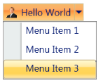
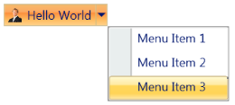
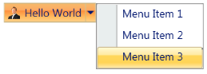
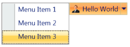
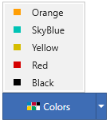
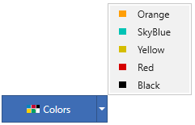

# Dropdown Direction in WPF Split Button

Dropdown direction is used to change the position of the popup being loaded while pressing the dropdown arrow. The direction can be changed using the [DropDirection](https://help.syncfusion.com/cr/wpf/Syncfusion.Windows.Tools.Controls.DropDownButtonAdv.html#Syncfusion_Windows_Tools_Controls_DropDownButtonAdv_DropDirection) enumeration.

The [DropDirection](https://help.syncfusion.com/cr/wpf/Syncfusion.Windows.Tools.Controls.DropDownButtonAdv.html#Syncfusion_Windows_Tools_Controls_DropDownButtonAdv_DropDirection) enumeration comprises the following values: 

* Left
* Right
* BottomLeft
* BottomRight
* TopLeft
* TopRight

N> The default value is **BottomLeft**.




<syncfusion:SplitButtonAdv DropDirection="BottomLeft" SmallIcon="Images/colors.png" Label="Colors">
    <syncfusion:DropDownMenuGroup>
        <syncfusion:DropDownMenuItem HorizontalAlignment="Left" Header="Orange">
            <syncfusion:DropDownMenuItem.Icon>
                <Image Source="Images/orange.png"/>
            </syncfusion:DropDownMenuItem.Icon>
        </syncfusion:DropDownMenuItem>
        <syncfusion:DropDownMenuItem HorizontalAlignment="Left" Header="SkyBlue">
            <syncfusion:DropDownMenuItem.Icon>
                <Image Source="Images/skyblue.png"/>
            </syncfusion:DropDownMenuItem.Icon>
        </syncfusion:DropDownMenuItem>
        <syncfusion:DropDownMenuItem HorizontalAlignment="Left" Header="Yellow">
            <syncfusion:DropDownMenuItem.Icon>
                <Image Source="Images/yellow.png"/>
            </syncfusion:DropDownMenuItem.Icon>
        </syncfusion:DropDownMenuItem>
        <syncfusion:DropDownMenuItem HorizontalAlignment="Left" Header="Red">
            <syncfusion:DropDownMenuItem.Icon   >
                <Image Source="Images/red.png"/>
            </syncfusion:DropDownMenuItem.Icon>
        </syncfusion:DropDownMenuItem>
        <syncfusion:DropDownMenuItem HorizontalAlignment="Left" Header="Black">
            <syncfusion:DropDownMenuItem.Icon>
                <Image Source="Images/black.png"/>
            </syncfusion:DropDownMenuItem.Icon>
        </syncfusion:DropDownMenuItem>
    </syncfusion:DropDownMenuGroup>
</syncfusion:SplitButtonAdv>
    



SplitButtonAdv splitbutton = new SplitButtonAdv();
splitbutton.Label = "Colors";
splitbutton.DropDirection = DropDirection.BottomLeft;
splitbutton.SmallIcon = new BitmapImage(new Uri("Images/colors.png"));
DropDownMenuGroup menu = new DropDownMenuGroup();
DropDownMenuItem Item1 = new DropDownMenuItem() { Header="Orange", Icon=new BitmapImage(new Uri("Images/orange.png")), HorizontalAlignment=HorizontalAlignment.Left};
DropDownMenuItem Item2 = new DropDownMenuItem() { Header ="Skyblue", Icon=new BitmapImage(new Uri("Images/skyblue.png")), HorizontalAlignment=HorizontalAlignment.Left};
DropDownMenuItem Item3 = new DropDownMenuItem() { Header ="Yellow", Icon=new BitmapImage(new Uri("Images/yellow.png")), HorizontalAlignment=HorizontalAlignment.Left};
DropDownMenuItem Item4 = new DropDownMenuItem() { Header ="Red", Icon=new BitmapImage(new Uri("Images/red.png")), HorizontalAlignment=HorizontalAlignment.Left};
DropDownMenuItem Item5 = new DropDownMenuItem() { Header ="Black", Icon=new BitmapImage(new Uri("Images/black.png")), HorizontalAlignment=HorizontalAlignment.Left};
menu.Items.Add(Item1);
menu.Items.Add(Item2);
menu.Items.Add(Item3);
menu.Items.Add(Item4);
menu.Items.Add(Item5);
splitbutton.Content=menu;




Drop Direction - BottomLeft
{:.caption}

Drop Direction - BottomRight
{:.caption}

Drop Direction - Right
{:.caption}

Drop Direction - Left
{:.caption}

Drop Direction - TopLeft
{:.caption}

Drop Direction - TopRight
{:.caption}
