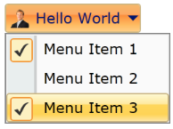
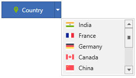
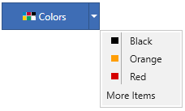
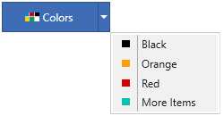

# Dropdown Menu Items in WPF Split Button

## Setting icon for dropdown menu items

The icon option helps to provide pictorial representation of the dropdown menu item. One can apply the icon by setting the [Icon](https://help.syncfusion.com/cr/wpf/Syncfusion.Windows.Tools.Controls.DropDownMenuItem.html#Syncfusion_Windows_Tools_Controls_DropDownMenuItem_Icon) property value to an image source.




<syncfusion:SplitButtonAdv Label="Country" x:Name="splitbutton" DropDirection="BottomRight" SizeMode="Normal" SmallIcon="Images\country.png">
    <syncfusion:DropDownMenuGroup>
        <syncfusion:DropDownMenuItem HorizontalAlignment="Left" Header="India">
            <syncfusion:DropDownMenuItem.Icon>
                <Image Source="Images\india.png"/>
            </syncfusion:DropDownMenuItem.Icon>
        </syncfusion:DropDownMenuItem>
        <syncfusion:DropDownMenuItem HorizontalAlignment="Left" Header="France"/>
        <syncfusion:DropDownMenuItem HorizontalAlignment="Left" Header="Germany"/>
    </syncfusion:DropDownMenuGroup>
</syncfusion:SplitButtonAdv>




SplitButtonAdv splitbutton = new SplitButtonAdv();
DropDownMenuGroup menu = new DropDownMenuGroup();
DropDownMenuItem Item1 = new DropDownMenuItem() { Header="India",Icon=new BitmapImage(new Uri("Images\india.png")), HorizontalAlignment="Left"};
DropDownMenuItem Item2 = new DropDownMenuItem() { Header ="France", HorizontalAlignment="Left" };
DropDownMenuItem Item3 = new DropDownMenuItem() { Header ="Germany", HorizontalAlignment="Left" };
menu.Items.Add(Item1);
menu.Items.Add(Item2);
menu.Items.Add(Item3);
splitbutton.Content = menu;
splitbutton.Label = "Country";
splitbutton.DropDirection = DropDirection.BottomRight;
splitbutton.SizeMode = SizeMode.Normal;
splitbutton.SmallIcon = new BitmapImage(new Uri("Images\country.png"));




## Setting icon bar visibility

The icon bar option helps to enable/disable the vertical bar next to the Dropdown menu item icon. One can change the icon bar visibility by setting the [IconBarEnabled](https://help.syncfusion.com/cr/wpf/Syncfusion.Windows.Tools.Controls.DropDownMenuGroup.html#Syncfusion_Windows_Tools_Controls_DropDownMenuGroup_IconBarEnabled) property to **true** or **false**.

N> The default value of [IconBarEnabled](https://help.syncfusion.com/cr/wpf/Syncfusion.Windows.Tools.Controls.DropDownMenuGroup.html#Syncfusion_Windows_Tools_Controls_DropDownMenuGroup_IconBarEnabled) is `false`.




<syncfusion:SplitButtonAdv Label="Country" DropDirection="BottomRight" x:Name="splitbutton" SizeMode="Normal" SmallIcon="Images\country.png">
    <syncfusion:DropDownMenuGroup IconBarEnabled="True">
        <syncfusion:DropDownMenuItem HorizontalAlignment="Left" Header="India">
            <syncfusion:DropDownMenuItem.Icon>
                <Image Source="Images\india.png"/>
            </syncfusion:DropDownMenuItem.Icon>
        </syncfusion:DropDownMenuItem>
        <syncfusion:DropDownMenuItem HorizontalAlignment="Left" Header="France"/>
        <syncfusion:DropDownMenuItem HorizontalAlignment="Left" Header="Germany"/>
    </syncfusion:DropDownMenuGroup>
</syncfusion:SplitButtonAdv>




SplitButtonAdv splitbutton = new SplitButtonAdv();
DropDownMenuGroup menu = new DropDownMenuGroup();
DropDownMenuItem Item1 = new DropDownMenuItem() { Header="India",Icon=new BitmapImage(new Uri("Images\india.png")), HorizontalAlignment="Left"};
DropDownMenuItem Item2 = new DropDownMenuItem() { Header ="France", HorizontalAlignment="Left" };
DropDownMenuItem Item3 = new DropDownMenuItem() { Header ="Germany", HorizontalAlignment="Left" };
menu.Items.Add(Item1);
menu.Items.Add(Item2);
menu.Items.Add(Item3);
menu.IconBarEnabled =true;
splitbutton.Content = menu;
splitbutton.Label = "Country";
splitbutton.SizeMode = SizeMode.Normal;
splitbutton.DropDirection = DropDirection.BottomRight;
splitbutton.SmallIcon = new BitmapImage(new Uri("Images\country.png"));




## Setting scrollbar visibility

The dropdown menu group supports built-in scrollbar to show large number of menu items in a compact view. One can enable the visibility of scroll bar by setting the [ScrollBarVisibility](https://help.syncfusion.com/cr/wpf/Syncfusion.Windows.Tools.Controls.DropDownMenuGroup.html#Syncfusion_Windows_Tools_Controls_DropDownMenuGroup_ScrollBarVisibility) property to **Visible**.




<syncfusion:SplitButtonAdv Label="Country" DropDirection="BottomRight" x:Name="splitbutton" SizeMode="Normal" SmallIcon="Images\country.png">
    <syncfusion:DropDownMenuGroup MaxHeight="111" ScrollBarVisibility="Visible">
        <syncfusion:DropDownMenuItem HorizontalAlignment="Left" Header="India">
            <syncfusion:DropDownMenuItem.Icon>
                <Image Source="Images/india.png"/>
            </syncfusion:DropDownMenuItem.Icon>
        </syncfusion:DropDownMenuItem>
        <syncfusion:DropDownMenuItem HorizontalAlignment="Left" Header="France">
            <syncfusion:DropDownMenuItem.Icon>
                <Image Source="Images\france.png"/>
            </syncfusion:DropDownMenuItem.Icon>
        </syncfusion:DropDownMenuItem>
        <syncfusion:DropDownMenuItem HorizontalAlignment="Left" Header="Germany" >
            <syncfusion:DropDownMenuItem.Icon>
                <Image Source="Images\germany.png"/>
            </syncfusion:DropDownMenuItem.Icon>
        </syncfusion:DropDownMenuItem>
        <syncfusion:DropDownMenuItem HorizontalAlignment="Left" Header="Canada">
            <syncfusion:DropDownMenuItem.Icon>
                    <Image Source="Images\canada.png"/>
            </syncfusion:DropDownMenuItem.Icon>
        </syncfusion:DropDownMenuItem>
        <syncfusion:DropDownMenuItem HorizontalAlignment="Left" Header="China">
            <syncfusion:DropDownMenuItem.Icon>
                <Image Source="Images\china.png"/>
            </syncfusion:DropDownMenuItem.Icon>
        </syncfusion:DropDownMenuItem>
        <syncfusion:DropDownMenuItem HorizontalAlignment="Left" Header="United States"/>
        <syncfusion:DropDownMenuItem HorizontalAlignment="Left" Header="Italy"/>
        <syncfusion:DropDownMenuItem HorizontalAlignment="Left" Header="Japan"/>
        <syncfusion:DropDownMenuItem HorizontalAlignment="Left" Header="Spain"/>
        <syncfusion:DropDownMenuItem HorizontalAlignment="Left" Header="Pakistan"/>
    </syncfusion:DropDownMenuGroup>
</syncfusion:SplitButtonAdv>




SplitButtonAdv splitbutton = new SplitButtonAdv();
DropDownMenuGroup menu = new DropDownMenuGroup();
DropDownMenuItem Item1 = new DropDownMenuItem() { Header="India",Icon=new BitmapImage(new Uri("Images\india.png")), HorizontalAlignment="Left"};
DropDownMenuItem Item2 = new DropDownMenuItem() { Header ="France", Icon=new BitmapImage(new Uri("Images\france.png")), HorizontalAlignment="Left"};
DropDownMenuItem Item3 = new DropDownMenuItem() { Header ="Germany", Icon=new BitmapImage(new Uri("Images\germany.png")), HorizontalAlignment="Left"};
DropDownMenuItem Item4 = new DropDownMenuItem() { Header ="Canada", Icon=new BitmapImage(new Uri("Images\canada.png")), HorizontalAlignment="Left"};
DropDownMenuItem Item5 = new DropDownMenuItem() { Header ="China", Icon=new BitmapImage(new Uri("Images\china.png")), HorizontalAlignment="Left"};
DropDownMenuItem Item6 = new DropDownMenuItem() { Header ="United State", HorizontalAlignment="Left"};
DropDownMenuItem Item7 = new DropDownMenuItem() { Header ="Italy", HorizontalAlignment="Left"};
DropDownMenuItem Item8 = new DropDownMenuItem() { Header ="Japan", HorizontalAlignment="Left"};
DropDownMenuItem Item9 = new DropDownMenuItem() { Header ="Spain", HorizontalAlignment="Left"};
DropDownMenuItem Item10 = new DropDownMenuItem() { Header ="Pakistan", HorizontalAlignment="Left"};
menu.Items.Add(Item1);
menu.Items.Add(Item2);
menu.Items.Add(Item3);
menu.Items.Add(Item4);
menu.Items.Add(Item5);
menu.Items.Add(Item6);
menu.Items.Add(Item7);
menu.Items.Add(Item8);
menu.Items.Add(Item9);
menu.Items.Add(Item10);
menu.MaxHeight=111;
menu.ScrollBarVisibility = ScrollBarVisibility.Visible;
splitbutton.Content = menu;
splitbutton.Label = "Country";
splitbutton.SizeMode = SizeMode.Normal;
splitbutton.DropDirection = DropDirection.BottomRight;
splitbutton.SmallIcon = new BitmapImage(new Uri("Images\country.png"));




 

## Checkable dropdown menu items

The checkable option helps to check/uncheck the dropdown menu item on selection by setting the [IsCheckable](https://help.syncfusion.com/cr/wpf/Syncfusion.Windows.Tools.Controls.DropDownMenuItem.html#Syncfusion_Windows_Tools_Controls_DropDownMenuItem_IsCheckable) property to **true**.




<syncfusion:SplitButtonAdv Label="Country" DropDirection="BottomRight" x:Name="splitbutton" SizeMode="Normal" SmallIcon="Images\country.png">
    <syncfusion:DropDownMenuGroup>
        <syncfusion:DropDownMenuItem HorizontalAlignment="Left" Header="India" IsChecked="True" IsCheckable="True"/>
        <syncfusion:DropDownMenuItem HorizontalAlignment="Left" Header="France" IsChecked="True" IsCheckable="True"/>
        <syncfusion:DropDownMenuItem HorizontalAlignment="Left" Header="Germany"/>
    </syncfusion:DropDownMenuGroup>
</syncfusion:SplitButtonAdv>




SplitButtonAdv splitbutton = new SplitButtonAdv();
DropDownMenuGroup menu = new DropDownMenuGroup();
DropDownMenuItem Item1 = new DropDownMenuItem() { Header="India", IsChecked=true, IsCheckable=true, HorizontalAlignment="Left"};
DropDownMenuItem Item2 = new DropDownMenuItem() { Header ="France", IsChecked=true, IsCheckable=true, HorizontalAlignment="Left"};
DropDownMenuItem Item3 = new DropDownMenuItem() { Header ="Germany", HorizontalAlignment="Left"};
menu.Items.Add(Item1);
menu.Items.Add(Item2);
menu.Items.Add(Item3);
splitbutton.Content = menu;
splitbutton.DropDirection = DropDirection.BottomRight;
splitbutton.Label = "Country";
splitbutton.SizeMode = SizeMode.Normal;
splitbutton.SmallIcon = new BitmapImage(new Uri("Images\country.png"));
    



## Resizing dropdown menu

The dropdown menu group popup height can be increased or decreased using the resizing gripper. One can enable the resizing behavior by setting the [IsResizable](https://help.syncfusion.com/cr/wpf/Syncfusion.Windows.Tools.Controls.DropDownMenuGroup.html#Syncfusion_Windows_Tools_Controls_DropDownMenuGroup_IsResizable) property to **true**.




<syncfusion:SplitButtonAdv Label="Country" x:Name="splitbutton" SmallIcon="images\country.png">
    <syncfusion:DropDownMenuGroup IsResizable=”True”>
        <syncfusion:DropDownMenuItem HorizontalAlignment="Left" Header="India">
            <syncfusion:DropDownMenuItem.Icon>
                <Image Source="images\india.png"/>
            </syncfusion:DropDownMenuItem.Icon>
        </syncfusion:DropDownMenuItem>
        <syncfusion:DropDownMenuItem HorizontalAlignment="Left" Header="France">
            <syncfusion:DropDownMenuItem.Icon>
                <Image Source="images\france.png"/>
            </syncfusion:DropDownMenuItem.Icon>
        </syncfusion:DropDownMenuItem>
        <syncfusion:DropDownMenuItem HorizontalAlignment="Left" Header="Germany">
            <syncfusion:DropDownMenuItem.Icon>
                <Image Source="images\germany.png"/>
            </syncfusion:DropDownMenuItem.Icon>
        </syncfusion:DropDownMenuItem>
    </syncfusion:DropDownMenuGroup>
</syncfusion:SplitButtonAdv>




SplitButtonAdv splitbutton = new SplitButtonAdv();
DropDownMenuGroup menu = new DropDownMenuGroup();
DropDownMenuItem Item1 = new DropDownMenuItem() { Header="India", Icon =new BitmapImage(new Uri("images\india.png")), HorizontalAlignment="Left"};
DropDownMenuItem Item2 = new DropDownMenuItem() { Header ="France", Icon =new BitmapImage(new Uri("images\france.png")), HorizontalAlignment="Left"};
DropDownMenuItem Item3 = new DropDownMenuItem() { Header ="Germany", Icon =new BitmapImage(new Uri("images\germany.png")), HorizontalAlignment="Left"};
menu.Items.Add(Item1);
menu.Items.Add(Item2);
menu.Items.Add(Item3);
menu.IsResizable = true;
splitbutton.Content = menu;
splitbutton.Label = "Colors";
splitbutton.SmallIcon = new BitmapImage(new Uri("images\country.png"));




N> View [sample](https://github.com/SyncfusionExamples/wpf-split-button-examples/tree/master/Samples/Customize-Menu-Items) in GitHub. This sample showcases how to set the drop-down item icon, icon bar visibility, scrollbar visibility, and checkable support.

## Adding custom dropdown menu items

The dropdown menu group has option to load custom items apart from actual dropdown menu items. One can populate the custom items using the [MoreItems](https://help.syncfusion.com/cr/wpf/Syncfusion.Windows.Tools.Controls.DropDownMenuGroup.html#Syncfusion_Windows_Tools_Controls_DropDownMenuGroup_MoreItems) property.

N> The **MoreItems** property has return type `ObservableCollection<UIElement>`, so it can accept any UIElement as its child items.




<Window x:Class="SplitButton_Custom_Items.MainWindow"
        xmlns="http://schemas.microsoft.com/winfx/2006/xaml/presentation"
        xmlns:x="http://schemas.microsoft.com/winfx/2006/xaml"
        xmlns:d="http://schemas.microsoft.com/expression/blend/2008"
        xmlns:mc="http://schemas.openxmlformats.org/markup-compatibility/2006"
        xmlns:local="clr-namespace:SplitButton_Custom_Items"
        xmlns:syncfusion="http://schemas.syncfusion.com/wpf"
        mc:Ignorable="d"
        Title="MainWindow" Height="450" Width="800">
    <Window.DataContext>
        <local:ColorViewModel/>
    </Window.DataContext>
    <Grid>
        <syncfusion:SplitButtonAdv Label="Colors" SizeMode="Normal" SmallIcon="Images\colors.png">
            <syncfusion:DropDownMenuGroup  IconBarEnabled="True" MoreItems="{Binding Items}" IsMoreItemsIconTrayEnabled="False">
                <syncfusion:DropDownMenuItem  HorizontalAlignment="Left" Header="Black">
                    <syncfusion:DropDownMenuItem.Icon>
                        <Image Source="Images\black.png"/>
                    </syncfusion:DropDownMenuItem.Icon>
                </syncfusion:DropDownMenuItem>
                <syncfusion:DropDownMenuItem HorizontalAlignment="Left" Header="Orange">
                    <syncfusion:DropDownMenuItem.Icon>
                        <Image Source="Images\orange.png"/>
                    </syncfusion:DropDownMenuItem.Icon>
                </syncfusion:DropDownMenuItem>
                <syncfusion:DropDownMenuItem HorizontalAlignment="Left" Header="Red">
                    <syncfusion:DropDownMenuItem.Icon>
                        <Image Source="Images\red.png"/>
                    </syncfusion:DropDownMenuItem.Icon>
                </syncfusion:DropDownMenuItem>
            </syncfusion:DropDownMenuGroup>
        </syncfusion:SplitButtonAdv>
    </Grid>
</Window>

 
 

using Syncfusion.Windows.Shared;
using System;
using System.Collections.ObjectModel;
using System.Windows;
using System.Windows.Controls;

namespace SplitButton_Custom_Items
{
    public class ColorViewModel : NotificationObject
    {
        public ObservableCollection<UIElement> items = new ObservableCollection<UIElement>();

        public ObservableCollection<UIElement> Items
        {
            get { return items; }
            set { items = value; RaisePropertyChanged("Items"); }
        }

        public ColorViewModel()
        {
            Items.Add(new Label() { Content = "More Items" });
        }
    }
}




## Setting icon bar visibility for custom dropdown menu items

The custom dropdown menu items icon visibility can be enabled/disabled by setting the [IsMoreItemsIconTrayEnabled](https://help.syncfusion.com/cr/wpf/Syncfusion.Windows.Tools.Controls.DropDownMenuGroup.html#Syncfusion_Windows_Tools_Controls_DropDownMenuGroup_IsMoreItemsIconTrayEnabled) property either to **true** or **false**.




<Window x:Class="SplitButton_Custom_Items.MainWindow"
        xmlns="http://schemas.microsoft.com/winfx/2006/xaml/presentation"
        xmlns:x="http://schemas.microsoft.com/winfx/2006/xaml"
        xmlns:d="http://schemas.microsoft.com/expression/blend/2008"
        xmlns:mc="http://schemas.openxmlformats.org/markup-compatibility/2006"
        xmlns:local="clr-namespace:SplitButton_Custom_Items"
        xmlns:syncfusion="http://schemas.syncfusion.com/wpf"
        mc:Ignorable="d"
        Title="MainWindow" Height="450" Width="800">
    <Window.DataContext>
        <local:ColorViewModel/>
    </Window.DataContext>
    <Grid>
        <syncfusion:SplitButtonAdv Label="Colors" x:Name="splitbutton" SizeMode="Normal" SmallIcon="Images\colors.png">
            <syncfusion:DropDownMenuGroup  IconBarEnabled="True" MoreItems="{Binding Colors}" IsMoreItemsIconTrayEnabled="True">
                <syncfusion:DropDownMenuItem  HorizontalAlignment="Left" Header="Black">
                    <syncfusion:DropDownMenuItem.Icon>
                        <Image Source="Images\black.png"/>
                    </syncfusion:DropDownMenuItem.Icon>
                </syncfusion:DropDownMenuItem>
                <syncfusion:DropDownMenuItem HorizontalAlignment="Left" Header="Orange">
                    <syncfusion:DropDownMenuItem.Icon>
                        <Image Source="Images\orange.png"/>
                    </syncfusion:DropDownMenuItem.Icon>
                </syncfusion:DropDownMenuItem>
                <syncfusion:DropDownMenuItem HorizontalAlignment="Left" Header="Red">
                    <syncfusion:DropDownMenuItem.Icon>
                        <Image Source="Images\red.png"/>
                    </syncfusion:DropDownMenuItem.Icon>
                </syncfusion:DropDownMenuItem>
            </syncfusion:DropDownMenuGroup>
        </syncfusion:SplitButtonAdv>
    </Grid>
</Window>




using Syncfusion.Windows.Shared;
using Syncfusion.Windows.Tools.Controls;
using System;
using System.Collections.ObjectModel;
using System.Windows;
using System.Windows.Media.Imaging;

namespace SplitButton_Custom_Items
{
    public class ColorViewModel : NotificationObject
    {
        public ObservableCollection<UIElement> color = new ObservableCollection<UIElement>();

        public ObservableCollection<UIElement> Colors
        {
            get { return color; }
            set { color = value; RaisePropertyChanged("Colors"); }
        }

        public ColorViewModel()
        {
            Colors.Add(new DropDownMenuItem() { Header = "More Items", Icon = new Image() { Source = new BitmapImage(new Uri("/Images/skyblue.png", UriKind.RelativeOrAbsolute)) } });
        }
    }
}




N> View [sample](https://github.com/SyncfusionExamples/wpf-split-button-examples/tree/master/Samples/Add-Custom-Items) in GitHub. This sample showcases how to add custom dropdown menu items and handle visibility of custom items icon bar in split button control.
