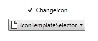
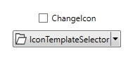

# Getting Started with Split Button

This section provides an overview of how to work with Split Button control. It describes the control structure, the control initialization and the image setting for the control and add items to the control.

## Control structure

## Assembly deployment

Refer [SplitButtonAdv](https://help.syncfusion.com/wpf/control-dependencies#splitbutton) control dependencies section to get the list of assemblies or [NuGet package](https://help.syncfusion.com/wpf/visual-studio-integration/nuget-packages) needs to be added as reference to use the SplitButtonAdv control in any application.

## Creating simple application with SplitButton

In this walk through, you will create WPF application that contains Split Button control. By the following ways, one can add the controls:

1. [Adding control via designer](#adding-control-via-designer)

2. [Adding control manually in XAML](#adding-control-manually-in-xaml)

3. [Adding control manually in C#](#adding-control-manually-in-c)

### Adding control via designer

Split Button control can be added to the application by dragging **SplitButtonAdv** from toolbox and dropping it in designer view. After dropping the controls in designer view, the assemblies such as **Syncfusion.Shared.WPF** gets added into the project automatically. The following code snippets will be added into the XAML.




    <syncfusion:SplitButtonAdv x:Name="splitButtonAdv" Label="Split Button"/>




N> **syncfusion** in XAML is an auto generated namespace.

### Adding control manually in XAML

In order to add the control manually in XAML, follow the below steps.

1. Add the below required assembly reference to the project.

    * Syncfusion.Shared.WPF

2. Import Syncfusion WPF schema `http://schemas.syncfusion.com/wpf` or the control namespace `Syncfusion.Windows.Tools.Controls` in XAML page.

3. Declare SplitButtonAdv control in XAML page.




<Window xmlns="http://schemas.microsoft.com/winfx/2006/xaml/presentation"
        xmlns:x="http://schemas.microsoft.com/winfx/2006/xaml"
        xmlns:local="clr-namespace:SplitButtonadv_GetStart_Sample"
        xmlns:syncfusion="http://schemas.syncfusion.com/wpf"
        xmlns:Syncfusion="http://schemas.microsoft.com/netfx/2009/xaml/presentation"
        mc:Ignorable="d"
        Title="MainWindow" Height="450" Width="800">
    <Grid>
        <syncfusion:SplitButtonAdv Height="44"  VerticalAlignment="Center" HorizontalAlignment="Center" Width="162"/>
     </Grid>
</Window>




### Adding control manually in C#

In order to add control manually in C#, do the below steps.

1. Add the below required assembly references to the project.

    * Syncfusion.Shared.WPF

2. Import the `Syncfusion.Windows.Tools.Controls` namespace.

3. Create SplitButtonAdv control instance and add it to the window.




<Window xmlns="http://schemas.microsoft.com/winfx/2006/xaml/presentation"
        xmlns:x="http://schemas.microsoft.com/winfx/2006/xaml"
        xmlns:local="clr-namespace:SplitButtonadv_GetStart_Sample"
        xmlns:syncfusion="http://schemas.syncfusion.com/wpf"
        xmlns:Syncfusion="http://schemas.microsoft.com/netfx/2009/xaml/presentation"
        mc:Ignorable="d"
        Title="MainWindow" Height="450" Width="800">
    <Grid x:Name="Root">

    </Grid>
</Window>




using Syncfusion.Windows.Tools.Controls;
    
namespace ButtonSample
{
    public partial class MainWindow : Window
    {
        public MainWindow()
        {
            InitializeComponent();
            SplitButtonAdv splitButtonAdv = new SplitButtonAdv();
            splitButtonAdv.Height=44;
            splitButtonAdv.Width=31;
            Root.Children.Add(splitButtonAdv);
        }
    }
}




## Setting label

The label on the button is a text that explains its action to the end-user. Apply the text by using the [Label](https://help.syncfusion.com/cr/wpf/Syncfusion.Windows.Tools.Controls.DropDownButtonAdv.html#Syncfusion_Windows_Tools_Controls_DropDownButtonAdv_Label) property.




<syncfusion:SplitButtonAdv Label="Colors" SmallIcon="Images\color.png"/>




SplitButtonAdv button = new SplitButtonAdv();
button.Label = "Colors";
button.SmallIcon = new BitmapImage(new Uri("Images\colors.png", UriKind.RelativeOrAbsolute));




## Setting size mode

Size mode is used to render Split Button control in different pre-defined sizes based on application demand. Apply the size mode by setting the [SizeMode](https://help.syncfusion.com/cr/wpf/Syncfusion.Windows.Tools.Controls.DropDownButtonAdv.html#Syncfusion_Windows_Tools_Controls_DropDownButtonAdv_SizeMode) property.

The **SizeMode** is an enumeration which contains the following values:

* Small
* Normal
* Large

### Small mode

When the mode is set to small, the control is displayed without the label. Only icon will be present in it.




<syncfusion:SplitButtonAdv SizeMode="Small" SmallIcon="Images\color.png" Label="Colors"/>




SplitButtonAdv button = new SplitButtonAdv();
button.Label = "Colors";
button.SizeMode = SizeMode.Small;
button.SmallIcon = new BitmapImage(new Uri("Images\colors.png", UriKind.RelativeOrAbsolute));




### Normal mode

In a normal size button, a small image with the text on the side will be displayed.




<syncfusion:SplitButtonAdv SizeMode="Normal" SmallIcon="Images\color.png" Label="Colors"/>




SplitButtonAdv button = new SplitButtonAdv();
button.Label = "Colors";
button.SizeMode = SizeMode.Normal;
button.SmallIcon = new BitmapImage(new Uri("Images\colors.png", UriKind.RelativeOrAbsolute));




### Large mode

In a large size button, a large image along with the text at the bottom will be displayed.




<syncfusion:SplitButtonAdv SizeMode="Large" LargeIcon="Images\color.png" Label="Colors"/>




SplitButtonAdv button = new SplitButtonAdv();
button.Label = "Colors";
button.SizeMode = SizeMode.Large;
button.LargeIcon = new BitmapImage(new Uri("Images\colors.png", UriKind.RelativeOrAbsolute));




## Setting image

The size of the image can be set by using an image path and icon template . When the size of the icon is provided in both the ways, then it will prioritize and first it will take the size from the icon templates, then it will take it  from the [SizeMode](https://help.syncfusion.com/cr/wpf/Syncfusion.Windows.Tools.Controls.DropDownButtonAdv.html#Syncfusion_Windows_Tools_Controls_DropDownButtonAdv_SizeMode) property.

### Setting image path

The image option helps to provide pictorial representation of the button. Image can be added either using the [SmallIcon](https://help.syncfusion.com/cr/wpf/Syncfusion.Windows.Tools.Controls.DropDownButtonAdv.html#Syncfusion_Windows_Tools_Controls_DropDownButtonAdv_SmallIcon) or [LargeIcon](https://help.syncfusion.com/cr/wpf/Syncfusion.Windows.Tools.Controls.DropDownButtonAdv.html#Syncfusion_Windows_Tools_Controls_DropDownButtonAdv_LargeIcon) property.

* **SmallIcon** — This property will be used to set the image when size mode is **Normal** or **Small**.
* **LargeIcon** — This property will be used to set the image when size mode is **Large**.

The **SmallIcon** property can be set as follows:




<syncfusion:SplitButtonAdv SizeMode="Small" Label="Syncfusion" SmallIcon="Images\syncfusion.png"/>




SplitButtonAdv button = new SplitButtonAdv();
button.Label = "Syncfusion";
button.SizeMode = SizeMode.Small;
button.SmallIcon = new BitmapImage(new Uri("Images\syncfusion.png", UriKind.RelativeOrAbsolute));




The **SmallIcon** property can be set even when the sizeMode is **Normal**.




<syncfusion:SplitButtonAdv SizeMode="Normal" SmallIcon="Images\Syncfusion.png" Label="Syncfusion"/>




SplitButtonAdv button = new SplitButtonAdv();
button.Label = "Syncfusion";
button.SizeMode = SizeMode.Normal;
button.SmallIcon = new BitmapImage(new Uri("Images\syncfusion.png", UriKind.RelativeOrAbsolute));




The **LargeIcon** property can be set as follows:




<syncfusion:SplitButtonAdv SizeMode="Large" LargeIcon="Images\Syncfusion.png" Label="Syncfusion"/>




SplitButtonAdv button = new SplitButtonAdv();
button.Label = "Syncfusion";
button.SizeMode = SizeMode.Large;
button.LargeIcon = new BitmapImage(new Uri("Images\syncfusion.png", UriKind.RelativeOrAbsolute));




N> When IconTemplate property is set to the SplitButtonAdv, the icon path set in [SmallIcon](https://help.syncfusion.com/cr/wpf/Syncfusion.Windows.Tools.Controls.DropDownButtonAdv.html#Syncfusion_Windows_Tools_Controls_DropDownButtonAdv_SmallIcon) and [LargeIcon](https://help.syncfusion.com/cr/wpf/Syncfusion.Windows.Tools.Controls.DropDownButtonAdv.html#Syncfusion_Windows_Tools_Controls_DropDownButtonAdv_LargeIcon) properties will not be utilized. Instead template will be applied.

### Setting Icon Template

The IconTemplate property provides support to set any type of image such as glyphs or any custom control to the SplitButtonAdv. The SplitButtonAdv will automatically resize the template content according to its [SizeMode](https://help.syncfusion.com/cr/wpf/Syncfusion.Windows.Tools.Controls.DropDownButtonAdv.html#Syncfusion_Windows_Tools_Controls_DropDownButtonAdv_SizeMode).





<Window x:Class="Button_IconTemplate.MainWindow"
        xmlns="http://schemas.microsoft.com/winfx/2006/xaml/presentation"
        xmlns:x="http://schemas.microsoft.com/winfx/2006/xaml"
        xmlns:d="http://schemas.microsoft.com/expression/blend/2008"
        xmlns:mc="http://schemas.openxmlformats.org/markup-compatibility/2006"
        xmlns:local="clr-namespace:Button_IconTemplate"
        xmlns:sync="http://schemas.syncfusion.com/wpf"
        mc:Ignorable="d"
        Title="MainWindow" Height="450" Width="800">
    <Grid>
        <Grid.RowDefinitions>
            <RowDefinition/>
            <RowDefinition/>
            <RowDefinition/>
            <RowDefinition/>
        </Grid.RowDefinitions>
        <Grid.ColumnDefinitions>
            <ColumnDefinition Width="150"/>
            <ColumnDefinition/>
        </Grid.ColumnDefinitions>
        <Label Grid.Row="0" Grid.Column="1" Content="Icon Template" FontWeight="Bold" HorizontalAlignment="Center" VerticalAlignment="Center"/>
        <Label Content="Size Mode : Small" Grid.Row="1" Grid.Column="0" HorizontalAlignment="Center" VerticalAlignment="Center" />
        <Label Content="Size Mode : Normal" Grid.Row="2" Grid.Column="0" HorizontalAlignment="Center" VerticalAlignment="Center" />
        <Label Content="Size Mode : Large" Grid.Row="3" Grid.Column="0" HorizontalAlignment="Center" VerticalAlignment="Center" />
        <sync:SplitButtonAdv Grid.Row="1" Grid.Column="1" SizeMode="Small" Label="New" HorizontalAlignment="Center" VerticalAlignment="Center">
            <sync:SplitButtonAdv.IconTemplate>
                <DataTemplate>
                    <Grid Width="12" Height="16">
                        <Path
                                Margin="0.5"
                                Data="M0,0 L5.9999999,0 11,5 11,15 0,15 z"
                                Fill="White"
                                Stretch="Fill" />
                        <Path
                                Data="M7,1.7070007 L7,5 10.292999,5 z M1,1 L1,15 11,15 11,6 6,6 6,1 z M0,0 L6.7070007,0 12,5.2929993 12,16 0,16 z"
                                Fill="#FF3A3A38"
                                Stretch="Fill" />
                    </Grid>
                </DataTemplate>
            </sync:SplitButtonAdv.IconTemplate>
        </sync:SplitButtonAdv>
        <sync:SplitButtonAdv Grid.Row="2" Grid.Column="1" SizeMode="Normal" Label="Open" HorizontalAlignment="Center" VerticalAlignment="Center">
            <sync:SplitButtonAdv.IconTemplate>
                <DataTemplate>
                    <Grid Width="16" Height="16">
                        <Path
                                Margin="0.5,0.5,0.738,0.502"
                                Data="M0,0 L5,0 6,1 12,1 12,3.4999998 11.499065,3.9999996 14.716998,3.9999996 11.92699,10.999 4.1853847,10.984859 0,10.982999 z"
                                Fill="White"
                                Stretch="Fill" />
                        <Path
                                Data="M5.162991,5.0009986 L1.7839907,10.979999 4.3081884,10.984653 5.0009999,10.984999 5.0009999,10.98593 12.088991,10.999 14.480014,5.0009986 z M0,0 L5.7069998,0 6.7069998,1 13,1 13,3.9999998 12,3.9999998 12,1.9999998 6.2930002,1.9999998 5.2930002,1 0.99999994,1 0.99999994,10.335325 4.5790062,4.0009986 15.954991,4.0009986 12.765994,12.000998 4.552258,11.98482 0,11.982999 z"
                                Fill="#FF3A3A38"
                                Stretch="Fill" />
                    </Grid>
                </DataTemplate>
            </sync:SplitButtonAdv.IconTemplate>
        </sync:SplitButtonAdv>
        <sync:SplitButtonAdv Grid.Row="3" Grid.Column="1" SizeMode="Large" Label="Save File" HorizontalAlignment="Center" VerticalAlignment="Center">
            <sync:SplitButtonAdv.IconTemplate>
                <DataTemplate>
                    <Grid  x:Name="Save"
                            Width="16"
                            Height="16">
                        <Path
                                Width="16"
                                Height="16"
                                Data="M5.0000019,11 L5.0000019,15 11.000002,15 11.000002,11 z M4.0000019,1 L4.0000019,6 12.000002,6 12.000002,1 z M1,1 L1,13.174 2.7160001,15 4.0000019,15 4.0000019,10 12.000002,10 12.000002,15 15,15 15,1 13.000002,1 13.000002,7 3.0000019,7 3.0000019,1 z M0,0 L3.0000019,0 13.000002,0 16,0 16,16 12.000002,16 4.0000019,16 2.2840004,16 0,13.57 z"
                                Fill="#FF3A3A38"
                                Stretch="Fill" />
                    </Grid>
                </DataTemplate>
            </sync:SplitButtonAdv.IconTemplate>
        </sync:SplitButtonAdv>
    </Grid>
</Window>

 

 

 

N> When IconTemplate property is set to the SplitButtonAdv, the icon path set in [SmallIcon](https://help.syncfusion.com/cr/wpf/Syncfusion.Windows.Tools.Controls.DropDownButtonAdv.html#Syncfusion_Windows_Tools_Controls_DropDownButtonAdv_SmallIcon) and [LargeIcon](https://help.syncfusion.com/cr/wpf/Syncfusion.Windows.Tools.Controls.DropDownButtonAdv.html#Syncfusion_Windows_Tools_Controls_DropDownButtonAdv_LargeIcon) properties will not be utilized. Instead template will be applied.

### Setting icon template selector

 The IconTemplateSelector property which allows you to specify a different data template based on the value given in the data templates.For example, the icon template selector is handled with the help of checking the checkbox for displaying the different icons based on the value given in the data template.

 



<Window x:Class="TemplateSelector_SplitButtonAdv.MainWindow"
        xmlns="http://schemas.microsoft.com/winfx/2006/xaml/presentation"
        xmlns:x="http://schemas.microsoft.com/winfx/2006/xaml"
        xmlns:d="http://schemas.microsoft.com/expression/blend/2008"
        xmlns:mc="http://schemas.openxmlformats.org/markup-compatibility/2006"
        xmlns:local="clr-namespace:TemplateSelector_SplitButtonAdv"
        xmlns:Sync="http://schemas.syncfusion.com/wpf"
        mc:Ignorable="d"
        Title="MainWindow" Height="450" Width="800">
    <Window.Resources>
        <DataTemplate x:Key="newIcon">
            <Grid Width="12" Height="16">
                <Path
                      Margin="0.5"
                      Data="M0,0 L5.9999999,0 11,5 11,15 0,15 z"
                      Fill="White"
                      Stretch="Fill" />
                <Path
                     Data="M7,1.7070007 L7,5 10.292999,5 z M1,1 L1,15 11,15 11,6 6,6 6,1 z M0,0 L6.7070007,0 12,5.2929993 12,16 0,16 z"
                     Fill="#FF3A3A38"
                     Stretch="Fill" />
            </Grid>
        </DataTemplate>
        <DataTemplate x:Key="OpenIcon">
            <Grid Width="16" Height="16">
                <Path
                     Margin="0.5,0.5,0.738,0.502"
                     Data="M0,0 L5,0 6,1 12,1 12,3.4999998 11.499065,3.9999996 14.716998,3.9999996 11.92699,10.999 4.1853847,10.984859 0,10.982999 z"
                     Fill="White"
                     Stretch="Fill" />
                <Path
                     Data="M5.162991,5.0009986 L1.7839907,10.979999 4.3081884,10.984653 5.0009999,10.984999 5.0009999,10.98593 12.088991,10.999 14.480014,5.0009986 z M0,0 L5.7069998,0 6.7069998,1 13,1 13,3.9999998 12,3.9999998 12,1.9999998 6.2930002,1.9999998 5.2930002,1 0.99999994,1 0.99999994,10.335325 4.5790062,4.0009986 15.954991,4.0009986 12.765994,12.000998 4.552258,11.98482 0,11.982999 z"
                     Fill="#FF3A3A38"
                     Stretch="Fill" />
            </Grid>
        </DataTemplate>
        <local:TemplateSelector x:Key="IconTemp" NewIcon="{StaticResource newIcon}" OpenIcon="{StaticResource OpenIcon}"/>
    </Window.Resources>
    <Grid>
        <StackPanel VerticalAlignment="Center">
            <CheckBox Name="Check" IsChecked="True" Checked="Check_Checked" Unchecked="Check_Unchecked" HorizontalAlignment="Center" Command="{Binding CheckCommand}" Content="ChangeIcon"/>
            <Sync:SplitButtonAdv HorizontalAlignment="Center" Margin="10" Content="{Binding IsChecked}" Label="IconTemplateSelector" IconTemplateSelector="{StaticResource IconTemp}"/>
    </StackPanel>
    </Grid>
</Window>



 

## Setting icon width and height

Icon width and icon height can be set using [IconWidth](https://help.syncfusion.com/cr/wpf/Syncfusion.Windows.Tools.Controls.DropDownButtonAdv.html#Syncfusion_Windows_Tools_Controls_DropDownButtonAdv_IconWidth) and [IconHeight](https://help.syncfusion.com/cr/wpf/Syncfusion.Windows.Tools.Controls.DropDownButtonAdv.html#Syncfusion_Windows_Tools_Controls_DropDownButtonAdv_IconHeight) properties respectively.




<syncfusion:SplitButtonAdv SizeMode="Normal" IconHeight="20" IconWidth="20"  Label="Syncfusion" SmallIcon="Images\syncfusion.png" />




SplitButtonAdv splitbutton = new SplitButtonAdv();
splitbutton.Label = "Syncfusion";
splitbutton.IconWidth=20;
splitbutton.IconHeight=20;
splitbutton.SmallIcon = new BitmapImage(new Uri("Images\syncfusion.png", UriKind.RelativeOrAbsolute));







<syncfusion:SplitButtonAdv x:Name="splitbutton"  SizeMode="Normal" IconHeight="30" IconWidth="30"  Label="Syncfusion"  SmallIcon="Images\syncfusion.png" />




SplitButtonAdv splitbutton = new SplitButtonAdv();
splitbutton.Label = "Syncfusion";
splitbutton.IconWidth=30;
splitbutton.IconHeight=30;
splitbutton.SmallIcon = new BitmapImage(new Uri("Images\syncfusion.png", UriKind.RelativeOrAbsolute));




N> View [sample](https://github.com/SyncfusionExamples/wpf-split-button-examples/blob/master/Samples/Getting-Started) in GitHub. This sample showcases how to add split button control and its basic features like image sizing options and size modes.

## IsDefault Property

The IsDefault property indicates whether the SplitButtonAdv is a Default button. The IsDefault property used to activate the SplitButtonAdv by pressing using Enter key. When setting the IsDefault property to true, the user can invoked the button click event by pressing the `Enter` key. 





 <sync:SplitButtonAdv x:Name="defaultButton" Label="Default" Grid.Column="1" Grid.Row="1" VerticalAlignment="Top" HorizontalAlignment="Center" Click="SplitButtonAdv_Click" IsDefault="True" />





## Adding items to Split Button

The DropDownMenuGroup acts as a container for the Split Button control. It provides options to add menu items and also options like header name, re-sizing and scrollbar.

N> For more information on how to bind data with command actions for Split Button please refer to the topics [Data Binding](https://help.syncfusion.com/wpf/split-button/data-binding) and [Command Binding](https://help.syncfusion.com/wpf/split-button/command-binding).




<Window x:Class="Split_Button_Menuitem_Binding.MainWindow"
        xmlns="http://schemas.microsoft.com/winfx/2006/xaml/presentation"
        xmlns:x="http://schemas.microsoft.com/winfx/2006/xaml"
        xmlns:d="http://schemas.microsoft.com/expression/blend/2008"
        xmlns:mc="http://schemas.openxmlformats.org/markup-compatibility/2006"
        xmlns:local="clr-namespace:Dropdown_Button_Menuitem_Binding"
        xmlns:syncfusion="http://schemas.syncfusion.com/wpf"
        mc:Ignorable="d"
        Title="MainWindow" Height="450" Width="800">
    <Window.DataContext>
        <local:CountryViewModel/>
    </Window.DataContext>
    <Grid>
        <syncfusion:SplitButtonAdv Label="Country" SmallIcon="Images/flagsmall.png" >
            <syncfusion:DropDownMenuGroup ItemsSource="{Binding DropDownItems}">
                <syncfusion:DropDownMenuGroup.ItemTemplate>
                    <DataTemplate>
                        <syncfusion:DropDownMenuItem Header="{Binding Name}" HorizontalAlignment="Left">
                            <syncfusion:DropDownMenuItem.Icon>
                                <Image Source="{Binding Flag}"/>
                            </syncfusion:DropDownMenuItem.Icon>
                        </syncfusion:DropDownMenuItem>
                    </DataTemplate>
                </syncfusion:DropDownMenuGroup.ItemTemplate>
            </syncfusion:DropDownMenuGroup>
        </syncfusion:SplitButtonAdv>
    </Grid>
</window>




public class Country
{
    private string name;

    public string Name
    {
        get
        {
            return name;
        }
        set
        {
            name = value;
        }
    }
    private BitmapImage flag;
    public BitmapImage Flag
    {
        get
        {
            return flag;
        }
        set
        {
            flag = value;
        }
    }
}
    
public class CountryViewModel
{
    private List<Country> dropDownItems;

    public List<Country> DropDownItems
    {
        get
        {
            return dropDownItems;
        }
        set
        {
            dropDownItems = value;
        }
    }

    public CountryViewModel()
    {
        DropDownItems = new List<Country>();
        DropDownItems.Add(new Country()
        {
            Name = "India",
            Flag = new BitmapImage(new Uri("/Images/india.png", UriKind.RelativeOrAbsolute))
        });
        DropDownItems.Add(new Country()
        {
            Name = "France",
            Flag = new BitmapImage(new Uri("/Images/france.png", UriKind.RelativeOrAbsolute))
        });
        DropDownItems.Add(new Country()
        {
            Name = "Germany",
            Flag = new BitmapImage(new Uri("/Images/germany.png", UriKind.RelativeOrAbsolute))
        });
        }
}




N> View [sample](https://github.com/SyncfusionExamples/wpf-split-button-examples/blob/master/Samples/Add-Menu-Items) in GitHub.

