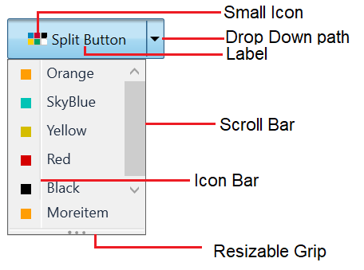
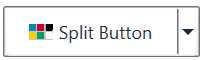
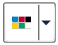
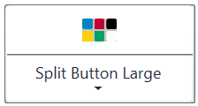
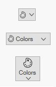
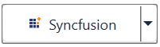
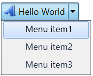

# Getting Started with Split Button

This section provides an overview of how to work with Split Button control. It describes the control structure, the control initialization and the image setting for the control and add items to the control.

## Control structure

## Assembly deployment

Refer [SplitButtonAdv](https://help.syncfusion.com/wpf/control-dependencies#splitbutton) control dependencies section to get the list of assemblies or [NuGet package](https://help.syncfusion.com/wpf/visual-studio-integration/nuget-packages) needs to be added as reference to use the SplitButtonAdv control in any application.

## Creating simple application with SplitButton

In this walk through, you will create WPF application that contains Split Button control. By the following ways, one can add the controls:

1. [Adding control via designer](#adding-control-via-designer)

2. [Adding control manually in XAML](#adding-control-manually-in-xaml)

3. [Adding control manually in C#](#adding-control-manually-in-c)

### Adding control via designer

Split Button control can be added to the application by dragging **SplitButtonAdv** from toolbox and dropping it in designer view. After dropping the controls in designer view, the assemblies such as **Syncfusion.Shared.WPF** gets added into the project automatically. The following code snippets will be added into the XAML.




    <syncfusion:SplitButtonAdv x:Name="splitButtonAdv" Label="Split Button"/>




N> **syncfusion** in XAML is an auto generated namespace.

### Adding control manually in XAML

In order to add the control manually in XAML, follow the below steps.

1. Add the below required assembly reference to the project.

    * Syncfusion.Shared.WPF

2. Import Syncfusion WPF schema `http://schemas.syncfusion.com/wpf` or the control namespace `Syncfusion.Windows.Tools.Controls` in XAML page.

3. Declare SplitButtonAdv control in XAML page.




<Window xmlns="http://schemas.microsoft.com/winfx/2006/xaml/presentation"
        xmlns:x="http://schemas.microsoft.com/winfx/2006/xaml"
        xmlns:local="clr-namespace:SplitButtonadv_GetStart_Sample"
        xmlns:syncfusion="http://schemas.syncfusion.com/wpf"
        xmlns:Syncfusion="http://schemas.microsoft.com/netfx/2009/xaml/presentation"
        mc:Ignorable="d"
        Title="MainWindow" Height="450" Width="800">
    <Grid>
        <syncfusion:SplitButtonAdv Height="44"  VerticalAlignment="Center" HorizontalAlignment="Center" Width="162"/>
     </Grid>
</Window>




### Adding control manually in C#

In order to add control manually in C#, do the below steps.

1. Add the below required assembly references to the project.

    * Syncfusion.Shared.WPF

2. Import the `Syncfusion.Windows.Tools.Controls` namespace.

3. Create SplitButtonAdv control instance and add it to the window.




<Window xmlns="http://schemas.microsoft.com/winfx/2006/xaml/presentation"
        xmlns:x="http://schemas.microsoft.com/winfx/2006/xaml"
        xmlns:local="clr-namespace:SplitButtonadv_GetStart_Sample"
        xmlns:syncfusion="http://schemas.syncfusion.com/wpf"
        xmlns:Syncfusion="http://schemas.microsoft.com/netfx/2009/xaml/presentation"
        mc:Ignorable="d"
        Title="MainWindow" Height="450" Width="800">
    <Grid x:Name="Root">

    </Grid>
</Window>




using Syncfusion.Windows.Tools.Controls;
    
namespace ButtonSample
{
    public partial class MainWindow : Window
    {
        public MainWindow()
        {
            InitializeComponent();
            SplitButtonAdv splitButtonAdv = new SplitButtonAdv();
            splitButtonAdv.Height=44;
            splitButtonAdv.Width=31;
            Root.Children.Add(splitButtonAdv);
        }
    }
}




## Setting label

The label on the button is a text that explains its action to the end-user. Apply the text by using the [Label](https://help.syncfusion.com/cr/wpf/Syncfusion.Windows.Tools.Controls.DropDownButtonAdv.html#Syncfusion_Windows_Tools_Controls_DropDownButtonAdv_Label) property.




<syncfusion:SplitButtonAdv Label="Colors" SmallIcon="Images\color.png"/>




SplitButtonAdv button = new SplitButtonAdv();
button.Label = "Colors";
button.SmallIcon = new BitmapImage(new Uri("Images\colors.png", UriKind.RelativeOrAbsolute));




## Setting size mode

Size mode is used to render Split Button control in different pre-defined sizes based on application demand. Apply the size mode by setting the [SizeMode](https://help.syncfusion.com/cr/wpf/Syncfusion.Windows.Tools.Controls.DropDownButtonAdv.html#Syncfusion_Windows_Tools_Controls_DropDownButtonAdv_SizeMode) property.

The **SizeMode** is an enumeration which contains the following values:

* Small
* Normal
* Large

### Small mode

When the mode is set to small, the control is displayed without the label. Only icon will be present in it.




<syncfusion:SplitButtonAdv SizeMode="Small" SmallIcon="Images\color.png" Label="Colors"/>




SplitButtonAdv button = new SplitButtonAdv();
button.Label = "Colors";
button.SizeMode = SizeMode.Small;
button.SmallIcon = new BitmapImage(new Uri("Images\colors.png", UriKind.RelativeOrAbsolute));




### Normal mode

In a normal size button, a small image with the text on the side will be displayed.




<syncfusion:SplitButtonAdv SizeMode="Normal" SmallIcon="Images\color.png" Label="Colors"/>




SplitButtonAdv button = new SplitButtonAdv();
button.Label = "Colors";
button.SizeMode = SizeMode.Normal;
button.SmallIcon = new BitmapImage(new Uri("Images\colors.png", UriKind.RelativeOrAbsolute));




### Large mode

In a large size button, a large image along with the text at the bottom will be displayed.




<syncfusion:SplitButtonAdv SizeMode="Large" LargeIcon="Images\color.png" Label="Colors"/>




SplitButtonAdv button = new SplitButtonAdv();
button.Label = "Colors";
button.SizeMode = SizeMode.Large;
button.LargeIcon = new BitmapImage(new Uri("Images\colors.png", UriKind.RelativeOrAbsolute));




## Setting icon template

The [IconTemplate](https://help.syncfusion.com/cr/wpf/Syncfusion.Windows.Tools.Controls.DropDownButtonAdv.html#Syncfusion_Windows_Tools_Controls_DropDownButtonAdv_IconTemplate) property provides support for setting up any type of image such as path data, font icons, etc. to the `SplitButtonAdv`. The icon will automatically resize the template content according to its size provided in the data template.





<sync:SplitButtonAdv Grid.Row="1" Grid.Column="1" SizeMode="Small" Label="Colors" HorizontalAlignment="Center" VerticalAlignment="Center">
    <sync:SplitButtonAdv.IconTemplate>
        <DataTemplate>
            <Grid Width="12" Height="16">
                <Path
                        Data=M11.403995,24.319994C12.395995,24.319994 13.199994,25.127996 13.199994,26.124 13.199994,27.121004 12.395995,27.928007 11.403995,27.928007 10.412996,27.928007 9.6089972,27.121004 9.6089972,26.124 9.6089972,25.127996 10.412996,24.319994 11.403995,24.319994z M17.906996,23.344005C18.898996,23.344005 19.702995,24.152004 19.702995,25.148004 19.702995,26.144005 18.898996,26.952003 17.906996,26.952003 16.915996,26.952003 16.111997,26.144005 16.111997,25.148004 16.111997,24.152004 16.915996,23.344005 17.906996,23.344005z M6.6579994,19.755001C7.6499986,19.755001 8.4539975,20.563002 8.4539975,21.559 8.4539975,22.555 7.6499986,23.362999 6.6579994,23.362999 5.6670007,23.362999 4.8630012,22.555 4.8630012,21.559 4.8630012,20.563002 5.6670007,19.755001 6.6579994,19.755001z M22.225996,18.761007C23.217995,18.761007 24.021994,19.568006 24.021994,20.565006 24.021994,21.561005 23.217995,22.369005 22.225996,22.369005 21.234997,22.369005 20.430998,21.561005 20.430998,20.565006 20.430998,19.568006 21.234997,18.761007 22.225996,18.761007z M22.123995,12.392005C23.115993,12.392005 23.919992,13.199004 23.919992,14.196004 23.919992,15.192003 23.115993,16.000004 22.123995,16.000004 21.132995,16.000004 20.328997,15.192003 20.328997,14.196004 20.328997,13.199004 21.132995,12.392005 22.123995,12.392005z M14.34922,4.7026652C15.503031,4.733209 16.70268,5.8161396 17.219744,7.4063476 17.829737,9.2813538 17.257744,11.15236 15.943761,11.583361 14.628778,12.015363 13.068799,10.844358 12.458807,8.9693526 11.849814,7.0933465 12.420807,5.2233409 13.735789,4.7913393 13.900037,4.7374643 14.068128,4.7086047 14.237728,4.7030128 14.274828,4.7017897 14.312,4.7016796 14.34922,4.7026652z M11.384993,2.000007C10.416991,2.0000073,9.6289967,2.7939981,9.6289967,3.7699956L9.6289967,10.694005C9.6289967,13.375005 7.4559931,15.556995 4.7850031,15.556995 3.2369992,15.556995 1.9999997,16.800999 1.9999994,18.330997 1.9999997,24.765001 7.2070001,30 13.608001,30L14.014998,30C20.736997,30,26.205,24.502993,26.205,17.746006L26.205,16.897007C26.205,8.6830043,19.557005,2.0000073,11.384993,2.000007z M11.384993,0C20.660002,0,28.205,7.5800074,28.205,16.897007L28.205,17.746006C28.205,25.606005,21.839994,32,14.014998,32L13.608001,32C6.1049951,32 -1.6119111E-07,25.867998 0,18.330997 -1.6119111E-07,15.698002 2.1340023,13.556996 4.7559961,13.556996 6.3529962,13.556996 7.6289972,12.272008 7.6289972,10.694005L7.6289972,3.7699956C7.6289972,1.6910015,9.3139943,0,11.384993,0z
                        Fill="#FF3A3A38"
                        Stretch="Fill" />
            </Grid>
        </DataTemplate>
    </sync:SplitButtonAdv.IconTemplate>
</sync:SplitButtonAdv>
<sync:SplitButtonAdv Grid.Row="2" Grid.Column="1" SizeMode="Normal" Label="Colors" HorizontalAlignment="Center" VerticalAlignment="Center">
    <sync:SplitButtonAdv.IconTemplate>
        <DataTemplate>
            <Grid Width="16" Height="16">
                <Path
                        Data=M11.403995,24.319994C12.395995,24.319994 13.199994,25.127996 13.199994,26.124 13.199994,27.121004 12.395995,27.928007 11.403995,27.928007 10.412996,27.928007 9.6089972,27.121004 9.6089972,26.124 9.6089972,25.127996 10.412996,24.319994 11.403995,24.319994z M17.906996,23.344005C18.898996,23.344005 19.702995,24.152004 19.702995,25.148004 19.702995,26.144005 18.898996,26.952003 17.906996,26.952003 16.915996,26.952003 16.111997,26.144005 16.111997,25.148004 16.111997,24.152004 16.915996,23.344005 17.906996,23.344005z M6.6579994,19.755001C7.6499986,19.755001 8.4539975,20.563002 8.4539975,21.559 8.4539975,22.555 7.6499986,23.362999 6.6579994,23.362999 5.6670007,23.362999 4.8630012,22.555 4.8630012,21.559 4.8630012,20.563002 5.6670007,19.755001 6.6579994,19.755001z M22.225996,18.761007C23.217995,18.761007 24.021994,19.568006 24.021994,20.565006 24.021994,21.561005 23.217995,22.369005 22.225996,22.369005 21.234997,22.369005 20.430998,21.561005 20.430998,20.565006 20.430998,19.568006 21.234997,18.761007 22.225996,18.761007z M22.123995,12.392005C23.115993,12.392005 23.919992,13.199004 23.919992,14.196004 23.919992,15.192003 23.115993,16.000004 22.123995,16.000004 21.132995,16.000004 20.328997,15.192003 20.328997,14.196004 20.328997,13.199004 21.132995,12.392005 22.123995,12.392005z M14.34922,4.7026652C15.503031,4.733209 16.70268,5.8161396 17.219744,7.4063476 17.829737,9.2813538 17.257744,11.15236 15.943761,11.583361 14.628778,12.015363 13.068799,10.844358 12.458807,8.9693526 11.849814,7.0933465 12.420807,5.2233409 13.735789,4.7913393 13.900037,4.7374643 14.068128,4.7086047 14.237728,4.7030128 14.274828,4.7017897 14.312,4.7016796 14.34922,4.7026652z M11.384993,2.000007C10.416991,2.0000073,9.6289967,2.7939981,9.6289967,3.7699956L9.6289967,10.694005C9.6289967,13.375005 7.4559931,15.556995 4.7850031,15.556995 3.2369992,15.556995 1.9999997,16.800999 1.9999994,18.330997 1.9999997,24.765001 7.2070001,30 13.608001,30L14.014998,30C20.736997,30,26.205,24.502993,26.205,17.746006L26.205,16.897007C26.205,8.6830043,19.557005,2.0000073,11.384993,2.000007z M11.384993,0C20.660002,0,28.205,7.5800074,28.205,16.897007L28.205,17.746006C28.205,25.606005,21.839994,32,14.014998,32L13.608001,32C6.1049951,32 -1.6119111E-07,25.867998 0,18.330997 -1.6119111E-07,15.698002 2.1340023,13.556996 4.7559961,13.556996 6.3529962,13.556996 7.6289972,12.272008 7.6289972,10.694005L7.6289972,3.7699956C7.6289972,1.6910015,9.3139943,0,11.384993,0z"
                        Fill="#FF3A3A38"
                        Stretch="Fill" />
            </Grid>
        </DataTemplate>
    </sync:SplitButtonAdv.IconTemplate>
</sync:SplitButtonAdv>
<sync:SplitButtonAdv Grid.Row="3" Grid.Column="1" SizeMode="Large" Label="Colors" HorizontalAlignment="Center" VerticalAlignment="Center">
    <sync:SplitButtonAdv.IconTemplate>
        <DataTemplate>
            <Grid  x:Name="Save"
                    Width="16"
                    Height="16">
                <Path
                        Width="16"
                        Height="16"
                        Data="M11.403995,24.319994C12.395995,24.319994 13.199994,25.127996 13.199994,26.124 13.199994,27.121004 12.395995,27.928007 11.403995,27.928007 10.412996,27.928007 9.6089972,27.121004 9.6089972,26.124 9.6089972,25.127996 10.412996,24.319994 11.403995,24.319994z M17.906996,23.344005C18.898996,23.344005 19.702995,24.152004 19.702995,25.148004 19.702995,26.144005 18.898996,26.952003 17.906996,26.952003 16.915996,26.952003 16.111997,26.144005 16.111997,25.148004 16.111997,24.152004 16.915996,23.344005 17.906996,23.344005z M6.6579994,19.755001C7.6499986,19.755001 8.4539975,20.563002 8.4539975,21.559 8.4539975,22.555 7.6499986,23.362999 6.6579994,23.362999 5.6670007,23.362999 4.8630012,22.555 4.8630012,21.559 4.8630012,20.563002 5.6670007,19.755001 6.6579994,19.755001z M22.225996,18.761007C23.217995,18.761007 24.021994,19.568006 24.021994,20.565006 24.021994,21.561005 23.217995,22.369005 22.225996,22.369005 21.234997,22.369005 20.430998,21.561005 20.430998,20.565006 20.430998,19.568006 21.234997,18.761007 22.225996,18.761007z M22.123995,12.392005C23.115993,12.392005 23.919992,13.199004 23.919992,14.196004 23.919992,15.192003 23.115993,16.000004 22.123995,16.000004 21.132995,16.000004 20.328997,15.192003 20.328997,14.196004 20.328997,13.199004 21.132995,12.392005 22.123995,12.392005z M14.34922,4.7026652C15.503031,4.733209 16.70268,5.8161396 17.219744,7.4063476 17.829737,9.2813538 17.257744,11.15236 15.943761,11.583361 14.628778,12.015363 13.068799,10.844358 12.458807,8.9693526 11.849814,7.0933465 12.420807,5.2233409 13.735789,4.7913393 13.900037,4.7374643 14.068128,4.7086047 14.237728,4.7030128 14.274828,4.7017897 14.312,4.7016796 14.34922,4.7026652z M11.384993,2.000007C10.416991,2.0000073,9.6289967,2.7939981,9.6289967,3.7699956L9.6289967,10.694005C9.6289967,13.375005 7.4559931,15.556995 4.7850031,15.556995 3.2369992,15.556995 1.9999997,16.800999 1.9999994,18.330997 1.9999997,24.765001 7.2070001,30 13.608001,30L14.014998,30C20.736997,30,26.205,24.502993,26.205,17.746006L26.205,16.897007C26.205,8.6830043,19.557005,2.0000073,11.384993,2.000007z M11.384993,0C20.660002,0,28.205,7.5800074,28.205,16.897007L28.205,17.746006C28.205,25.606005,21.839994,32,14.014998,32L13.608001,32C6.1049951,32 -1.6119111E-07,25.867998 0,18.330997 -1.6119111E-07,15.698002 2.1340023,13.556996 4.7559961,13.556996 6.3529962,13.556996 7.6289972,12.272008 7.6289972,10.694005L7.6289972,3.7699956C7.6289972,1.6910015,9.3139943,0,11.384993,0z"
                        Fill="#FF3A3A38"
                        Stretch="Fill" />
            </Grid>
        </DataTemplate>
    </sync:SplitButtonAdv.IconTemplate>
</sync:SplitButtonAdv>
 

 

 

 N> The [SplitButtonAdv](https://help.syncfusion.com/cr/wpf/Syncfusion.Windows.Tools.Controls.SplitButton.html) loads the icon in the following priority order.
* [IconTemplate](https://help.syncfusion.com/cr/wpf/Syncfusion.Windows.Tools.Controls.DropDownButtonAdv.html#Syncfusion_Windows_Tools_Controls_DropDownButtonAdv_IconTemplate)
* [LargeIcon](https://help.syncfusion.com/cr/wpf/Syncfusion.Windows.Tools.Controls.DropDownButtonAdv.html#Syncfusion_Windows_Tools_Controls_DropDownButtonAdv_LargeIcon)
* [SmallIcon](https://help.syncfusion.com/cr/wpf/Syncfusion.Windows.Tools.Controls.DropDownButtonAdv.html#Syncfusion_Windows_Tools_Controls_DropDownButtonAdv_SmallIcon)

## Setting icon template selector

 The [IconTemplateSelector](https://help.syncfusion.com/cr/wpf/Syncfusion.Windows.Tools.Controls.DropDownButtonAdv.html#Syncfusion_Windows_Tools_Controls_DropDownButtonAdv_IconTemplateSelector) property allows you to specify a different data template based on the size mode or different validation criteria.

 

 

 <Window x:Class="TemplateSelector_SplitButtonAdv.MainWindow"
        xmlns="http://schemas.microsoft.com/winfx/2006/xaml/presentation"
        xmlns:x="http://schemas.microsoft.com/winfx/2006/xaml"
        xmlns:d="http://schemas.microsoft.com/expression/blend/2008"
        xmlns:mc="http://schemas.openxmlformats.org/markup-compatibility/2006"
        xmlns:local="clr-namespace:TemplateSelector_SplitButtonAdv"
        xmlns:Sync="http://schemas.syncfusion.com/wpf"
        mc:Ignorable="d"
        Title="MainWindow" Height="450" Width="800">
    <Window.Resources>
        <DataTemplate x:Key="newIcon">
            <Grid Width="12" Height="16">
                <Path
                      Margin="0.5"
                      Data="M0,0 L5.9999999,0 11,5 11,15 0,15 z"
                      Fill="White"
                      Stretch="Fill" />
                <Path
                     Data="M7,1.7070007 L7,5 10.292999,5 z M1,1 L1,15 11,15 11,6 6,6 6,1 z M0,0 L6.7070007,0 12,5.2929993 12,16 0,16 z"
                     Fill="#FF3A3A38"
                     Stretch="Fill" />
            </Grid>
        </DataTemplate>
        <DataTemplate x:Key="OpenIcon">
            <Grid Width="16" Height="16">
                <Path
                     Margin="0.5,0.5,0.738,0.502"
                     Data="M0,0 L5,0 6,1 12,1 12,3.4999998 11.499065,3.9999996 14.716998,3.9999996 11.92699,10.999 4.1853847,10.984859 0,10.982999 z"
                     Fill="White"
                     Stretch="Fill" />
                <Path
                     Data="M5.162991,5.0009986 L1.7839907,10.979999 4.3081884,10.984653 5.0009999,10.984999 5.0009999,10.98593 12.088991,10.999 14.480014,5.0009986 z M0,0 L5.7069998,0 6.7069998,1 13,1 13,3.9999998 12,3.9999998 12,1.9999998 6.2930002,1.9999998 5.2930002,1 0.99999994,1 0.99999994,10.335325 4.5790062,4.0009986 15.954991,4.0009986 12.765994,12.000998 4.552258,11.98482 0,11.982999 z"
                     Fill="#FF3A3A38"
                     Stretch="Fill" />
            </Grid>
        </DataTemplate>
        <local:TemplateSelector x:Key="IconTemp" NewIcon="{StaticResource newIcon}" OpenIcon="{StaticResource OpenIcon}"/>
    </Window.Resources>
    <Grid>
        <StackPanel VerticalAlignment="Center">
            <CheckBox Name="Check" IsChecked="True" Checked="Check_Checked" Unchecked="Check_Unchecked" HorizontalAlignment="Center" Command="{Binding CheckCommand}" Content="ChangeIcon"/>
            <Sync:SplitButtonAdv HorizontalAlignment="Center" Margin="10" Content="{Binding IsChecked}" Label="IconTemplateSelector" IconTemplateSelector="{StaticResource IconTemp}"/>
        </StackPanel>
    </Grid>
</Window>

 
 

 public class TemplateSelector : DataTemplateSelector
 {
    public DataTemplate NewIcon { get; set; }
    public DataTemplate OpenIcon { get; set; }
    public override DataTemplate SelectTemplate(object item, DependencyObject container)
    {
        if (item == null)
        {
            return OpenIcon;
        }
        if ((item as Model).IsChecked)
        {
            return NewIcon;
        }
        return base.SelectTemplate(item, container);
    }
 }
 
 

 
 
 N> The [SplitButtonAdv](https://help.syncfusion.com/cr/wpf/Syncfusion.Windows.Tools.Controls.SplitButton.html) loads the icon in the following priority order.
* [IconTemplateSelector](https://help.syncfusion.com/cr/wpf/Syncfusion.Windows.Tools.Controls.DropDownButtonAdv.html#Syncfusion_Windows_Tools_Controls_DropDownButtonAdv_IconTemplateSelector)
* [IconTemplate](https://help.syncfusion.com/cr/wpf/Syncfusion.Windows.Tools.Controls.DropDownButtonAdv.html#Syncfusion_Windows_Tools_Controls_DropDownButtonAdv_IconTemplate)
* [LargeIcon](https://help.syncfusion.com/cr/wpf/Syncfusion.Windows.Tools.Controls.DropDownButtonAdv.html#Syncfusion_Windows_Tools_Controls_DropDownButtonAdv_LargeIcon)
* [SmallIcon](https://help.syncfusion.com/cr/wpf/Syncfusion.Windows.Tools.Controls.DropDownButtonAdv.html#Syncfusion_Windows_Tools_Controls_DropDownButtonAdv_SmallIcon)

## Setting image

The image option helps to provide pictorial representation of the button. Image can be added either using the [SmallIcon](https://help.syncfusion.com/cr/wpf/Syncfusion.Windows.Tools.Controls.DropDownButtonAdv.html#Syncfusion_Windows_Tools_Controls_DropDownButtonAdv_SmallIcon) or [LargeIcon](https://help.syncfusion.com/cr/wpf/Syncfusion.Windows.Tools.Controls.DropDownButtonAdv.html#Syncfusion_Windows_Tools_Controls_DropDownButtonAdv_LargeIcon) property.

* **SmallIcon** — This property will be used to set the image when size mode is **Normal** or **Small**.
* **LargeIcon** — This property will be used to set the image when size mode is **Large**.

The **SmallIcon** property can be set as follows:




<syncfusion:SplitButtonAdv SizeMode="Small" Label="Syncfusion" SmallIcon="Images\syncfusion.png"/>




SplitButtonAdv button = new SplitButtonAdv();
button.Label = "Syncfusion";
button.SizeMode = SizeMode.Small;
button.SmallIcon = new BitmapImage(new Uri("Images\syncfusion.png", UriKind.RelativeOrAbsolute));




The **SmallIcon** property can be set even when the sizeMode is **Normal**.




<syncfusion:SplitButtonAdv SizeMode="Normal" SmallIcon="Images\Syncfusion.png" Label="Syncfusion"/>




SplitButtonAdv button = new SplitButtonAdv();
button.Label = "Syncfusion";
button.SizeMode = SizeMode.Normal;
button.SmallIcon = new BitmapImage(new Uri("Images\syncfusion.png", UriKind.RelativeOrAbsolute));




The **LargeIcon** property can be set as follows:




<syncfusion:SplitButtonAdv SizeMode="Large" LargeIcon="Images\Syncfusion.png" Label="Syncfusion"/>




SplitButtonAdv button = new SplitButtonAdv();
button.Label = "Syncfusion";
button.SizeMode = SizeMode.Large;
button.LargeIcon = new BitmapImage(new Uri("Images\syncfusion.png", UriKind.RelativeOrAbsolute));




## Setting icon width and height

Icon width and icon height can be set using [IconWidth](https://help.syncfusion.com/cr/wpf/Syncfusion.Windows.Tools.Controls.DropDownButtonAdv.html#Syncfusion_Windows_Tools_Controls_DropDownButtonAdv_IconWidth) and [IconHeight](https://help.syncfusion.com/cr/wpf/Syncfusion.Windows.Tools.Controls.DropDownButtonAdv.html#Syncfusion_Windows_Tools_Controls_DropDownButtonAdv_IconHeight) properties respectively.




<syncfusion:SplitButtonAdv SizeMode="Normal" IconHeight="20" IconWidth="20"  Label="Syncfusion" SmallIcon="Images\syncfusion.png" />




SplitButtonAdv splitbutton = new SplitButtonAdv();
splitbutton.Label = "Syncfusion";
splitbutton.IconWidth=20;
splitbutton.IconHeight=20;
splitbutton.SmallIcon = new BitmapImage(new Uri("Images\syncfusion.png", UriKind.RelativeOrAbsolute));







<syncfusion:SplitButtonAdv x:Name="splitbutton"  SizeMode="Normal" IconHeight="30" IconWidth="30"  Label="Syncfusion"  SmallIcon="Images\syncfusion.png" />




SplitButtonAdv splitbutton = new SplitButtonAdv();
splitbutton.Label = "Syncfusion";
splitbutton.IconWidth=30;
splitbutton.IconHeight=30;
splitbutton.SmallIcon = new BitmapImage(new Uri("Images\syncfusion.png", UriKind.RelativeOrAbsolute));




N> View [sample](https://github.com/SyncfusionExamples/wpf-split-button-examples/blob/master/Samples/Getting-Started) in GitHub. This sample showcases how to add split button control and its basic features like image sizing options and size modes.

## IsDefault mode

The [IsDefault](https://help.syncfusion.com/cr/wpf/Syncfusion.Windows.Tools.Controls.SplitButtonAdv.html#Syncfusion_Windows_Tools_Controls_SplitButtonAdv_IsDefault) property indicates whether the SplitButtonAdv is a `Default` button and is used to activate the SplitButtonAdv by pressing using `Enter` key. When setting the `IsDefault` property to true, the user can invoke the button by pressing the `Enter` key. 





 <sync:SplitButtonAdv x:Name="defaultButton" Label="Default" Grid.Column="1" Grid.Row="1" VerticalAlignment="Top" HorizontalAlignment="Center" Click="SplitButtonAdv_Click" IsDefault="True" />





## Adding items to Split Button

The DropDownMenuGroup acts as a container for the Split Button control. It provides options to add menu items and also options like header name, re-sizing and scrollbar.

N> For more information on how to bind data with command actions for Split Button please refer to the topics [Data Binding](https://help.syncfusion.com/wpf/split-button/data-binding) and [Command Binding](https://help.syncfusion.com/wpf/split-button/command-binding).




<Window x:Class="Split_Button_Menuitem_Binding.MainWindow"
        xmlns="http://schemas.microsoft.com/winfx/2006/xaml/presentation"
        xmlns:x="http://schemas.microsoft.com/winfx/2006/xaml"
        xmlns:d="http://schemas.microsoft.com/expression/blend/2008"
        xmlns:mc="http://schemas.openxmlformats.org/markup-compatibility/2006"
        xmlns:local="clr-namespace:Dropdown_Button_Menuitem_Binding"
        xmlns:syncfusion="http://schemas.syncfusion.com/wpf"
        mc:Ignorable="d"
        Title="MainWindow" Height="450" Width="800">
    <Window.DataContext>
        <local:CountryViewModel/>
    </Window.DataContext>
    <Grid>
        <syncfusion:SplitButtonAdv Label="Country" SmallIcon="Images/flagsmall.png" >
            <syncfusion:DropDownMenuGroup ItemsSource="{Binding DropDownItems}">
                <syncfusion:DropDownMenuGroup.ItemTemplate>
                    <DataTemplate>
                        <syncfusion:DropDownMenuItem Header="{Binding Name}" HorizontalAlignment="Left">
                            <syncfusion:DropDownMenuItem.Icon>
                                <Image Source="{Binding Flag}"/>
                            </syncfusion:DropDownMenuItem.Icon>
                        </syncfusion:DropDownMenuItem>
                    </DataTemplate>
                </syncfusion:DropDownMenuGroup.ItemTemplate>
            </syncfusion:DropDownMenuGroup>
        </syncfusion:SplitButtonAdv>
    </Grid>
</window>




public class Country
{
    private string name;

    public string Name
    {
        get
        {
            return name;
        }
        set
        {
            name = value;
        }
    }
    private BitmapImage flag;
    public BitmapImage Flag
    {
        get
        {
            return flag;
        }
        set
        {
            flag = value;
        }
    }
}
    
public class CountryViewModel
{
    private List<Country> dropDownItems;

    public List<Country> DropDownItems
    {
        get
        {
            return dropDownItems;
        }
        set
        {
            dropDownItems = value;
        }
    }

    public CountryViewModel()
    {
        DropDownItems = new List<Country>();
        DropDownItems.Add(new Country()
        {
            Name = "India",
            Flag = new BitmapImage(new Uri("/Images/india.png", UriKind.RelativeOrAbsolute))
        });
        DropDownItems.Add(new Country()
        {
            Name = "France",
            Flag = new BitmapImage(new Uri("/Images/france.png", UriKind.RelativeOrAbsolute))
        });
        DropDownItems.Add(new Country()
        {
            Name = "Germany",
            Flag = new BitmapImage(new Uri("/Images/germany.png", UriKind.RelativeOrAbsolute))
        });
        }
}




N> View [sample](https://github.com/SyncfusionExamples/wpf-split-button-examples/blob/master/Samples/Add-Menu-Items) in GitHub.

