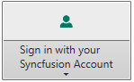

---
layout: post
title: Multiline Text Support in WPF SplitButton | Syncfusion®
description: Display button labels across multiple lines in large size mode to improve readability and presentation.
platform: WPF
control: SplitButtonAdv
documentation: ug
---

# Multiline Text in WPF Split Button (SplitButtonAdv)

Multiline text support is used to render text content of the Split Button control in multiple lines for precise view. One can apply the multiline text by using the [IsMultiLine](https://help.syncfusion.com/cr/wpf/Syncfusion.Windows.Tools.Controls.DropDownButtonAdv.html#Syncfusion_Windows_Tools_Controls_DropDownButtonAdv_IsMultiLine) property.

N> This property is only applicable for large size mode of the Split Button.




<syncfusion:SplitButtonAdv Label="Sign in with your Syncfusion Account" LargeIcon="image\userlarge.png" SizeMode="Large" IsMultiLine="True"/>




SplitButtonAdv splitbutton = new SplitButtonAdv();
splitbutton.Label = "Sign in with your Syncfusion Account";
splitbutton.IsMultiLine =true;
splitbutton.SizeMode = SizeMode.Large;
splitbutton.SmallIcon = new BitmapImage(new Uri("image\userlarge.png"));




