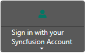

# Themes in WPF Split Button

Split Button supports various built-in themes. Refer to the below links to apply themes for the Split Button,

  * [Apply theme using SfSkinManager](https://help.syncfusion.com/wpf/themes/skin-manager)
	
  * [Create a custom theme using ThemeStudio](https://help.syncfusion.com/wpf/themes/theme-studio#creating-custom-theme)

