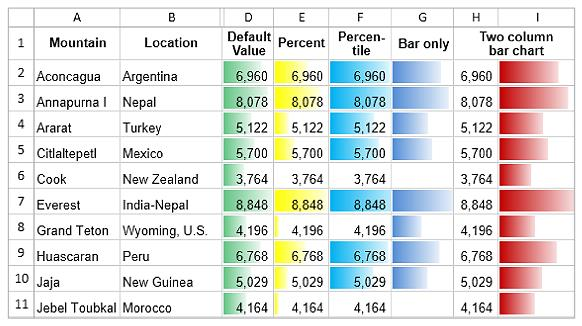
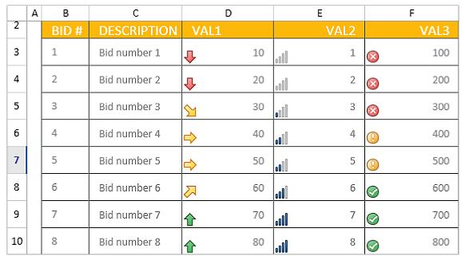

# Conditional Formatting in WPF Spreadsheet (SfSpreadsheet)

This section explains about how to apply conditional formatting rules programmatically at run time in SfSpreadsheet.

In SfSpreadsheet, to apply conditional format for a cell or range of cells, add [IConditionalFormat](https://help.syncfusion.com/cr/wpf/Syncfusion.XlsIO.IConditionalFormat.html) to that range by using [AddCondition](https://help.syncfusion.com/cr/wpf/Syncfusion.XlsIO.IConditionalFormats.html#Syncfusion_XlsIO_IConditionalFormats_AddCondition) method.



var worksheet =spreadsheet.Workbook.Worksheets[0];
IConditionalFormats condition = worksheet.Range["A1"].ConditionalFormats;
IConditionalFormat condition1 = condition.AddCondition();



## Highlight Cell Rules

### Based on CellValue

To format the cells based on cell value, define the conditional format type as **CellValue** and other formatting options such as formula, operator, background color etc., to the specified cell or range. Finally, invalidate the cells to refresh the view.



var worksheet = spreadsheet.Workbook.Worksheets[0];
IConditionalFormats condition = worksheet.Range["A1:A100"].ConditionalFormats;
IConditionalFormat condition1 = condition.AddCondition();
condition1.FormatType = ExcelCFType.CellValue;
condition1.Operator = ExcelComparisonOperator.Greater;
condition1.FirstFormula = "10";
condition1.BackColor = ExcelKnownColors.Light_orange;
spreadsheet.ActiveGrid.InvalidateCell(GridRangeInfo.Col(1));



### Based on Formula or Cell References

To format the cells based on Formula or Cell References, define the conditional format type as **Formula** and other formatting options such as formula, background color etc., to the specified cell or range. Finally, invalidate the cells to refresh the view.



var worksheet = spreadsheet.Workbook.Worksheets[0];
IConditionalFormats condition = worksheet.Range["A1:A100"].ConditionalFormats;
IConditionalFormat condition1 = condition.AddCondition();
condition1.FormatType = ExcelCFType.Formula;
condition1.FirstFormula = "=(B1+B2)>50";
condition1.BackColor = ExcelKnownColors.Brown;
spreadsheet.ActiveGrid.InvalidateCell(GridRangeInfo.Col(1));



### Based on SpecificText

To format the cells based on specified text, define the conditional format type as **SpecificText** and other formatting options such as the particular text, operator, background color etc., to the specified cell or range. Finally, invalidate the cells to refresh the view.



var worksheet = spreadsheet.Workbook.Worksheets[0];
IConditionalFormats condition = worksheet.Range["A1:A100"].ConditionalFormats;
IConditionalFormat condition1 = condition.AddCondition();
condition1.FormatType = ExcelCFType.SpecificText;
condition1.Text = "SYNC";
condition1.Operator = ExcelComparisonOperator.ContainsText;
condition1.BackColor = ExcelKnownColors.Light_orange;
spreadsheet.ActiveGrid.InvalidateCell(GridRangeInfo.Col(1));



### Based on TimePeriod

To format the cells based on time period, define the conditional format type as **TimePeriod** and other formatting options such as the time periods for the date, operator, background color etc., to the specified cell or range. Finally, invalidate the cells to refresh the view.



var worksheet = spreadsheet.Workbook.Worksheets[0];
IConditionalFormats condition = worksheet.Range["A1:A100"].ConditionalFormats;
IConditionalFormat condition1 = condition.AddCondition();
condition1.FormatType = ExcelCFType.TimePeriod;
condition1.TimePeriodType = CFTimePeriods.Today
condition1.BackColor = ExcelKnownColors.Light_orange;
spreadsheet.ActiveGrid.InvalidateCell(GridRangeInfo.Col(1));



Sample Output

## Data Bars

To apply the conditional format based on data bars,define the conditional format type as a **DataBar** and specify the properties associated with DataBars such as bar color, MinPoint, MaxPoint etc.,.to the specified cell or range. Finally, invalidate that cells to update the view.



var worksheet = spreadsheet.Workbook.Worksheets[0];
var conditionalFormats =   worksheet.Range["B1:B100"].ConditionalFormats;
var conditionalFormat = conditionalFormats.AddCondition();
conditionalFormat.FormatType = ExcelCFType.DataBar;
conditionalFormat.DataBar.BarColor = Color.FromArgb(255, 214, 0, 123);
conditionalFormat.DataBar.MinPoint.Type = ConditionValueType.LowestValue;
conditionalFormat.DataBar.MaxPoint.Type = ConditionValueType.HighestValue;
spreadsheet.ActiveGrid.InvalidateCell(GridRangeInfo.Col(2));



Sample Output

## Color Scales

To apply the conditional format based on color scales, define the conditional format type as a **ColorScale** and specify the other properties associated with ColorScale such as condition count,color criteria etc.,to the specified cell or range. Finally,invalidate that cells to update the view.



var worksheet = spreadsheet.Workbook.Worksheets[0];
var conditionalFormats = worksheet.Range["C2:C100"].ConditionalFormats;
var conditionalFormat = conditionalFormats.AddCondition();
conditionalFormat.FormatType = ExcelCFType.ColorScale;
conditionalFormat.ColorScale.SetConditionCount(2);
conditionalFormat.ColorScale.Criteria[0].FormatColorRGB = Color.FromArgb(255, 99, 190, 123);
conditionalFormat.ColorScale.Criteria[1].FormatColorRGB = Color.FromArgb(255, 90, 138, 198);
spreadsheet.ActiveGrid.InvalidateCell(GridRangeInfo.Col(3));



Sample Output

## Icon Sets

To apply the conditional format for Icon sets, define the conditional format type as **IconSet** and  the properties associated with IconSet such as the type of the icon,criteria etc., to the specified cell or range. Finally, invalidate that cells to update the view.



vvar worksheet = spreadsheet.Workbook.Worksheets[0];
var conditionalFormats = worksheet.Range["D2:D100"].ConditionalFormats;
var conditionalFormat = conditionalFormats.AddCondition();
conditionalFormat.FormatType = ExcelCFType.IconSet;
conditionalFormat.IconSet.IconSet = ExcelIconSetType.ThreeSymbols;
spreadsheet.ActiveGrid.InvalidateCell(GridRangeInfo.Col(4));



Sample Output

