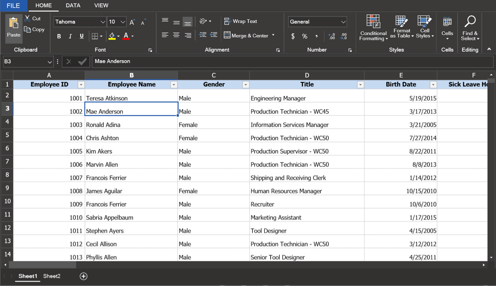

# Themes in WPF Spreadsheet (SfSpreadsheet)

SfSpreadsheet supports the following built-in themes.
*	MaterialLight
*	MaterialDark
*	Office2019Colorful
*	Office2019Black
*	Office2019White
*	Office2019DarkGray
*	FluentLight
*	FluentDark
*	SystemTheme

Refer to the below links to apply themes for the SfSpreadsheet,

  * [Apply theme using SfSkinManager](https://help.syncfusion.com/wpf/themes/skin-manager)
	
  * [Create a custom theme using ThemeStudio](https://help.syncfusion.com/wpf/themes/theme-studio#creating-custom-theme)
 
  

N> You can refer to our [WPF Spreadsheet](https://www.syncfusion.com/wpf-controls/spreadsheet) feature tour page for its groundbreaking feature representations. You can also explore our [WPF Spreadsheet example](https://github.com/syncfusion/wpf-demos) to know how to render and configure the spreadsheet.