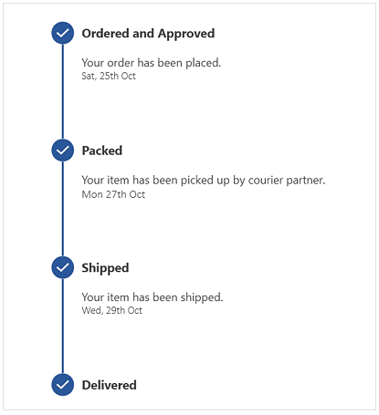

# WPF Step ProgressBar Overview

The SfStepProgressBar control is used to show the progress of a multiple-step process, such as new user registration or package status tracking. You can customize its appearance by changing the step shape, progress bar color, step template, and content template.

## Key features

• Visualize the step progress markers with different shapes, such as square and circle.

• Supports active, inactive, and indeterminate statuses to show progress.

• Visualize the progress of a multiple-step process in the horizontal or vertical orientation.

• Customize the progress bar styles, markers, and contents using the templates.