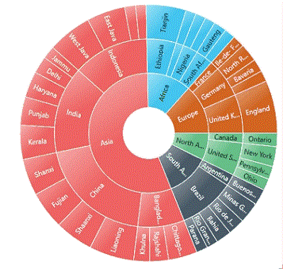
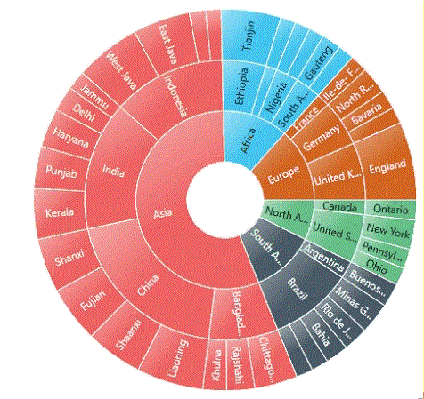

---

layout: post
title: Animation
description: This section explains how to use animation in the chart. 
platform: wpf 
control: SfSunburstChart 
documentation: ug

---

# Animation

Sunburst chart allows you to animate the chart segments. You can enable animation using [`EnableAnimation`](https://help.syncfusion.com/cr/wpf/Syncfusion.UI.Xaml.SunburstChart.SfSunburstChart.html#Syncfusion_UI_Xaml_SunburstChart_SfSunburstChart_EnableAnimation) property. Also you can set the duration for animation by using [`AnimationDuration`](https://help.syncfusion.com/cr/wpf/Syncfusion.UI.Xaml.SunburstChart.SfSunburstChart.html#Syncfusion_UI_Xaml_SunburstChart_SfSunburstChart_AnimationDuration) property.





 <sunburst:SfSunburstChart EnableAnimation="True" 
                          AnimationDuration="5000">

 </sunburst:SfSunburstChart>





sunburstChart.EnableAnimation = true;

sunburstChart.AnimationDuration = 5000;





## Animation types

Sunburst chart provide options to animate the chart segments in different ways using [`AnimationType`](https://help.syncfusion.com/cr/wpf/Syncfusion.UI.Xaml.SunburstChart.SfSunburstChart.html#Syncfusion_UI_Xaml_SunburstChart_SfSunburstChart_AnimationType) property. 

FadeIn – It gradually changes opacity of the chart segment.

Rotation – During an animation, control rotate from 0 to 360 angle. 

### FadeIn

The following example shows, how to enable the FadeIn animation. 





  <sunburst:SfSunburstChart EnableAnimation="True"                                
                            AnimationType="FadeIn">
                            
  </sunburst:SfSunburstChart>





sunburstChart.EnableAnimation = true;
sunburstChart.AnimationType = AnimationType.FadeIn;





### Rotation

The following example shows, how to enable the Rotation animation. 





  <sunburst:SfSunburstChart EnableAnimation="True"                                
                            AnimationType="Rotation">

  </sunburst:SfSunburstChart>





sunburstChart.EnableAnimation = true;
sunburstChart.AnimationType = AnimationType.Rotation;





