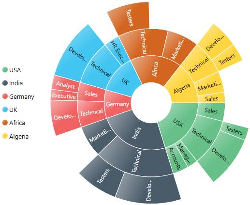
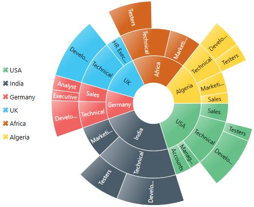
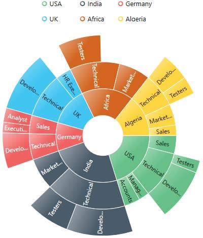
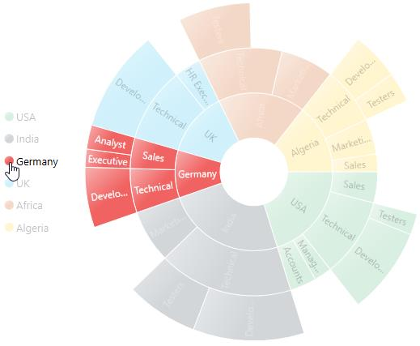
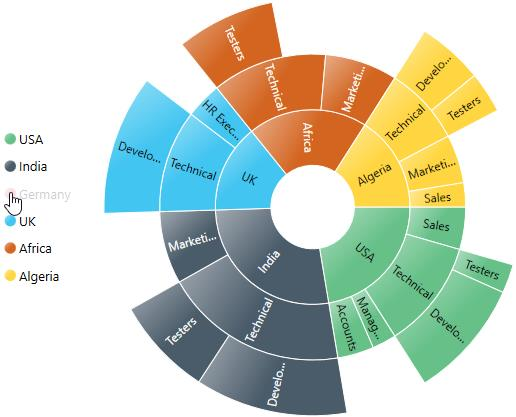

---

layout: post
title: Legend in WPF Sunburst Chart control | Syncfusion
description: Learn here all about Legend support in Syncfusion WPF Sunburst Chart (SfSunburstChart) control and more.
platform: wpf 
control: SfSunburstChart 
documentation: ug

---

# Legend in WPF Sunburst Chart (SfSunburstChart)

The Legend is used to represent the first level of categories in sunburst chart. 

You can initialize the legend as in the below code snippet:





       <sunburst:SfSunburstChart.Legend>

            <sunburst:SunburstLegend/>

      </sunburst:SfSunburstChart.Legend>





SunburstLegend legend = new SunburstLegend();
chart.Legend = legend;





## Legend Icon

You can specify different shapes of legend icon by using the [`LegendIcon`](https://help.syncfusion.com/cr/wpf/Syncfusion.UI.Xaml.SunburstChart.SunburstLegend.html#Syncfusion_UI_Xaml_SunburstChart_SunburstLegend_LegendIcon) property. By default, legend icon is Circle. The Sunburst chart have some predefined shapes such as:

* Circle
* Cross
* Diamond
* Pentagon
* Rectangle
* Triangle





     <sunburst:SfSunburstChart.Legend>

           <sunburst:SunburstLegend LegendIcon="Pentagon"/>

     </sunburst:SfSunburstChart.Legend>





SunburstLegend legend = new SunburstLegend()
{
       LegendIcon = SunburstLegendIcon.Pentagon
};
chart.Legend = legend;





The following properties are used to customize the legend icons size.

* [`IconHeight`](https://help.syncfusion.com/cr/wpf/Syncfusion.UI.Xaml.SunburstChart.SunburstLegend.html#Syncfusion_UI_Xaml_SunburstChart_SunburstLegend_IconHeight) – Gets or sets the double value to represents icon(s) height.
* [`IconWidth`](https://help.syncfusion.com/cr/wpf/Syncfusion.UI.Xaml.SunburstChart.SunburstLegend.html#Syncfusion_UI_Xaml_SunburstChart_SunburstLegend_IconWidth) – Gets or sets the double value to represents icon(s) width.

You can customize your own legend shape by applying custom template using [`LegendIconTemplate`](https://help.syncfusion.com/cr/wpf/Syncfusion.UI.Xaml.SunburstChart.SunburstLegend.html#Syncfusion_UI_Xaml_SunburstChart_SunburstLegend_LegendIconTemplate) property as shown in the below code. 





        <Grid.Resources>
            <DataTemplate x:Key="legendTemplate">
                <Path  Stroke="{Binding Stroke}" Stretch="Fill" Fill="{Binding Interior}"  
                            StrokeThickness="{Binding StrokeThickness}"
                            Data="F1 M 133.133,45.7109L 154.307,24.5363L 175.482,45.7109L 154.307,66.8856L 175.482,88.0603L 154.307,109.235L 133.133,88.0603L 111.958,109.235L 90.7835,88.0603L 111.958,66.8856L 90.7835,45.7109L 111.958,24.5363L 133.133,45.7109 Z " />

            </DataTemplate>
        </Grid.Resources>

      <sunburst:SfSunburstChart.Legend>
                <sunburst:SunburstLegend LegendIcon="Custom" 
                                         LegendIconTemplate="{StaticResource legendTemplate}"/>
      </sunburst:SfSunburstChart.Legend>





            SfSunburstChart sunburst = new SfSunburstChart();
            sunburst.ValueMemberPath = "EmployeesCount";
            sunburst.SetBinding(SfSunburstChart.ItemsSourceProperty, "Data");
            sunburst.Levels.Add(new SunburstHierarchicalLevel() { GroupMemberPath = "Country" });
            sunburst.Levels.Add(new SunburstHierarchicalLevel() { GroupMemberPath = "JobDescription" });
            sunburst.Levels.Add(new SunburstHierarchicalLevel() { GroupMemberPath = "JobGroup" });
            sunburst.Levels.Add(new SunburstHierarchicalLevel() { GroupMemberPath = "JobRole" });

            SunburstLegend legend = new SunburstLegend()
            {
                LegendIcon = SunburstLegendIcon.Custom,
                LegendIconTemplate = grid.Resources["legendTemplate"] as DataTemplate
            };
            sunburst.Legend = legend;           
            grid.Children.Add(sunburst);





Note: You need to set [`LegendIcon`](https://help.syncfusion.com/cr/wpf/Syncfusion.UI.Xaml.SunburstChart.SunburstLegendIcon.html) value as Custom in order to apply custom template.

## Positioning the Legend

You can customize the position to left, right, top, bottom for the legend using [`DockPosition`](https://help.syncfusion.com/cr/wpf/Syncfusion.UI.Xaml.SunburstChart.SunburstLegend.html#Syncfusion_UI_Xaml_SunburstChart_SunburstLegend_DockPosition) property as like in below code snippet





       <sunburst:SfSunburstChart.Legend>
                
          <sunburst:SunburstLegend DockPosition="Top" />
                
       </sunburst:SfSunburstChart.Legend>





SunburstLegend legend = new SunburstLegend()
{
       DockPosition =ChartDock.Top
};
chart.Legend = legend;





## Customize the Legend

You can arrange the legend items smartly by using ItemPanelTemplate and ItemTemplate property. The following code shows how to arrange the legend items smartly. 



    <sunburst:SfSunburstChart.Legend>

         <sunburst:SunburstLegend  DockPosition="Top" Margin="0,25,0,0" >
                    
                  <sunburst:SunburstLegend.ItemsPanel>
                        <ItemsPanelTemplate>
                            <WrapPanel Height="100" Width="250" />
                        </ItemsPanelTemplate>
                   </sunburst:SunburstLegend.ItemsPanel>

                    <sunburst:SunburstLegend.ItemTemplate>

                        <ItemContainerTemplate>

                            <StackPanel Width="75" Height="30" Orientation="Horizontal">
                                <Ellipse Stroke="{Binding Interior}" StrokeThickness="2" Fill="White"
                                     Height="10" Width="10" Margin="5"/>
                                <TextBlock Text="{Binding Label}" HorizontalAlignment="Center"   VerticalAlignment="Center"/>
                            </StackPanel>
                        </ItemContainerTemplate>

                  </sunburst:SunburstLegend.ItemTemplate>
                    
                </sunburst:SunburstLegend>

            </sunburst:SfSunburstChart.Legend>



## Legend Interactivity

You can select a specific category while clicking on corresponding legend item through [`ClickAction`](https://help.syncfusion.com/cr/wpf/Syncfusion.UI.Xaml.SunburstChart.SunburstLegend.html#Syncfusion_UI_Xaml_SunburstChart_SunburstLegend_ClickAction) property. It has three types of action 

* ToggleSegmentSelection
* ToggleSegmentVisiblity
* None

### ToggleSegmentSelection

Used to highlight specific category while clicking on legend item. 





    <sunburst:SfSunburstChart.Legend>
                
           <sunburst:SunburstLegend ClickAction="ToggleSegmentSelection"/>

    </sunburst:SfSunburstChart.Legend>





SunburstLegend legend = new SunburstLegend()
{
          ClickAction =LegendClickAction.ToggleSegmentSelection
};
chart.Legend = legend;





### ToggleSegmentVisibility

Used to disable the specific category while clicking on legend item. 





     <sunburst:SfSunburstChart.Legend>
                
              <sunburst:SunburstLegend ClickAction ="ToggleSegmentVisibility"/>

     </sunburst:SfSunburstChart.Legend>





SunburstLegend legend = new SunburstLegend()
{
          ClickAction = LegendClickAction.ToggleSegmentVisibility
};
chart.Legend = legend;





