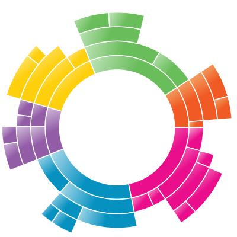

---

layout: post
title: ChartArea of Sunburst.
description: This section explains entire chart properties and all its elements. 
platform: wpf 
control: SfSunburstChart 
documentation: ug

---

# Sunburst Region

Sunburst region represents the entire chart and all its elements. It includes all the chart elements like Legend, DataLabel, Levels etc. It has some major properties as

[`ItemsSource`](https://help.syncfusion.com/cr/cref_files/wpf/Syncfusion.SfSunburstChart.WPF~Syncfusion.UI.Xaml.SunburstChart.SfSunburstChart~ItemsSource.html) – Gets or sets the IEnumerable values used to generate the chart.

[`ValueMemberPath`](https://help.syncfusion.com/cr/cref_files/wpf/Syncfusion.SfSunburstChart.WPF~Syncfusion.UI.Xaml.SunburstChart.SfSunburstChart~ValueMemberPath.html) – Gets or Sets the property path of the value.

[`Legend`](https://help.syncfusion.com/cr/cref_files/wpf/Syncfusion.SfSunburstChart.WPF~Syncfusion.UI.Xaml.SunburstChart.SfSunburstChart~Legend.html) – Gets or Sets the legend for the chart.

[`Levels`](https://help.syncfusion.com/cr/cref_files/wpf/Syncfusion.SfSunburstChart.WPF~Syncfusion.UI.Xaml.SunburstChart.SfSunburstChart~Levels.html) – Gets or Sets the collection of hierarchical level for the chart.

[`DataLabels`](https://help.syncfusion.com/cr/cref_files/wpf/Syncfusion.SfSunburstChart.WPF~Syncfusion.UI.Xaml.SunburstChart.SfSunburstChart~DataLabels.html) – Gets or Sets the collection of DataLabels for the chart.

[`Behaviors`](https://help.syncfusion.com/cr/cref_files/wpf/Syncfusion.SfSunburstChart.WPF~Syncfusion.UI.Xaml.SunburstChart.SfSunburstChart~Behaviors.html) – Gets or Sets the collection of behavior for the chart.

## Start and End angle

You can change the start and end angle of Sunburst chart using [`StartAngle`](https://help.syncfusion.com/cr/cref_files/wpf/Syncfusion.SfSunburstChart.WPF~Syncfusion.UI.Xaml.SunburstChart.SfSunburstChart~StartAngle.html) and [`EndAngle`](https://help.syncfusion.com/cr/cref_files/wpf/Syncfusion.SfSunburstChart.WPF~Syncfusion.UI.Xaml.SunburstChart.SfSunburstChart~EndAngle.html) property as shown in below code





   <sunburst:SfSunburstChart StartAngle="180"
                             EndAngle="360">

    </sunburst:SfSunburstChart>





sunburstChart.StartAngle = 180;
sunburstChart.EndAngle = 360;





## Sunburst radius

Sunburst chart allows you to customize the sunburst radius by using [`Radius`](https://help.syncfusion.com/cr/cref_files/wpf/Syncfusion.SfSunburstChart.WPF~Syncfusion.UI.Xaml.SunburstChart.SfSunburstChart~Radius.html) property. Default value of this property is 0.9 and the value range between 0 to 1.





<sunburst:SfSunburstChart Radius="0.6">

</sunburst:SfSunburstChart>





chart.Radius = 0.6;





## Sunburst inner radius

Sunburst chart allows you to customize the inner radius using [`InnerRadius`](https://help.syncfusion.com/cr/cref_files/wpf/Syncfusion.SfSunburstChart.WPF~Syncfusion.UI.Xaml.SunburstChart.SfSunburstChart~InnerRadius.html) property. The default value of this property is 0.2 and value range between 0 to 1.





<sunburst:SfSunburstChart InnerRadius="0.5">

</sunburst:SfSunburstChart>





chart.InnerRadius = 0.5;





