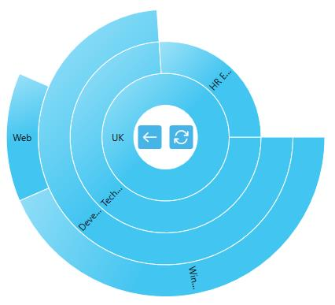

---

layout: post
title: Zooming in WPF Sunburst Chart control | Syncfusion
description: Learn here all about Zooming support in Syncfusion WPF Sunburst Chart (SfSunburstChart) control and more.
platform: wpf 
control: SfSunburstChart 
 documentation: ug

---

# Zooming in WPF Sunburst Chart (SfSunburstChart)

Sunburst chart provides zooming (drill down) experience with animation for both mouse and touch enabled devices. It allows you to virtualize large sets of data into minimum data view. 

The following code shows how to initialize the zooming behavior.





 <sunburst:SfSunburstChart.Behaviors>

              <sunburst:SunburstZoomingBehavior/>

 </sunburst:SfSunburstChart.Behaviors>





SunburstZoomingBehavior zoom = new SunburstZoomingBehavior();
chart.Behaviors.Add(zoom);





N> You can enable or disable the zooming by using EnableZooming property. By default, EnableZooming property value is True.

## Zooming Toolbar

By default, zooming toolbar will be enabled while zooming the segment; it contains both back and reset option.

You can align the zooming toolbar position by using ToolBarHorizontalAlignment and ToolBarVerticalAlignment property.



             <sunburst:SfSunburstChart.Behaviors>

                <sunburst:SunburstZoomingBehavior EnableZooming="True"
                                                    ToolBarHorizontalAlignment="Center"
                                                  ToolBarVerticalAlignment="Center"/>
            </sunburst:SfSunburstChart.Behaviors>



You can customize the zooming toolbar using the following properties.

* ToolBarItemHeight – Gets or sets height for the toolbar item.
* ToolBarItemWidth – Gets or sets width for the toolbar item.
* ToolBarItemMargin – Gets or sets margin of the toolbar item.



          <sunburst:SfSunburstChart.Behaviors>

                <sunburst:SunburstZoomingBehavior EnableZooming="True"
                                                  ToolBarHorizontalAlignment="Center"
                                                  ToolBarVerticalAlignment="Center"
                                                  ToolBarItemHeight="30"
                                                  ToolBarItemWidth="50"
                                                  ToolBarItemMargin="5"/>
            </sunburst:SfSunburstChart.Behaviors>



