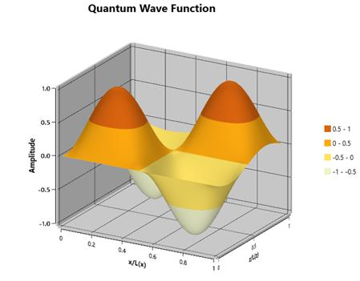

# Overview

Essential Surface Chart shows a three-dimensional surface that connects a set of data points.  

## Key Feature of Surface Chart

* ColorBar represents a range of values. 
* Built-in palettes.
* Supports gradient brushes. 
* Perspective and Orthographic view.
* Contour and wireframe support.