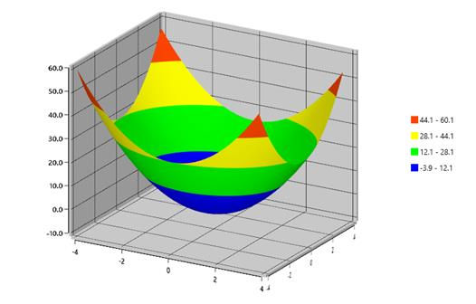

# Palettes in WPF Surface Chart (SfSurfaceChart)

Surface chart provides options to apply different kinds of palettes.

Some of the predefined palettes include:

* Metro
* AutumnBrights
* FloraHues
* Pineapple
* TomotoSpectrum
* RedChrome
* PurpleChrome
* BlueChrome
* GreenChrome
* Elite
* LightCandy
* SandyBeach

### Applying Predefined Brushes

Using the above palette you can apply a set of predefined brushes to surface chart as shown in the following code example. 





	    <chart:SfSurfaceChart Palette="Metro">
        </chart:SfSurfaceChart>
	




SfSurfaceChart chart = new SfSurfaceChart();
chart.Palette = ChartColorPalette.Metro;
grid.Children.Add(chart);





### Applying Custom Brushes

The custom palette option enables you to define your own color brushes for the Palette using ColorModel property as given in the following code example.





	<chart:SfSurfaceChart Palette="Custom" >

	  <chart:SfSurfaceChart.ColorModel>

                <chart:ChartColorModel>

                    <chart:ChartColorModel.CustomBrushes>

                        <SolidColorBrush Color="Blue"/>

                        <SolidColorBrush Color="Lime"/>

                        <SolidColorBrush Color="Yellow"/>

                        <SolidColorBrush Color="Blue"/>

                        <SolidColorBrush Color="Lime"/>

                        <SolidColorBrush Color="Yellow"/>

                        <SolidColorBrush Color="OrangeRed"/>

                    </chart:ChartColorModel.CustomBrushes>

                </chart:ChartColorModel>

            </chart:SfSurfaceChart.ColorModel>
	   
	<chart:SfSurfaceChart />
	




            SfSurfaceChart chart = new SfSurfaceChart();

            chart.Palette = ChartColorPalette.Custom;

            ChartColorModel colorModel = new ChartColorModel();

            colorModel.CustomBrushes.Add(new SolidColorBrush(Colors.Blue));

            colorModel.CustomBrushes.Add(new SolidColorBrush(Colors.Lime));

            colorModel.CustomBrushes.Add(new SolidColorBrush(Colors.Yellow));

            colorModel.CustomBrushes.Add(new SolidColorBrush(Colors.Blue));

            colorModel.CustomBrushes.Add(new SolidColorBrush(Colors.Lime));

            colorModel.CustomBrushes.Add(new SolidColorBrush(Colors.Yellow));

            colorModel.CustomBrushes.Add(new SolidColorBrush(Colors.OrangeRed));

            chart.ColorModel = colorModel;

			grid.Children.Add(chart);





