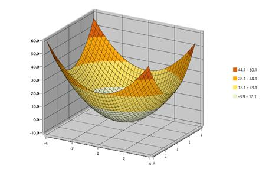
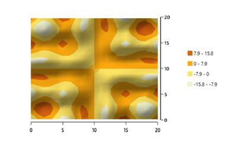
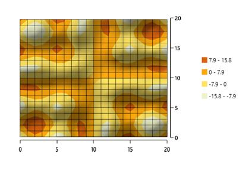

# Surface Types in WPF Surface Chart (SfSurfaceChart)

Essential Surface Chart provides the following types to plot three dimensional data points.

* Surface
* WireframeSurface
* Contour 
* WireframeContour

### Surface

Surface charts are used to explore the relationship between three dimensional data. 

The following code shows how to set the type of surface.





   <chart:SfSurfaceChart Type="Surface"/>





SfSurfaceChart chart = new SfSurfaceChart();

chart.Type = SurfaceType.Surface;





### WireframeSurface

You can draw the wireframe or mesh, for the surface chart.





   <chart:SfSurfaceChart Type="WireframeSurface"/>





SfSurfaceChart chart = new SfSurfaceChart();

chart.Type = SurfaceType.WireframeSurface;





### Contour

Viewing the surface chart from the top is called contour. It is a graphical technique that represents the three dimensional surface in a two dimensional format.  





<chart:SfSurfaceChart Type="Contour"/>





SfSurfaceChart chart = new SfSurfaceChart();

chart.Type = SurfaceType.Contour;





### WireframeContour

You can draw the wireframe or mesh for the contour chart





<chart:SfSurfaceChart Type="WireframeContour"/>





SfSurfaceChart chart = new SfSurfaceChart();

chart.Type = SurfaceType.WireframeContour;





