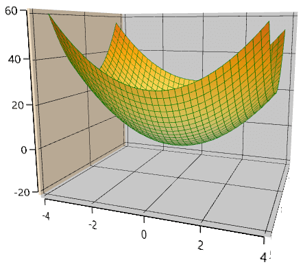

# User interaction in WPF Surface Chart (SfSurfaceChart)

The essential surface chart allows you to zoom and rotate the chart for a better visualization of all the axis and their points.

## Zooming

Zooming of the surface chart is controlled with the help of [`EnableZooming`](https://help.syncfusion.com/cr/wpf/Syncfusion.UI.Xaml.Charts.SfSurfaceChart.html#Syncfusion_UI_Xaml_Charts_SfSurfaceChart_EnableZooming) property.

The following code shows how to enable zooming on surface chart.





    <chart:SfSurfaceChart EnableZooming="True" >
    </chart:SfSurfaceChart>





            SfSurfaceChart chart = new SfSurfaceChart();
            chart.EnableZooming = true;           
            grid.Children.Add(chart);





Zooming can either be done with pinch zooming or by programmatically with the [`ZoomLevel`](https://help.syncfusion.com/cr/wpf/Syncfusion.UI.Xaml.Charts.SfSurfaceChart.html#Syncfusion_UI_Xaml_Charts_SfSurfaceChart_ZoomLevel) property.





    <chart:SfSurfaceChart EnableZooming="True" ZoomLevel="0.5">
    </chart:SfSurfaceChart>





            SfSurfaceChart chart = new SfSurfaceChart();
            chart.EnableZooming = true; 
            chart.ZoomLevel = 0.5;
            grid.Children.Add(chart);





## Rotation

Surface chart can be rotated for better visualization of all the axis and their plots.

This can be controlled with the help of [`EnableRotation`](https://help.syncfusion.com/cr/wpf/Syncfusion.UI.Xaml.Charts.SurfaceBase.html#Syncfusion_UI_Xaml_Charts_SurfaceBase_EnableRotation) property.





    <chart:SfSurfaceChart EnableRotation="True">
    </chart:SfSurfaceChart>





            SfSurfaceChart chart = new SfSurfaceChart();
            chart.EnableRotation = true; 
            grid.Children.Add(chart);





Rotation can either be done with interaction or by programmatically using [`Rotate`](https://help.syncfusion.com/cr/wpf/Syncfusion.UI.Xaml.Charts.SurfaceBase.html#Syncfusion_UI_Xaml_Charts_SurfaceBase_Rotate) property.





    <chart:SfSurfaceChart EnableRotation="True" Rotate="50">
    </chart:SfSurfaceChart>





            SfSurfaceChart chart = new SfSurfaceChart();
            chart.EnableRotation = true; 
            chart.Rotate = 50;
            grid.Children.Add(chart);





## Tilt

Surface chart can be tilted to a certain angle using the [`Tilt`](https://help.syncfusion.com/cr/wpf/Syncfusion.UI.Xaml.Charts.SurfaceBase.html#Syncfusion_UI_Xaml_Charts_SurfaceBase_Tilt) property.





    <chart:SfSurfaceChart  Tilt="40">
    </chart:SfSurfaceChart>





            SfSurfaceChart chart = new SfSurfaceChart();
            chart.Tilt = 40;
            grid.Children.Add(chart);





