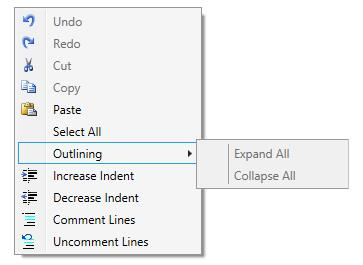

## Default Context Menu

ShowDefaultContextMenu

EditControl has a built-in context menu which enables users to easily perform common text editing operations. The default context menu can be enabled/disabled using `ShowDefaultContextMenu` property. By default, this property is set to `true`.

Set the ShowDefaultContextMenu property of EditControl by using the following code.




<sfedit:EditControl x:Name="editControl" ShowDefaultContextMenu="True"/>




editControl.ShowDefaultContextMenu = true;





The following image displays the Outlining Menu Expanded window.

**Functionalities supported by EditControl’s ContextMenu**

EditControl’s built-in context menu supports the following functionalities.

<table>
<tr>
<td>
Command  </td><td>
Usage  </td></tr>
<tr>
<td>
Undo  </td><td>
Revert the previous action performed in the EditControl  </td></tr>
<tr>
<td>
Redo  </td><td>
Performs the action again that was reverted using Undo command  </td></tr>
<tr>
<td>
Cut  </td><td>
Cut the selected text  </td></tr>
<tr>
<td>
Copy  </td><td>
Copy the selected text  </td></tr>
<tr>
<td>
Paste  </td><td>
Paste the text in the clipboard in the current cursor location.  </td></tr>
<tr>
<td>
Select All  </td><td>
Selects all the text in the EditControl  </td></tr>
<tr>
<td>
Outlining -> Expand All   </td><td>
Expands all the collapsed blocks in the text. This functionality is supported only when the EnableOutlining is set to `true` and the language supports outlining.  </td></tr>
<tr>
<td>
Outlining -> Collapse All  </td><td>
Hides all the blocks in the EditControl’s text. This functionality is supported only when the EnableOutlining is set to `true` and the language supports outlining.  </td></tr>
<tr>
<td>
Increase Indent  </td><td>
Appends a series of empty characters (tab) in front of the first valid character in the line. This command can be performed on an individual line or selected lines.  </td></tr>
<tr>
<td>
Decrease Indent  </td><td>
Removes a series of empty characters (tab) if any, in front of the first valid character in the line. This command can be performed on an individual line or selected lines  </td></tr>
<tr>
<td>
Comment Lines  </td><td>
It detects the supported comment Lexem from the Language configuration of EditControl’s current language and appends it to individual or multiple selected lines.  </td></tr>
<tr>
<td>
Uncomment Line  </td><td>
Removes the comment from the individual or selected lines.  </td></tr>
</table>
