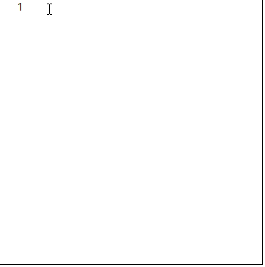
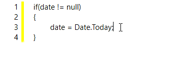
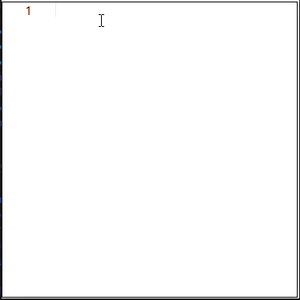

## Editing Text in EditControl WPF

[EditControl](https://help.syncfusion.com/cr/wpf/Syncfusion.Windows.Edit.EditControl.html) supports displaying or editing string values with any number of lines. It also supports all basic editing operations such as typing, cut, copy, paste, delete, backspace, undo and redo operations.

[EditControl](https://help.syncfusion.com/cr/wpf/Syncfusion.Windows.Edit.EditControl.html) supports performing edit operations through keyboard and mouse. It supports shortcut keys for basic editing operations such as cut, copy, paste, undo and redo operations. EditControl also has a built-in context menu to perform common editing operations such undo, redo, cut, copy, paste, select all operations using mouse. User can enable/ disable the built- in context menu.  For more information refer to [Default Context Menu](https://help.syncfusion.com/wpf/syntax-editor/basic-editing/default-context-menu).

[Text](https://help.syncfusion.com/cr/wpf/Syncfusion.Windows.Edit.EditControl.html#Syncfusion_Windows_Edit_EditControl_Text) property of the EditControl contains the text available in the EditControl at any point of time. The [Text](https://help.syncfusion.com/cr/wpf/Syncfusion.Windows.Edit.EditControl.html#Syncfusion_Windows_Edit_EditControl_Text) property of EditControl gets updated when you edit the text in the control by typing, editing the text by cut, paste, delete, undo or redo operations or by setting the Text property exclusively at runtime. The TextChanged event of EditControl gets raised when the Text property gets changed. Refer to [EditControl Events](https://help.syncfusion.com/cr/wpf/Syncfusion.Windows.Edit.EditControl.html ) section to know more about TextChanged and other events available in EditControl.

Set a simple string as EditControl’s Text by using the following line of code.





<syncfusion:EditControl x:Name="editControl" Text="This is Syncfusion's EditControl"/>





editControl.Text = "Setting Text property from code behind (C#)";





To set a multi-line string as Text property through **XAML**, String class in **mscorlib**.**dll** can be used with **xml**:**space**=”**preserve**”. The following lines of code can be used to set a multiline text from **XAML**.





<syncfusion:EditControl x:Name="editControl">

<library:String xml:space="preserve" xmlns:library="clr-namespace:System;assembly=mscorlib">Setting multiline

Text using String class in mscorlib.dll.

When preserve is used, XAML considers the indentation spaces as empty spaces.

</library:String>

</syncfusion:EditControl>









editControl.Text = @"Setting multi-line text" + Environment.NewLine + "from C# using" + Environment.NewLine + "Environment.NewLine.";





## Indentation in EditControl
[EditControl](https://help.syncfusion.com/cr/wpf/Syncfusion.Windows.Edit.EditControl.html) allows to auto indent the text when enter key pressed to add new lines. Auto indentation can be enabled by setting [IsAutoIndentationEnabled](https://help.syncfusion.com/cr/wpf/Syncfusion.Windows.Edit.EditControl.html#Syncfusion_Windows_Edit_EditControl_IsAutoIndentationEnabled) to 'true'. Auto indentation works based on [IndentingOptions](https://help.syncfusion.com/cr/wpf/Syncfusion.Windows.Edit.EditControl.html#Syncfusion_Windows_Edit_EditControl_IndentingOptions) property which has following options,

* None - When <kbd>ENTER</kbd> key is pressed, edit cursor will move to beginning of the next line.

* Block - When <kbd>ENTER</kbd> key is pressed, edit cursor will move to next line with same indentation of current line.

* Smart - When <kbd>ENTER</kbd> key is pressed, edit cursor will move to next line with one tab space.





<syncfusion:EditControl Name="Edit1" Background="White" Margin="0" IsAutoIndentationEnabled="True" IndentingOptions="Smart" Foreground="Black" />





EditControl editControl = new EditControl() {IsAutoIndentationEnabled = true, Height = 200, Width = 200, Background = Brushes.White, Foreground = Brushes.Black };
editControl.IndentingOptions = IndentingOptions.Smart;

    
   

### TabSpaces in EditControl

[EditControl](https://help.syncfusion.com/cr/wpf/Syncfusion.Windows.Edit.EditControl.html) supports for changing the number of empty spaces to be added for singe Tab key press by setting  [TabSpaces](https://help.syncfusion.com/cr/wpf/Syncfusion.Windows.Edit.EditControl.html#Syncfusion_Windows_Edit_EditControl_TabSpaces) property. The default value is 4.

 



<syncfusion:EditControl Name="Edit1" Background="White" Margin="0" IsAutoIndentationEnabled="True" TabSpaces="10" IndentingOptions="Smart" Foreground="Black" ShowLineNumber="True" />





EditControl editControl = new EditControl() {Height = 200, Width = 200, Background = Brushes.White, Foreground = Brushes.Black };
editControl.TabSpaces = 10;

    
        

