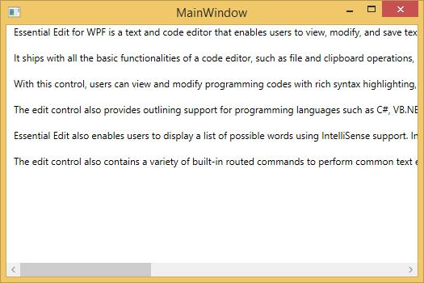

# File Support in WPF Syntax Editor

Essential Edit WPF facilitates users to create, open, modify and save text files and programming language files. EditControl provides built-in support for a variety of text based file formats such as txt, cs, VB, SQL, XAML, and XML. It also enables to specify custom file types in the custom language configurations.

## Opening a file

Opening a file in the `EditControl` can be done in the following three ways:

### Using file path

The `DocumentSource` property of EditControl is used to specify the file to be opened with EditControl. The following code can be used to set the DocumentSource property.




<sfedit:EditControl x:Name="editControl" DocumentSource="C:\Content.txt" ShowLineNumber="False" EnableOutlining="False"/>





editControl.DocumentSource = @"C:\Content.txt";





The following image displays the contents from file set as DocumentSource window.

### Opening through file dialog

Files can also be opened using the LoadFile method. LoadFile method displays a FileOpenDialog to enable you to choose the file that needs to be opened in the EditControl.





editControl.LoadFile();





The following image displays the file open dialog.

### Dropping a file
The `EditControl` allows users to drop a file over it, by setting the `AllowDrop` property to true. Users can drop any type of file supported in the `EditControl`. The editor will automatically switch its `DocumentLanguage` based on dropped file's extension. When dropping, if any documents is already in open, it will be closed, and the `DocumentClosing` event will occur. Here, you can control the desired action before closing.



this.editControl.AllowDrop = true;


Me.editControl.AllowDrop = True

 

## Saving the text in a file

SaveFile method in the EditControl class is used to save the text in EditControl to a file. EditControl does support saving all the built-in languages, file types and custom language file type respectively.

Enable save file, by using the following code.





editControl.SaveFile();





The following image displays the save file dialog.

## DocumentClosing event
By default, the existing file will not be saved when loading or dropping a new file. You can control this behavior using the [DocumentClosing](https://help.syncfusion.com/cr/wpf/Syncfusion.Windows.Edit.EditControl.html) event, which occurs when closing a file. You can use the `HasUnsavedChanges` property to identify whether the existing file contains changes, based on which you can choose the action need to be performed.

| [DocumentClosingEventArgs](https://help.syncfusion.com/cr/wpf/Syncfusion.Windows.Edit.DocumentClosingEventArgs.html) | Description |
|---------------|-------------|
| HasUnsavedChanges | Represents a value that indicates whether the file contains unsaved changes. |
| Action| Represents a value to specify the save actions.|

| [SaveAction](https://help.syncfusion.com/cr/wpf/Syncfusion.Windows.Edit.SaveAction.html) | Description |
|---|---|
| Save | Saves the changes before closing document. |
| Discard | Ignores the changes and closes the document. |
| Cancel | Cancels the current action that is being performed. |
| Prompt | Opens a dialog for allowing users to choose one of the above actions. |




        public MainWindow()
        {
            InitializeComponent();
            editControl.DocumentClosing += EditControl_DocumentClosing;
        }

        private void EditControl_DocumentClosing(object sender, DocumentClosingEventArgs args)
        {
           if(HasUnsavedChanges)
           {
               args.Action = SaveAction.Save;
           }
        }



        
        editControl.DocumentClosing += AddressOf EditControl_DocumentClosing

        Private Sub EditControl_DocumentClosing(ByVal sender As Object, ByVal args As DocumentClosingEventArgs)
        If HasUnsavedChanges Then
        args.Action = SaveAction.Save
        End Ifargs.Action = SaveAction.Save
        End Sub


   
