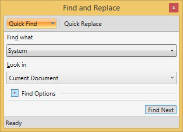
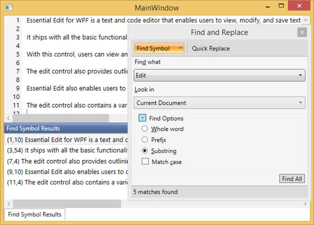
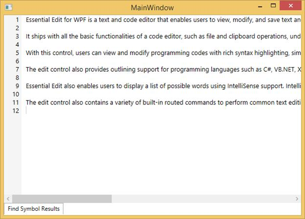
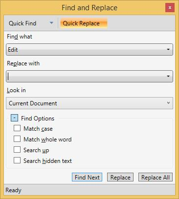
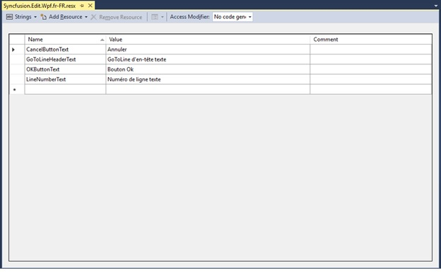
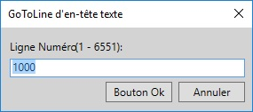

## Find and Replace

Essential Edit WPF is now enhanced with Find and Replace feature, which enables users to search a text and replace it with an alternate text. Various options available in text search are:

* Match case
* Match whole word
* Search hidden Text
* Substring
* Prefix

To enable/disable Find and Replace feature, use `ShowFindAndReplace` property in EditControl.
The following code can be used to set the ShowFindAndReplace property of EditControl class.





<sfedit:EditControl x:Name="editControl" DocumentSource="C:\Content.txt" FontSize="13" EnableOutlining="False" ShowFindAndReplace="True"/>





editControl.ShowFindAndReplace = true;





The following image displays the Find and Replace Window.

The Find and Replace dialog provides the basic search functionality as mentioned below. 

* Quick Find
* Quick Replace
* Find Symbol

**Quick** **Find**: Quick Find tab enables to search a text in an open document or a selection for a string. 

**Find** **Symbol**: Find Symbol tab enables to search for words and the position of the word in the document. 

**Quick** **Replace**: Quick Replace tab enables to find a text and replace it with an alternative text.

**Quick** **find**

Quick Find tab enables users to search all the occurrences of a text in an open document or a selection. Select Quick Find in Find and Replace dialog or use <kbd>Ctrl+F</kbd> to enable Quick Find.

The following image displays Quick Find Tab.

**Find** **what**: Enter the search text in Find what field to search the text in the document.

**Look** **in**: You can choose the search area (the whole document or a selection) in this field.

N> Select an area in the document before opening Find and Replace dialog,Selection is automatically selected in this field. This can also be selected in the drop-down box.

The following image displays look in field in Find and Replace Window.

**Find** **options**: Find options are placed under collapsible GroupBox control to have a compact view of the Find and Replace window.

Find and Replace window facilitates you to search the text based on the following options.

* **Match** **case**: Performs a case-sensitive search.
* **Match** **whole** **word**: Searches for the text specified with in a word boundary.
* **Search** **up**: Searches in lines above the current cursor location.
* **Search** **hidden** **text**: Text from the collapsed region will also be included in search area.

The following image displays Find Options Collapsed window.

Click the Find Next or Enter to search the text in document. The Find Next Button will be enabled only when the search text is entered in Find what field.

The following image displays EditControl Sample Window.

**Find** **symbol**

Find symbol tab in Find and Replace window facilitates the users to find all the occurrences of the specified text in the entire Edit Control’s text. Find Symbol tab can be enabled by selecting the drop-down option in the Quick Find tab.

The following image displays Find and Replace Window.

The following image displays Find Symbol Tab in Find and Replace Window.

Find Symbol tab supports the following search options to refine the search results.

* **Whole** **word**: Searches the text when the whole word matches.
* **Prefix**: Locates the line, when the line starts with the search text.
* **Substring**: Locates the line, when the line contains the search text.
* **Match** **case**: Performs a case sensitive search.

Find Symbol Results (<kbd>Shift+F12</kbd>): The Whole word, Prefix, Substring options are radio buttons and Sub string will be selected in default.

Find symbol results tab lists all the occurrences of the search text with additional details of line number and position of the text in the line. Double clicking on any item listed in the Find symbol will navigate the cursor to the result selected.

The following image displays EditControl Sample Window.

Click the Find All or Enter to search the text in document.

N> Find Symbol results tab is a dockable so that it can be hidden,pinned or closed as necessary.

The following image displays Find Symbol Results.

The following image displays Find Symbol Results tab in Hidden State Window.

**Quick** **replace**

Quick replace tab in Find and replace window enables the users to search a text and replace it with an alternate text. Quick replace tab can be enabled by clicking on the Quick Replace button at the top of the Find and Replace window or by using <kbd>Ctrl+H</kbd> key from EditControl.

The following image shows Quick Replace Tab in Find and Replace Window.

1. Quick Replace tab is similar to that of Quick Find except for **Replace** **With** field.
2. Replace with: Enter the alternative text to be replaced in this field.
3. Quick replace supports two functionalities as follows:
* Replace: Replaces the immediate occurrence of text specified in **Find** **what** with text specified in Replace with field.
* Replaces: Replaces all the occurrences of the text specified in **Find** **what** with the text specified in the Replace with field.

**GoToLine** **support**

EditControl supports GoToLine functionality helps to reach out the line by programmatically or at run time using KeyBoard ShortKey as inspired from the Microsoft Visual Studio Editor. The GoToLine method is used to position the mouse pointer on any specified line. It not only positions the pointer on the appropriate line, but it also scrolls the concerned line as per the user requirement. Some of the common usage of this method associated with the purpose such as:

<table>
<tr>
<th>
Edit control method</th>
<th>
Description</th></tr>
<tr>
<td>
GoToLine(Int LineNumber)</td><td>
This function helps to scroll to a particular line, based on user input/requirement</td></tr>
<tr>
<td>
ShowGoToLine()</td>
<td>
This function helps to show the GoToLine Window programmatically and current cursor line index will be displayed in it.
</td></tr>
<tr>
<td>
ShowGoToLine(int LineNumber)   
</td><td>
This function helps to show the GoToLine Window programmatically with the given line number included. </td></tr>
</table>

**GoToLine method**
 


//Places the Cursor at the given line number
editcontrol.GoToLine(1);





‘Places the Cursor at the given line number
editcontrol.GoToLine(100)





**ShowGoToLine**

The GoToLine Window is invoked using the ShowGoToLine method. The KeyBoard Shortcut key is <kbd>Ctrl+G</kbd>.





// Method used to invoke the GoToLine Dialog Box
editcontrol.ShowGoToLine();





‘Method used to invoke the GoToLine Dialog Box
editcontrol.ShowGoToLine()





The following output shows the GoToLine Dialog Window.

**ShowGoToLine with LineNumber**





// Method used to invoke the GoToLine Window with user given line number
editcontrol.ShowGoToLine(1000);





‘Method used to invoke the GoToLine Window with user given line number
editcontrol.ShowGoToLine(1000)





**Localization support**

EditControl also provides the Localization support for the GoToLine functionality. This allows to configure the content of the GoToLine window in the multi-lingual according to the cultures.

As explained in the [Localization](https://help.syncfusion.com/wpf/localization) section, you can localize the content of the EditControl using the same steps.

The key text associated with the GoToLine Dialog Window can be localized as follows:
<table>
<tr>
<th>
Localization text</th>
<th>
Description</th></tr>
<tr>
<td>
OkButtonText</td><td>
Helps to localize the OK Button Text.</td></tr>
<tr>
<td>
GoToLineHeaderText</td>
<td>
Helps to localize the GoToLine Dialog Window Header Text.   
</td></tr>
<tr>
<td>
LineNumberText 
</td><td>
Helps to Localize the Line Number Text </td></tr>
<tr>
<td>
CancelButtonText
</td><td>
Helps to localize the Cancel Button Text.
</td></tr>
</table>





public MainWindow()
{
//used to assign the culture
System.Threading.Thread.CurrentThread.CurrentUICulture = new System.Globalization.CultureInfo("fr-FR");
InitializeComponent();
}





Public Sub New()
used to assign the culture
System.Threading.Thread.CurrentThread.CurrentUICulture = New System.Globalization.CultureInfo("fr-FR")
InitializeComponent()
End Sub





The following output shows the GoToLine Window localized in French culture.

