# Status Bar in WPF Syntax Editor

 The status bar option is used to view primary information such as the loaded document's path, encoding type, line number and column number based on the cursor position. By default, [Visibility](https://help.syncfusion.com/cr/wpf/Syncfusion.Windows.Edit.StatusBarSettings.html#Syncfusion_Windows_Edit_StatusBarSettings_Visibility) property for status bar is set to be **Collapsed**. 





<!--Adding EditControl to application and setting its StatusBarVisiblity to Visible-->

<syncfusion:EditControl Background="White" Name="EditControl1">
   <syncfusion:EditControl.StatusBarSettings >
      <syncfusion:StatusBarSettings Visibility="Visible"/>
   </syncfusion:EditControl.StatusBarSettings>
</syncfusion:EditControl> 





public partial class MainWindow : Window

{

public MainWindow()

{

InitializeComponent();

this.EditControl1.DocumentSource = "../../Source.cs";

this.EditControl1.StatusBarSettings.Visibility = Visibility.Visible;

}

}





public partial class MainWindow : Window

{

public MainWindow()

{

InitializeComponent();

Me.EditControl1.DocumentSource = "../../Source.cs";

Me.EditControl1.StatusBarSettings.Visibility = Visibility.Visible;

}

}





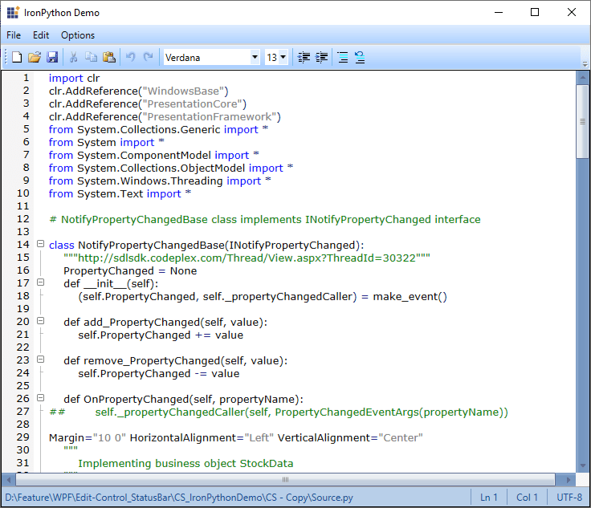

The status bar shows the file path, encoding type, line number and column number. The visibility of each item in the status bar can be customized by using the below properties.
 
  * [ShowFilePath](https://help.syncfusion.com/cr/wpf/Syncfusion.Windows.Edit.StatusBarSettings.html#Syncfusion_Windows_Edit_StatusBarSettings_ShowFilePath): It shows the exact application directory and the file path which was loaded in Edit Control. File Path property can be enabled/disabled by changing it's visibility property.
  * [ShowLineNumber](https://help.syncfusion.com/cr/wpf/Syncfusion.Windows.Edit.StatusBarSettings.html#Syncfusion_Windows_Edit_StatusBarSettings_ShowLineNumber): It shows the current line number where the cursor is placed on Edit Control. By changing it's visibility user can enable/disable the line number property.
  * [ShowColumnNumber](https://help.syncfusion.com/cr/wpf/Syncfusion.Windows.Edit.StatusBarSettings.html#Syncfusion_Windows_Edit_StatusBarSettings_ShowColumnNumber): It shows the current column number where the cursor is placed on Edit Control. By changing it's visibility user can enable/disable the Column number property.
  * [ShowEncoding](https://help.syncfusion.com/cr/wpf/Syncfusion.Windows.Edit.StatusBarSettings.html#Syncfusion_Windows_Edit_StatusBarSettings_ShowEncoding): It shows the current encoding type of the loaded file in Edit Control. Encoding property can be enable/disable by changing it's visibility property.





<!--Adding EditControl to application and setting its StatusBarVisiblity to Visible-->

<syncfusion:EditControl Background="White" Name="EditControl1">
   <syncfusion:EditControl.StatusBarSettings >
      <syncfusion:StatusBarSettings Visibility="Visible" ShowFilePath="Visible" ShowLineNumber="Visible" ShowColumnNumber="Visible" ShowEncoding="Collapsed"/>
   </syncfusion:EditControl.StatusBarSettings>
</syncfusion:EditControl> 





public partial class MainWindow : Window

{

public MainWindow()

{

InitializeComponent();

this.EditControl1.DocumentSource = "../../Source.cs";

this.EditControl1.StatusBarSettings.Visibility = Visibility.Visible;
this.EditControl1.StatusBarSettings.ShowFilePath = Visibility.Visible;
this.EditControl1.StatusBarSettings.ShowLineNumber = Visibility.Visible;
this.EditControl1.StatusBarSettings.ShowColumnNumber = Visibility.Visible;
this.EditControl1.StatusBarSettings.ShowEncoding = Visibility.Collapsed;

}

}





public partial class MainWindow : Window

{

public MainWindow()

{

InitializeComponent();

Me.EditControl1.DocumentSource = "../../Source.cs";

Me.EditControl1.StatusBarSettings.Visibility = Visibility.Visible;
Me.EditControl1.StatusBarSettings.ShowFilePath = Visibility.Visible;
Me.EditControl1.StatusBarSettings.ShowLineNumber = Visibility.Visible;
Me.EditControl1.StatusBarSettings.ShowColumnNumber = Visibility.Visible;
Me.EditControl1.StatusBarSettings.ShowEncoding = Visibility.Collapsed;

}

}





The following screenshot shows the Edit Control after changing the [ShowEncoding](https://help.syncfusion.com/cr/wpf/Syncfusion.Windows.Edit.StatusBarSettings.html#Syncfusion_Windows_Edit_StatusBarSettings_ShowEncoding) visibility property to **Collapsed**.

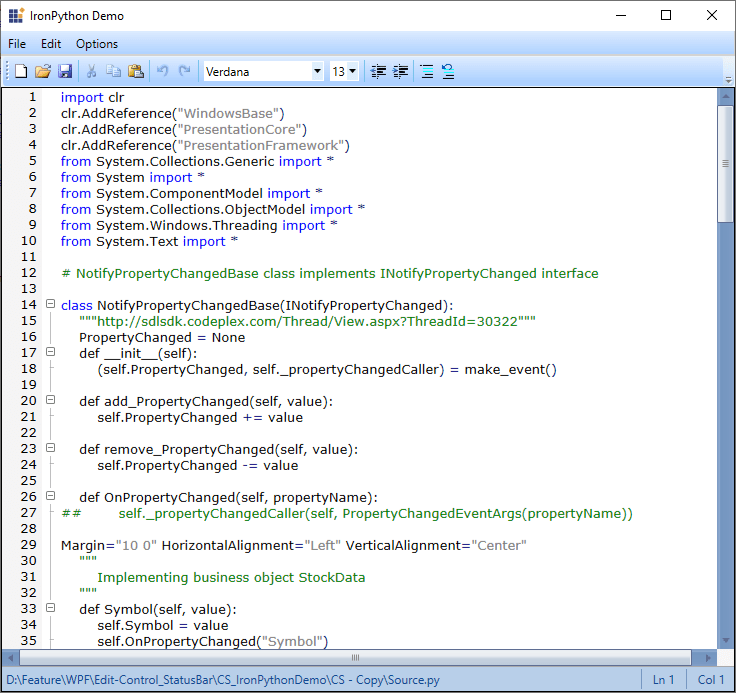

## Customization of status bar

The status bar can be customized by opening context menu on right clicking the Edit Control in designer page. In that select **Edit Template** and then click **Edit a Copy...**. A new dialog will be shown in that choose the options enabled in combo box **EditControl: Edit1** which adds the Edit Control template to the current Edit Control class.  

Then user can able to add custom controls such as Progress Bar, TextBox, etc… as needed to be displayed in that status bar by modifying the default template in it. The following screenshots illustrate how to do the same thing step-by-step.

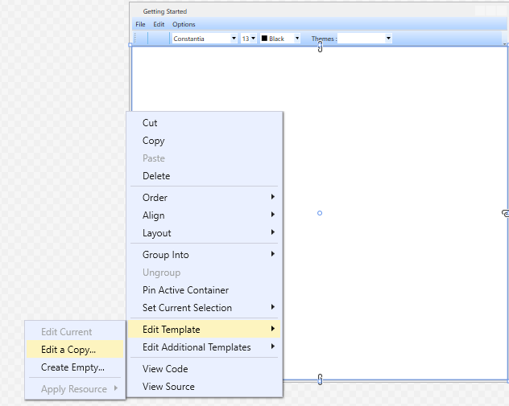

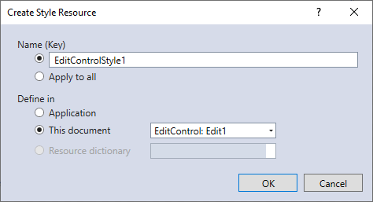

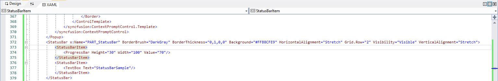

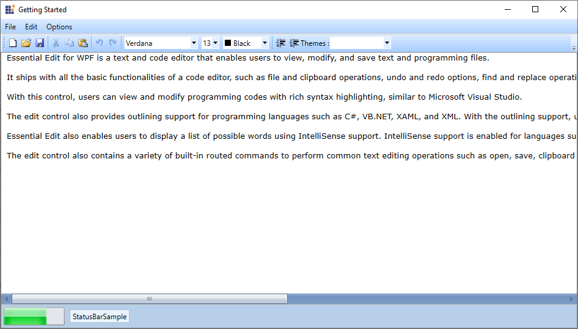

## Styling the status bar

The status bar supports following built-in styles,

* Blend

* Default

* Metro

* Office2007Black

* Office2007Blue

* Office2007Silver

* VS2010

The following illustrations shows how the status bar is applied with different built-in styles.

**Blend**

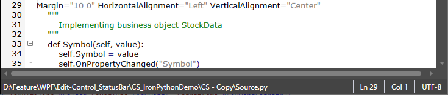

**Default**

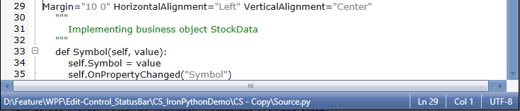

**Metro**

**Office2007Black**

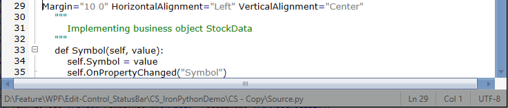

**Office2007Blue**

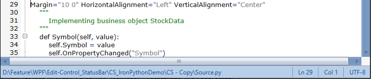

**Office2007Silver**

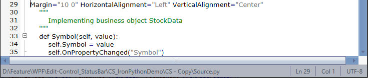

**VS2010**

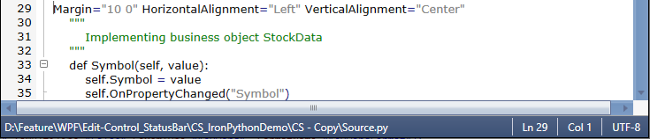
