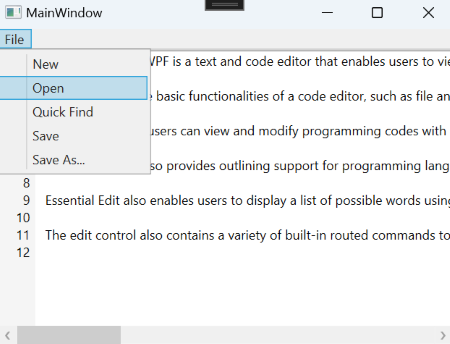

# Edit Commands in WPF Syntax Editor (EditControl)

Essential Edit for WPF provides built-in `RoutedUICommand` objects for common editing and file operations such as Select All, Cut, Copy, Paste, New, Open, Save, and Save As. These commands can be bound to the EditControl through the `Command` property of external controls such as Button and MenuItem. The built-in commands are defined in the `EditCommands` class, which belongs to the `Syncfusion.Windows.Edit` namespace.





<StackPanel>
    <Menu Background="Transparent" BorderThickness="0,0,1,2">
        <MenuItem Header="_File" Background="Transparent" Width="{Binding}" >
            <MenuItem Command="{x:Static sfedit:EditCommands.New}" CommandTarget="{Binding ElementName=Edit1}"/>
            <MenuItem Command="{x:Static sfedit:EditCommands.Open}" CommandTarget="{Binding ElementName=Edit1}"/>
            <MenuItem Command="{x:Static sfedit:EditCommands.Find}" CommandTarget="{Binding ElementName=Edit1}"/>
            <MenuItem Command="{x:Static sfedit:EditCommands.Save}" CommandTarget="{Binding ElementName=Edit1}"/>
            <MenuItem Command="{x:Static sfedit:EditCommands.SaveAs}" CommandTarget="{Binding ElementName=Edit1}"/>
        </MenuItem>
        <MenuItem Header="_Edit" Background="Transparent" Width="{Binding}" >
            <MenuItem Command="{x:Static sfedit:EditCommands.Copy}" CommandTarget="{Binding ElementName=Edit1}"/>
            <MenuItem Command="{x:Static sfedit:EditCommands.Cut}" CommandTarget="{Binding ElementName=Edit1}"/>
            <MenuItem Command="{x:Static sfedit:EditCommands.Find}" CommandTarget="{Binding ElementName=Edit1}"/>
            <MenuItem Command="{x:Static sfedit:EditCommands.Paste}" CommandTarget="{Binding ElementName=Edit1}"/>
            <MenuItem Command="{x:Static sfedit:EditCommands.Undo}" CommandTarget="{Binding ElementName=Edit1}"/>
        </MenuItem>
    </Menu>
    
    <sfedit:EditControl Name="Edit1" EnableOutlining="False" Height="270"
                        Background="white" AllowDrop="True" ShowLineNumber="True"/>
</StackPanel>





The following image displays **Open** edit command window.

