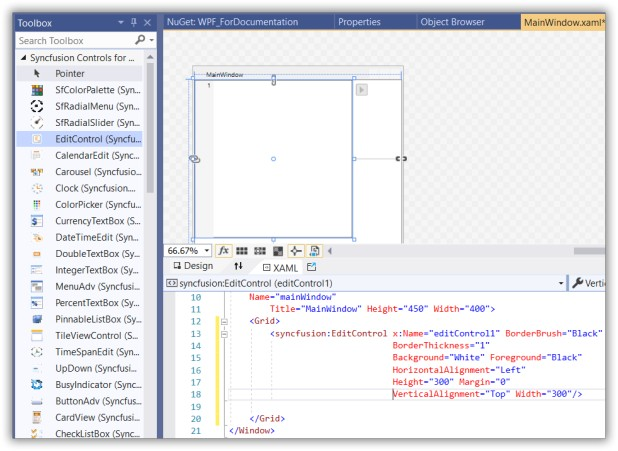
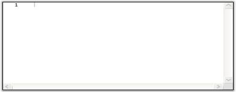
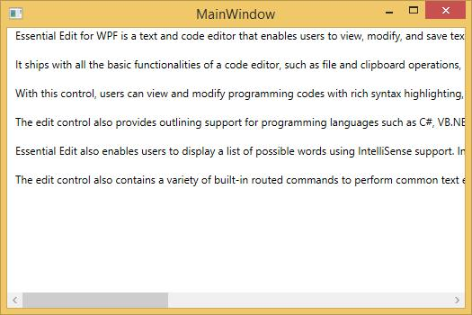
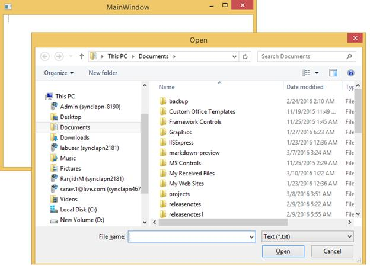
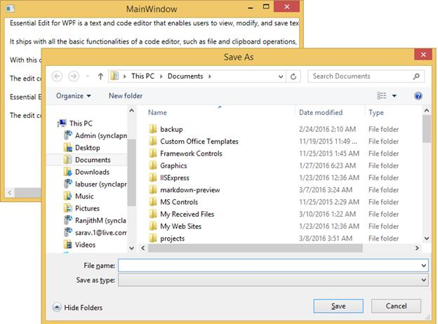
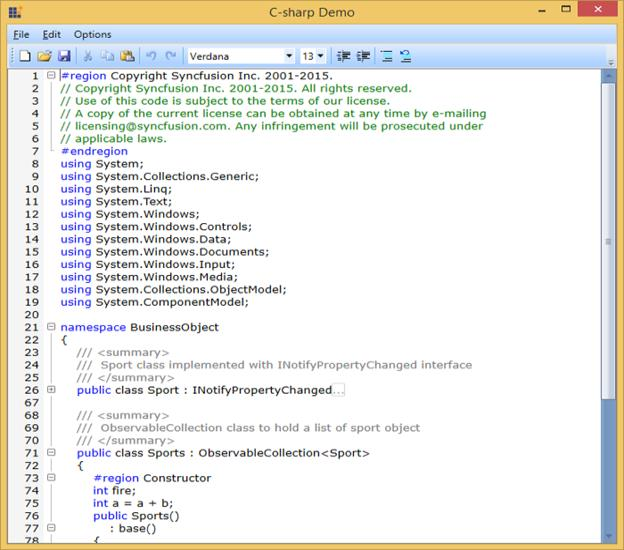

# Getting Started with WPF Syntax Editor (EditControl)

This section explains how to create an interactive code editor application like the Visual Studio code editor using the [EditControl](https://help.syncfusion.com/cr/wpf/Syncfusion.Windows.Edit.EditControl.html).

## Assembly deployment

Refer to the [Control Dependencies](https://help.syncfusion.com/wpf/control-dependencies#edit-control) section for the list of assemblies or NuGet packages that need to be added as references to use the control in any application. The minimum NuGet package required is `Syncfusion.Edit.WPF`.

Refer to this [documentation](https://help.syncfusion.com/wpf/installation/install-nuget-packages) to find more details about installing NuGet packages in a WPF application.

## Creating a simple application with EditControl

You can create a WPF application with [EditControl](https://help.syncfusion.com/cr/wpf/Syncfusion.Windows.Edit.EditControl.html) as follows:

1. [Creating the project](#creating-the-project)
2. [Adding the control via Designer](#adding-editcontrol-via-designer)
3. [Adding the control via XAML](#adding-editcontrol-via-xaml)
4. [Adding the control via C#](#adding-editcontrol-via-c)
5. [Loading a file into the document](#loading-a-file-into-the-document)
6. [Syntax highlighting](#syntax-highlighting)

### Creating the project

1. Open Visual Studio and click **Create a new project**.
2. Select **WPF App (.NET Framework)** (or **WPF Application** for .NET/.NET Core) and click **Next**.
3. Type a project name, choose a location, and click **Create**.

### Adding EditControl via designer

The [EditControl](https://help.syncfusion.com/cr/wpf/Syncfusion.Windows.Edit.EditControl.html) can be added to the application by dragging it from the toolbox and dropping it in the designer view. The following required assembly references will be added automatically:

* `Syncfusion.Edit.WPF`
* `Syncfusion.GridCommon.WPF`
* `Syncfusion.Shared.WPF`
* `Syncfusion.Tools.WPF`

### Adding EditControl via XAML

To add the [EditControl](https://help.syncfusion.com/cr/wpf/Syncfusion.Windows.Edit.EditControl.html) manually in XAML, follow these steps:

1. Create a new WPF project in Visual Studio.
2. Add the following required assembly references to the project:

        * Syncfusion.Edit.WPF

        * Syncfusion.GridCommon.WPF

        * Syncfusion.Shared.WPF

        * Syncfusion.Tools.WPF

3. Import Syncfusion WPF schema **http://schemas.syncfusion.com/wpf**, and declare the EditControl in XAML page.






<Window
        xmlns="http://schemas.microsoft.com/winfx/2006/xaml/presentation"
        xmlns:x="http://schemas.microsoft.com/winfx/2006/xaml"
        xmlns:d="http://schemas.microsoft.com/expression/blend/2008"
        xmlns:mc="http://schemas.openxmlformats.org/markup-compatibility/2006"
        xmlns:local="clr-namespace:WPF_ForDocumentation"
        xmlns:syncfusion="http://schemas.syncfusion.com/wpf" 
        x:Class="WPF_ForDocumentation.MainWindow"
        mc:Ignorable="d"
         Name="mainWindow"
        Title="MainWindow" Height="450" Width="400">
<Grid>
<syncfusion:EditControl x:Name="editControl1" BorderBrush="Black"
BorderThickness="1"
Background="White" Foreground="Black" 
HorizontalAlignment="Left" 
Height="300" Margin="0" 
VerticalAlignment="Top" Width="300"/>

</Grid>
</Window>





{{ codesnippet1 | OrderList_Indent_Level_1 }}

## Adding WPF EditControl via C#

To add the [EditControl](https://help.syncfusion.com/cr/wpf/Syncfusion.Windows.Edit.EditControl.html) manually in C#, follow these steps:

1. Create a new WPF application via Visual Studio.
2. Add the following required assembly references to the project:
   * `Syncfusion.Edit.WPF`
   * `Syncfusion.GridCommon.WPF`
   * `Syncfusion.Shared.WPF`
   * `Syncfusion.Tools.WPF`
3. Include the required namespace in your code-behind file.

        * Syncfusion.Edit.WPF

        * Syncfusion.GridCommon.WPF

        * Syncfusion.Shared.WPF

        * Syncfusion.Tools.WPF

3. Include the required namespace.






using Syncfusion.Windows.Edit;





{{ codesnippet2 | OrderList_Indent_Level_1 }}

4. Create an instance of [EditControl](https://help.syncfusion.com/cr/wpf/Syncfusion.Windows.Edit.EditControl.html), and add it to the window.






public MainWindow()
{
        InitializeComponent();
        //Initializing EditControl and setting necessary property values.
        EditControl editControl = new EditControl() {Height = 200, Width = 200, Background = Brushes.White, Foreground = Brushes.Black };
        this.Content = editControl;
}





{{ codesnippet3 | OrderList_Indent_Level_1 }}

## Loading a file into document

This option helps to load a file into the [EditControl](https://help.syncfusion.com/cr/wpf/Syncfusion.Windows.Edit.EditControl.html). Essential Edit WPF facilitates users to create, open, modify, and save text files and programming language files. EditControl provides built-in support for a variety of text-based file formats such as `txt`, `cs`, `vb`, `sql`, `xaml`, and `xml`. It also allows you to specify custom file types in custom language configurations.

Essential Edit WPF facilitates users to create, open, modify and save text files and programming language files. EditControl provides built-in support for a variety of text based file formats such as txt, cs, VB, SQL, XAML, and XML. It also enables to specify custom file types in the custom language configurations.

### Opening a file

The [DocumentSource](https://help.syncfusion.com/cr/wpf/Syncfusion.Windows.Edit.EditControl.html#Syncfusion_Windows_Edit_EditControl_DocumentSource) property of EditControl is used to specify the file to be opened with [EditControl](https://help.syncfusion.com/cr/wpf/Syncfusion.Windows.Edit.EditControl.html). The following code can be used to set the [DocumentSource](https://help.syncfusion.com/cr/wpf/Syncfusion.Windows.Edit.EditControl.html#Syncfusion_Windows_Edit_EditControl_DocumentSource) property of EditControl is used to specify the file to be opened with EditControl property.





<syncfusion:EditControl x:Name="editControl" DocumentSource="C:\Content.txt" ShowLineNumber="False" EnableOutlining="False"/>





editControl.DocumentSource = @"C:\Content.txt";





editControl.DocumentSource = "C:\Content.txt"





Files can also be opened using the [LoadFile](https://help.syncfusion.com/cr/wpf/Syncfusion.Windows.Edit.EditControl.html#Syncfusion_Windows_Edit_EditControl_LoadFile) method. LoadFile method displays a FileOpenDialog to enable you to choose the file that needs to be opened in the [EditControl](https://help.syncfusion.com/cr/wpf/Syncfusion.Windows.Edit.EditControl.html).





editControl.LoadFile();





editControl.LoadFile()





### Saving the text to a file

### Saving the text in a file

The [SaveFile](https://help.syncfusion.com/cr/wpf/Syncfusion.Windows.Edit.EditControl.html#Syncfusion_Windows_Edit_EditControl_SaveFile) method in the [EditControl](https://help.syncfusion.com/cr/wpf/Syncfusion.Windows.Edit.EditControl.html) class is used to save the text in EditControl to a file. EditControl supports saving all built-in languages, file types, and custom language file types.





editControl.SaveFile();





editControl.SaveFile()





## Syntax highlighting

The [EditControl](https://help.syncfusion.com/cr/wpf/Syncfusion.Windows.Edit.EditControl.html) offers mostly used languages like C#, VB, XML, XAML, and SQL as built-in languages. It also provides support to configure a new custom language.

The [EditControl](https://help.syncfusion.com/cr/wpf/Syncfusion.Windows.Edit.EditControl.html) has built-in syntax highlighting support for the following languages:

* C
* C Sharp
* Custom
* Delphi
* HTML
* Java
* JScript
* PowerShell
* Text
* VBScript
* Visual Basic
* XML
* XAML
* SQL

With the language support, [EditControl](https://help.syncfusion.com/cr/wpf/Syncfusion.Windows.Edit.EditControl.html) enables users to create, open, modify, and save programming code from different file types. EditControl provides built-in syntax highlighting and outlining support for all supported languages, with SQL being an exception in outlining support. It also provides built-in IntelliSense support for all procedural languages such as C# and Visual Basic.

The [DocumentLanguage](https://help.syncfusion.com/cr/wpf/Syncfusion.Windows.Edit.EditControl.html#Syncfusion_Windows_Edit_EditControl_DocumentLanguage) property enables the user to select the language. `DocumentLanguage` is a [`Languages`](https://help.syncfusion.com/cr/wpf/Syncfusion.Windows.Edit.Languages.html) enum property with a default value of `Text`.





<syncfusion:EditControl x:Name="editControl" DocumentLanguage="CSharp" DocumentSource="C:\Source.cs" FontSize="13"/>





editControl.DocumentLanguage = Languages.CSharp;





editControl.DocumentLanguage = Languages.CSharp





## Theme

SyntaxEditor supports various built-in themes. Refer to the below links to apply themes for the SyntaxEditor,

  * [Apply theme using SfSkinManager](https://help.syncfusion.com/wpf/themes/skin-manager)
	
  * [Create a custom theme using ThemeStudio](https://help.syncfusion.com/wpf/themes/theme-studio#creating-custom-theme)

  
