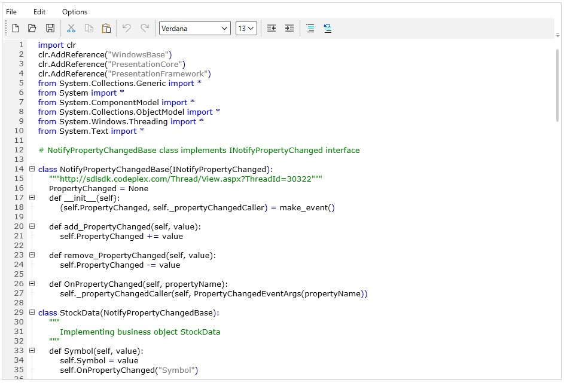

## Custom Language Support

The EditControl provides built-in syntax highlighting and outlining support for common procedural languages such as C# and Visual Basic, markup languages like XAML and XML, and SQL. It also allows the developer to create Custom Language configurations to apply syntax highlighting and outlining.

The EditControl’s Custom Language support helps the developers to create code editors for custom languages by specifying their language configurations class and applying it as a Custom Language in EditControl.

The Edit WPF provides the following classes to enable the users create their Custom Languages by inheriting from any of the following base classes.

* LanguageBase
* ProceduralLanguageBase
* MarkupLanguageBase

Each of these classes has basic level of implementations to let the users define minimum set of configurations to get started with the Custom Languages easily.

**Important features**

* Allows the developer to choose the base class considering the complexity and type of language that developer is planning to create.
* Provides much more flexibility to developers than before in writing their custom logics in syntax coloring and outlining.

Supports DataBinding of Lexem and formats by implementing their custom business classes with ILexem and IFormat Interfaces.

### Customization of features

**Language** **base** **classes**

As described in earlier topics, the Edit WPF provides three base classes for the developers to choose, in order to create their Custom Languages. Following are the level of implementations available in each of the base classes.

**LanguageBase**: Contains implementation that are common for all the languages such as rendering lines, backspace and delete key operations, comment and uncomment commands and provides methods to override language specific functionalities such as syntax coloring, outlining, and IntelliSense.

**ProceduralLanguageBase**: Contains implementations of syntax highlighting, outlining and IntelliSense for procedural languages such C# and Visual Basic.

**MarkupLanguageBase**: Contains implementation of Regex based syntax highlighting and outlining features specific to markup languages such as XAML and XML.

### Creating a custom language

This section of the documentation discusses on creating a Custom Language configuration with EditControl. A language specification document for which custom language is being created will help the users in finding the details of languages such as keywords, literals, comments etc. In this section, a custom language for IronPython is created as an example.

Create a new class inheriting from ProceduralLanguageBase class and set basic properties of the language, by using the following code.




public class PythonLanguage : ProceduralLanguageBase

{

public PythonLanguage(EditControl control)

: base(control)

{

this.Name = "Python";

this.FileExtension = "py";

this.ApplyColoring = true;

this.SupportsIntellisense = false;

this.SupportsOutlining = true;

this.TextForeground = Brushes.Black;

}

}





Create Lexem and Formats collection for Custom Language, to enable data binding with Lexem and Format properties; we have modified the `Lexem` and `Formats` property type to IEnumerable from LexemCollection and FormatCollection respectively.

N> In previous versions,Lexem and Formats were added directly to Lexems and Formats properties of EditLanguage class.Now since it is IEnumerable,a custom collection need to be created and apply it to Lexem and Format properties of custom language class,here it is PythonLanguage class.

**Formats** **for** **IronPython**

Create a collection of IFormat implemented classes to apply in Formats property of custom language, by using the following code. 

N> EditControl uses this collection to fetch the color to be applied to the tokens.





<syncfusion:FormatsCollection x:Key="pythonLanguageFormats">

<syncfusion:EditFormats Foreground="Green" FormatName="CommentFormat"/>

<syncfusion:EditFormats Foreground="Black" FormatName="MultilineCommentFormat"/>

<syncfusion:EditFormats Foreground="Blue" FormatName="KeywordFormat"/>

<syncfusion:EditFormats Foreground="Navy" FormatName="OperatorFormat"/>

<syncfusion:EditFormats Foreground="Gray" FormatName="LiteralsFormat"/>

</syncfusion:FormatsCollection>





**Lexem** **for** **IronPython**

Create a collection of ILexem implemented class, by using the following code. 

N> This collection will be applied to Lexem property of the custom language.EditControl uses the Lexem property to retrieve all keywords,comments,literals,preprocessors etc.




<syncfusion:LexemCollection x:Key="pythonLanguageLexems">

<syncfusion:Lexem StartText="class \w+[\s:\w,()]+" IsRegex="True" IsMultiline="True" ContainsEndText="True" LexemType="CodeSnippet" EndText="\r\n" ScopeLevel="Class" ShowAlternateIntellisenseText="True"  IntellisenseDisplayText="class"/>

<syncfusion:Lexem StartText="def \w+[\s:\w,()]+" IsRegex="True" IsMultiline="True" ContainsEndText="True" LexemType="CodeSnippet" EndText="\r\n" ScopeLevel="Member" ShowAlternateIntellisenseText="True"  IntellisenseDisplayText="def"/>

<syncfusion:Lexem StartText="#" EndText="\r\n" IsMultiline="False" ContainsEndText="True" LexemType="Comment" FormatName="CommentFormat"/>

<syncfusion:Lexem StartText="&quot;&quot;&quot;" EndText="&quot;&quot;&quot;" IsMultiline="True" ContainsEndText="True" LexemType="Comment" FormatName="CommentFormat" />

<syncfusion:Lexem StartText="and" ContainsEndText="False" IsMultiline="False" LexemType="Keyword"  FormatName="KeywordFormat"/>

<syncfusion:Lexem StartText="as" ContainsEndText="False" IsMultiline="False" LexemType="Keyword"  FormatName="KeywordFormat"/>

<syncfusion:Lexem StartText="assert" ContainsEndText="False" IsMultiline="False" LexemType="Keyword"  FormatName="KeywordFormat"/>

<syncfusion:Lexem StartText="break" ContainsEndText="False" IsMultiline="False" LexemType="Keyword"  FormatName="KeywordFormat"/>

<syncfusion:Lexem StartText="class" ContainsEndText="False" IsMultiline="False" LexemType="Keyword"  FormatName="KeywordFormat"/>

<syncfusion:Lexem StartText="continue" ContainsEndText="False" IsMultiline="False" LexemType="Keyword"  FormatName="KeywordFormat"/>

<syncfusion:Lexem StartText="def" ContainsEndText="False" IsMultiline="False" LexemType="Keyword"  FormatName="KeywordFormat"/>

<syncfusion:Lexem StartText="del" ContainsEndText="False" IsMultiline="False" LexemType="Keyword"  FormatName="KeywordFormat"/>

<syncfusion:Lexem StartText="elif" ContainsEndText="False" IsMultiline="False" LexemType="Keyword"  FormatName="KeywordFormat"/>

<syncfusion:Lexem StartText="else" ContainsEndText="False" IsMultiline="False" LexemType="Keyword"  FormatName="KeywordFormat"/>

<syncfusion:Lexem StartText="except" ContainsEndText="False" IsMultiline="False" LexemType="Keyword"  FormatName="KeywordFormat"/>

<syncfusion:Lexem StartText="exec" ContainsEndText="False" IsMultiline="False" LexemType="Keyword"  FormatName="KeywordFormat"/>

<syncfusion:Lexem StartText="finally" ContainsEndText="False" IsMultiline="False" LexemType="Keyword"  FormatName="KeywordFormat"/>

<syncfusion:Lexem StartText="for" ContainsEndText="False" IsMultiline="False" LexemType="Keyword"  FormatName="KeywordFormat"/>

<syncfusion:Lexem StartText="from" ContainsEndText="False" IsMultiline="False" LexemType="Keyword"  FormatName="KeywordFormat"/>

<syncfusion:Lexem StartText="global" ContainsEndText="False" IsMultiline="False" LexemType="Keyword"  FormatName="KeywordFormat"/>

<syncfusion:Lexem StartText="if" ContainsEndText="False" IsMultiline="False" LexemType="Keyword"  FormatName="KeywordFormat"/>

<syncfusion:Lexem StartText="import" ContainsEndText="False" IsMultiline="False" LexemType="Keyword"  FormatName="KeywordFormat"/>

<syncfusion:Lexem StartText="in" ContainsEndText="False" IsMultiline="False" LexemType="Keyword"  FormatName="KeywordFormat"/>

<syncfusion:Lexem StartText="is" ContainsEndText="False" IsMultiline="False" LexemType="Keyword"  FormatName="KeywordFormat"/>

<syncfusion:Lexem StartText="lambda" ContainsEndText="False" IsMultiline="False" LexemType="Keyword"  FormatName="KeywordFormat"/>

<syncfusion:Lexem StartText="not" ContainsEndText="False" IsMultiline="False" LexemType="Keyword"  FormatName="KeywordFormat"/>

<syncfusion:Lexem StartText="or" ContainsEndText="False" IsMultiline="False" LexemType="Keyword"  FormatName="KeywordFormat"/>

<syncfusion:Lexem StartText="pass" ContainsEndText="False" IsMultiline="False" LexemType="Keyword"  FormatName="KeywordFormat"/>

<syncfusion:Lexem StartText="print" ContainsEndText="False" IsMultiline="False" LexemType="Keyword"  FormatName="KeywordFormat"/>

<syncfusion:Lexem StartText="raise" ContainsEndText="False" IsMultiline="False" LexemType="Keyword"  FormatName="KeywordFormat"/>

<syncfusion:Lexem StartText="return" ContainsEndText="False" IsMultiline="False" LexemType="Keyword"  FormatName="KeywordFormat"/>

<syncfusion:Lexem StartText="try" ContainsEndText="False" IsMultiline="False" LexemType="Keyword"  FormatName="KeywordFormat"/>

<syncfusion:Lexem StartText="while" ContainsEndText="False" IsMultiline="False" LexemType="Keyword"  FormatName="KeywordFormat"/>

<syncfusion:Lexem StartText="with" ContainsEndText="False" IsMultiline="False" LexemType="Keyword"  FormatName="KeywordFormat"/>

<syncfusion:Lexem StartText="yeild" ContainsEndText="False" IsMultiline="False" LexemType="Keyword"  FormatName="KeywordFormat"/>

<syncfusion:Lexem StartText="&quot;" EndText="&quot;" IsMultiline="False" LexemType="Literals" FormatName="LiteralsFormat"/>

<syncfusion:Lexem StartText="(" ContainsEndText="False" IsMultiline="False" LexemType="Operator" FormatName="OperatorFormat"/>

<syncfusion:Lexem StartText=")" ContainsEndText="False" IsMultiline="False" LexemType="Operator" FormatName="OperatorFormat"/>

<syncfusion:Lexem StartText="[" ContainsEndText="False" IsMultiline="False" LexemType="Operator" FormatName="OperatorFormat"/>

<syncfusion:Lexem StartText="]" ContainsEndText="False" IsMultiline="False" LexemType="Operator" FormatName="OperatorFormat"/>

<syncfusion:Lexem StartText="\{" ContainsEndText="False" IsMultiline="False" LexemType="Operator" FormatName="OperatorFormat"/>

<syncfusion:Lexem StartText="\}" ContainsEndText="False" IsMultiline="False" LexemType="Operator" FormatName="OperatorFormat"/>

<syncfusion:Lexem StartText="." ContainsEndText="False" IsMultiline="False" LexemType="Operator" FormatName="OperatorFormat"/>

<syncfusion:Lexem StartText="," ContainsEndText="False" IsMultiline="False" LexemType="Operator" FormatName="OperatorFormat"/>

<syncfusion:Lexem StartText=";" ContainsEndText="False" IsMultiline="False" LexemType="Operator" FormatName="OperatorFormat"/>

<syncfusion:Lexem StartText=":" ContainsEndText="False" IsMultiline="False" LexemType="Operator" FormatName="OperatorFormat"/>

<syncfusion:Lexem StartText="+" ContainsEndText="False" IsMultiline="False" LexemType="Operator" FormatName="OperatorFormat"/>

<syncfusion:Lexem StartText="-" ContainsEndText="False" IsMultiline="False" LexemType="Operator" FormatName="OperatorFormat"/>

<syncfusion:Lexem StartText="/" ContainsEndText="False" IsMultiline="False" LexemType="Operator" FormatName="OperatorFormat"/>

<syncfusion:Lexem StartText="%" ContainsEndText="False" IsMultiline="False" LexemType="Operator" FormatName="OperatorFormat"/>

<syncfusion:Lexem StartText="^" ContainsEndText="False" IsMultiline="False" LexemType="Operator" FormatName="OperatorFormat"/>

<syncfusion:Lexem StartText="*" ContainsEndText="False" IsMultiline="False" LexemType="Operator" FormatName="OperatorFormat"/>

<syncfusion:Lexem StartText="**" ContainsEndText="False" IsMultiline="False" LexemType="Operator" FormatName="OperatorFormat"/>

<syncfusion:Lexem StartText="|" ContainsEndText="False" IsMultiline="False" LexemType="Operator" FormatName="OperatorFormat"/>

<syncfusion:Lexem StartText="|=" ContainsEndText="False" IsMultiline="False" LexemType="Operator" FormatName="OperatorFormat"/>

<syncfusion:Lexem StartText="&amp;" ContainsEndText="False" IsMultiline="False" LexemType="Operator" FormatName="OperatorFormat"/>

<syncfusion:Lexem StartText="~" ContainsEndText="False" IsMultiline="False" LexemType="Operator" FormatName="OperatorFormat"/>

<syncfusion:Lexem StartText="=" ContainsEndText="False" IsMultiline="False" LexemType="Operator" FormatName="OperatorFormat"/>

<syncfusion:Lexem StartText="&lt;" ContainsEndText="False" IsMultiline="False" LexemType="Operator" FormatName="OperatorFormat"/>

<syncfusion:Lexem StartText="&gt;" ContainsEndText="False" IsMultiline="False" LexemType="Operator" FormatName="OperatorFormat"/>

<syncfusion:Lexem StartText="==" ContainsEndText="False" IsMultiline="False" LexemType="Operator" FormatName="OperatorFormat"/>

<syncfusion:Lexem StartText="!=" ContainsEndText="False" IsMultiline="False" LexemType="Operator" FormatName="OperatorFormat"/>

<syncfusion:Lexem StartText="&lt;=" ContainsEndText="False" IsMultiline="False" LexemType="Operator" FormatName="OperatorFormat"/>

<syncfusion:Lexem StartText="&gt;=" ContainsEndText="False" IsMultiline="False" LexemType="Operator" FormatName="OperatorFormat"/>

<syncfusion:Lexem StartText="+=" ContainsEndText="False" IsMultiline="False" LexemType="Operator" FormatName="OperatorFormat"/>

<syncfusion:Lexem StartText="-=" ContainsEndText="False" IsMultiline="False" LexemType="Operator" FormatName="OperatorFormat"/>

<syncfusion:Lexem StartText="*=" ContainsEndText="False" IsMultiline="False" LexemType="Operator" FormatName="OperatorFormat"/>

<syncfusion:Lexem StartText="%=" ContainsEndText="False" IsMultiline="False" LexemType="Operator" FormatName="OperatorFormat"/>

<syncfusion:Lexem StartText="/=" ContainsEndText="False" IsMultiline="False" LexemType="Operator" FormatName="OperatorFormat"/>

<syncfusion:Lexem StartText="&amp;=" ContainsEndText="False" IsMultiline="False" LexemType="Operator" FormatName="OperatorFormat"/>

<syncfusion:Lexem StartText="^=" ContainsEndText="False" IsMultiline="False" LexemType="Operator" FormatName="OperatorFormat"/>

<syncfusion:Lexem StartText="|=" ContainsEndText="False" IsMultiline="False" LexemType="Operator" FormatName="OperatorFormat"/>

<syncfusion:Lexem StartText="&lt;&lt;" ContainsEndText="False" IsMultiline="False" LexemType="Operator" FormatName="OperatorFormat"/>

<syncfusion:Lexem StartText="&lt;&lt;=" ContainsEndText="False" IsMultiline="False" LexemType="Operator" FormatName="OperatorFormat"/>

<syncfusion:Lexem StartText="=&gt;" ContainsEndText="False" IsMultiline="False" LexemType="Operator" FormatName="OperatorFormat"/>

<syncfusion:Lexem StartText="&lt;&gt;" ContainsEndText="False" IsMultiline="False" LexemType="Operator" FormatName="OperatorFormat"/>

<syncfusion:Lexem StartText="&gt;&gt;=" ContainsEndText="False" IsMultiline="False" LexemType="Operator" FormatName="OperatorFormat"/>

<syncfusion:Lexem StartText="**;=" ContainsEndText="False" IsMultiline="False" LexemType="Operator" FormatName="OperatorFormat"/>

</syncfusion:LexemCollection>





Initialize Lexem and Formats properties of PythonLanguage by using the following code.





customLanguage.Lexem = this.Resources["pythonLanguageLexems"] as LexemCollection;

customLanguage.Formats = this.Resources["pythonLanguageFormats"] as FormatsCollection;





Syntax highlighting will work with these changes itself as the implementations are same for procedural languages. Moreover, if there are any tweaks needs to be done, ApplyColoring method can be overridden to apply syntax colorings.

Outlining in IronPython differs when compared to C# and Visual Basic as IronPython does not have specific keyword or symbol to mark the close of a block. So the regular expand collapse logic in ProceduralLanguageBase needs to be overridden to write custom outlining logic for IronPython.

To provide interactivity and overcome UI blockages, ApplyExpandCollapse method runs in the Background thread hence any attempt to access resources outside this thread will throw a thread access exception. Therefore helper classes that would serve the necessary information as argument for this ApplyExpandCollapse method is created.

**LineItemExpandInformation**

<table>
<tr>
<td>
Name of the property  </td><td>
Description  </td></tr>
<tr>
<td>
ContainsLines  </td><td>
A boolean property to determine whether the line contains child items. Default value is set to false. This property has to be set based on the language’s block configuration. Set this property to `true` to display a button in the outlining area of EditControl otherwise a line is displayed.  </td></tr>
<tr>
<td>
ContainsPreprocessor  </td><td>
A boolean property to determine if the LineItem contains a preprocessor text. This property is used to display the collapsed lines similar to Visual Studio. For instance, region name within rounded rectangle.  </td></tr>
<tr>
<td>
EndLine  </td><td>
Specifies the line number of block’s end.   </td></tr>
<tr>
<td>
IsExpanded  </td><td>
Specifies the state of the LineItem. This property displays  '–' symbol for `true` value and '+' symbol for `false` value.  </td></tr>
<tr>
<td>
LineStartBlock  </td><td>
A property to hold Block information. This property is used as a reference to previous lines block information.  </td></tr>
<tr>
<td>
ParentLineNumber  </td><td>
Specifies the LineNumber of its Parent.   </td></tr>
<tr>
<td>
PreprocessorText  </td><td>
Specifies the text to be displayed when the preprocessor is collapsed.  </td></tr>
<tr>
<td>
StartLine  </td><td>
Specifies the Start Line of the block.  </td></tr>
<tr>
<td>
ToggleExpansion  </td><td>
A boolean property to expand all the child lines of a line item. This property is used to unhide all the collapsed lines when a collapsed line loses the block status.  For instance, the lines under a namespace need to be expanded when the namespace is commented.  </td></tr>
</table>
Property values of **LineItemExpandInformation** need to be updated in the **ApplyExpandCollapse** method which will be reflected in the **LineItem** once the Background thread is completed.

**ApplyExpandCollapseArgs**

ApplyExpandCollapseArgs class contains following properties to enable the developers get necessary information about the language and content of the EditControl.

<table>
<tr>
<td>
Name of the property  </td><td>
Description  </td><td>
Type of the property  </td></tr>
<tr>
<td>
Assemblies  </td><td>
Contains the assemblies added as references in EditControl, if any operations related to IntelliSense are to be performed while outlining like creating scope definitions etc.  </td><td>
List (Uri)  </td></tr>
<tr>
<td>
ExpandInformation  </td><td>
A property of type LineItemExpandInformation containing all necessary properties related to current LineItem.  </td><td>
LineItemExpandInformation  </td></tr>
<tr>
<td>
Formats  </td><td>
Returns the Formats property of custom language.  </td><td>
IEnumerable (IFormat)   </td></tr>
<tr>
<td>
LanguageBlocks  </td><td>
Provides a collection of blocks definitions from the Lexem included.  </td><td>
List (BlockListener)  </td></tr>
<tr>
<td>
Lexems  </td><td>
Returns the Lexem property of custom language.  </td><td>
IEnumerable (ILexem)  </td></tr>
<tr>
<td>
Source  </td><td>
Returns a collection of LineItemExpandInformation for all lines in EditControl.  </td><td>
List (LineItemExpandInformation)  </td></tr>
</table>

Here we proceed to override the ApplyExpandCollapse method of LanguageBase class to apply custom outlining. In this method, use LanguageBlocks property from argument as reference for Block definitions. These block definitions are generated using the Lexem property.





/// 

/// Override method of ApplyExpandCollapse to perform language specific expand

/// options. This method runs in a background thread to provide better

/// interactivity.

/// 

/// <param name="args">represents the instance of ApplyExpandCollapseArgs contains

/// all necessary information related to each line</param>

protected override void ApplyExpandCollapse(ApplyExpandCollapseArgs args)

{

bool createListener = false;

if (args.LanguageBlocks == null)

{

return;

}

/// LanguageBlocks of args is a collection block definitions added in Lexem property

/// we use it as identify if the current line contains any block start

var selblocks = from blk in args.LanguageBlocks

where ((!blk.IsRegex && args.ExpandInformation.Text.Trim().StartsWith(blk.BlockStart) || (blk.IsRegex && Regex.Match(args.ExpandInformation.Text, blk.BlockStart).Success)))

select blk;

if (selblocks.Count() > 0)

{

var block = selblocks.ElementAt(0);

///Checks if the Line starts with a comment or comes under a comment block.

if (CheckCommentBlock(args.ExpandInformation))

{

createListener = true;

}

if (createListener)

{

///currentListener property is used to hold the current block information. Whenever a block is encountered

///the currentListener value is moved in a stack and a new currentListener is created with the necessary values.

if (currentListener != null)

{

///IronPython does not have a specific Block end and a condition is checked whether a  class is contained in the current block.

if (currentListener.BlockStart.StartsWith("class") && block.BlockStart.StartsWith("class"))

{

var parentLineItem = args.Source[currentListener.ParentLineNumber - 1];

parentLineItem.EndLine = args.Source.IndexOf(args.ExpandInformation) - 1;

currentListener.EndLineNumber = parentLineItem.EndLine;

lastBlockEndLine = parentLineItem.EndLine;

}

else

{

args.ExpandInformation.ParentLineNumber = currentListener.ParentLineNumber;

args.ExpandInformation.StartLine = args.Source.IndexOf(args.ExpandInformation) + 2;

if (blocksStack == null)

{

blocksStack = new Stack<BlockListener>();

}

blocksStack.Push(currentListener);

}

}

currentListener = new BlockListener()

{

BlockStart = block.BlockStart,

BlockEnd = block.BlockEnd,

IsPreprocessor = block.IsPreprocessor,

ParentLineNumber = args.Source.IndexOf(args.ExpandInformation) + 1,

IsRegex = block.IsRegex,

CheckParentType = block.CheckParentType,

ParentLexemType = block.ParentLexemType,

LexemType = block.LexemType,

ScopeLevel = block.ScopeLevel

};

args.ExpandInformation.ContainsPreprocessor = block.IsPreprocessor;

args.ExpandInformation.PreprocessorText = block.IsPreprocessor ? args.ExpandInformation.Text.Trim().Substring(block.BlockStart.Length).Trim() : string.Empty;

args.ExpandInformation.ContainsLines = true;

int tempInd = args.Source.IndexOf(args.ExpandInformation);

args.ExpandInformation.StartLine = block.IsPreprocessor ? tempInd + 1 : tempInd + 2;

}

else if (currentListener != null)

{

args.ExpandInformation.ParentLineNumber = currentListener.ParentLineNumber;

args.ExpandInformation.IsExpanded = true;

args.ExpandInformation.ContainsLines = false;

}

else

{

args.ExpandInformation.ParentLineNumber = -1;

args.ExpandInformation.IsExpanded = true;

args.ExpandInformation.ContainsLines = false;

}

}

else if (currentListener != null)

{

args.ExpandInformation.ContainsLines = false;

args.ExpandInformation.ParentLineNumber = currentListener.ParentLineNumber;

///Checking if the text is empty to close the block. If there is a block end available we can check the condition and close the block.

if (args.ExpandInformation.Text.Trim() == string.Empty)

{

var parentLineItem = args.Source[currentListener.ParentLineNumber - 1];

parentLineItem.EndLine = args.Source.IndexOf(args.ExpandInformation);

currentListener.EndLineNumber = parentLineItem.EndLine;

lastBlockEndLine = parentLineItem.EndLine;

currentListener = null;

if (blocksStack.Count > 0)

{

currentListener = blocksStack.Pop();

}

}

else if (currentListener.BlockEnd == null)

{

currentListener = null;

if (blocksStack.Count > 0)

{

currentListener = blocksStack.Pop();

}

}

}

else

{

args.ExpandInformation.ContainsLines = false;

if (!args.ExpandInformation.IsExpanded)

{

args.ExpandInformation.IsExpanded = true;

args.ExpandInformation.ToggleExpansion = true;

}

args.ExpandInformation.IsExpanded = true;

args.ExpandInformation.ContainsLines = false;

}

///Closing block for last line since there will not be any empty lines

if (args.Source.IndexOf(args.ExpandInformation) == args.Source.Count - 1)

{

if (currentListener != null)

{

var parentLineItem = args.Source[currentListener.ParentLineNumber - 1];

parentLineItem.EndLine = lastBlockEndLine;

currentListener.EndLineNumber = parentLineItem.EndLine;

}

}

}        

/// 

/// Override method of ApplyExpandCollapse to perform any initialization before Expand 

///collapse is applied.

/// 

protected override void InitializeApplyExpandCollapse()

{

currentListener = null;

}

/// 

/// Helper method to check if the line starts with single line or multiline

/// comment

/// 

/// <param name="item">represents the LineItemExpandInformation instance.</param>

/// <returns>

/// a boolean value indicating if the line starts with comment type of lexem.

/// </returns>

private bool CheckCommentBlock(LineItemExpandInformation item)

{

if (item.LineStartBlock != null && item.LineStartBlock.LexemType == EditTokenType.Comment)

{

return false;

}

if (commentsCollection != null)

{

LineItemExpandInformation tempItem = item;

RegexOptions options = this.CaseSensitive ? RegexOptions.None : RegexOptions.IgnoreCase;

var blocks = commentsCollection.Where(lexem => (!lexem.IsMultiline && tempItem.Text.Trim().StartsWith(lexem.StartText)) || (lexem.IsMultiline && tempItem.Text.Trim().StartsWith(lexem.StartText) &&

(tempItem.Text.IndexOf(lexem.EndText) == -1 || tempItem.Text.IndexOf(lexem.EndText) == tempItem.Text.Length - lexem.EndText.Length)));

if (blocks.Count() > 0)

{

return false;

}

}

return true;

}





The following screenshot displays IronPython Demo Window.

N> Refer to IronPython Demo in the Essential Studio WPF SampleBrowser to view its functionality or debug the application.
