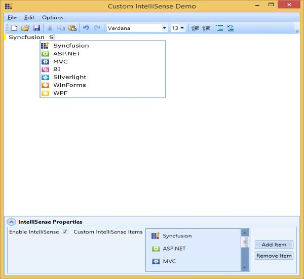
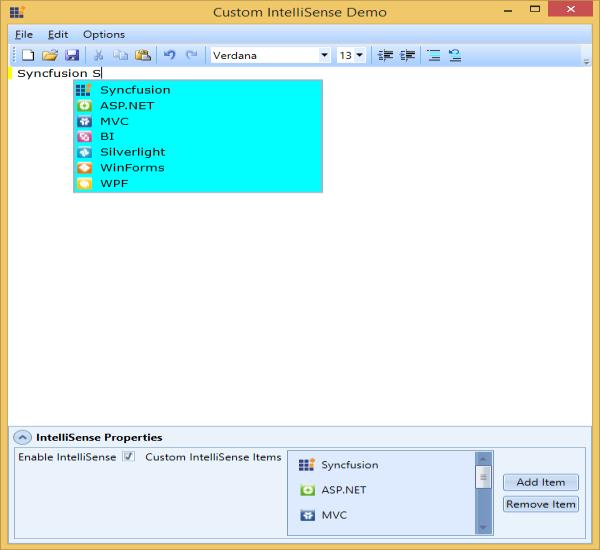

# IntelliSense Support in WPF Syntax Editor

The Essential Edit for WPF provides Visual Studio like IntelliSense support. With IntelliSense support users can quickly choose the possible words while typing text in the control.

IntelliSense support in Edit WPF facilitates you to select possible words while typing text in the EditControl.

When you type the text in the EditControl, it displays a list of possible words in a popup. You can navigate, using Up and Down arrow keys or mouse and Scrollbar, to appropriate items. Select an item from the list to append to the text in the EditControl.

**Important features**

* **IntelliSense** in Edit WPF works in two modes namely **Auto** or **Custom**. 
  * **Auto** **mode**: This automatically generates the list of items to be displayed from the pre-built assemblies specified in `AssemblyReferences` property. This mode of operation is currently supported for C# and Visual Basic language respectively.
  * **Custom** **mode**: This enables the users to provide the list of items to be displayed in the IntelliSense.
* Exclusive properties in EditControl enable the users to customize the look and feel of the IntelliSense pop-up and its items.

This provides the facility to modify the characters on the selected item to be appended, to the text similar to that of Visual Studio IntelliSense settings. It also provides options to enable or disable appending text when space bar is pressed.

### Customization of IntelliSense modes

IntelliSense in Edit WPF works in two modes: Auto and Custom.  IntelliSense modes can be switched by using `IntelliSenseMode` property in EditControl class. It is an enum of the type of IntelliSenseMode. By default, IntelliSenseMode property is set to Auto.

**Auto mode**

In Auto mode, EditControl generates the IntelliSense list box items similar to Visual Studio based on the current language configurations (Lexem). IntelliSense also displays Types, Properties, Events and Methods from pre-built assemblies specified using AssemblyReferences property of EditControl class.

N> Auto IntelliSense mode is currently supported for C# and Visual Basic languages and will be extended to other markup languages supported by EditControl in forthcoming releases.

### Adding EditControl to the application

Add EditControl to the application and set its IntelliSenseMode to Auto by using the following code.





<!--Adding EditControl to application and setting its IntelliSenseMode to Auto-->

<syncfusion:EditControl Background="White" DocumentLanguage="CSharp" Name="EditControl1" IntellisenseMode="Auto"/>





public partial class MainWindow : Window

{

ObservableCollection<Uri> uriList;

public MainWindow()

{

InitializeComponent();

uriList = new ObservableCollection<Uri>();

EditControl1.DocumentSource = "../../Source.cs";

EditControl1.AssemblyReferences = uriList;

}

private void Button_Click(object sender, RoutedEventArgs e)

{

OpenFileDialog fileDialog = new OpenFileDialog();

fileDialog.Filter = "Assembly Files (*.dll) | *.dll";

fileDialog.ShowDialog();

if (fileDialog.FileName.Trim() != string.Empty)

{

uriList.Add(new Uri(fileDialog.FileName));

}

}

}





N> Having an INotifyCollectionChanged implemented collection as AssemblyReferences will update the IntelliSense items automatically when an assembly reference is added at runtime.

The following image displays the Intellisense Demo Window.

**Custom mode**

IntelliSense support in Edit WPF enables you to bind collections of your business object as an ItemsSource of IntelliSenseListBox. It also provides the flexibility to change the ItemTemplate of the IntelliSenseListBox to suite your business object or requirements.

This ensures that your business object is implemented from IIntelliSenseItem interface to your business object compatible with the IntelliSenseListBox. The EditControl have exclusive properties implemented to enable the users bind custom collections and apply custom ItemTemplates.

* **IntelliSenseMode**: Set `IntelliSenseMode` property to custom to apply a custom ItemsSource to IntelliSense.
* **IntelliSenseCustomItemsSource**: IEnumerable type of property to bind custom ItemsSource to IntelliSense ListBox.
* **IntelliSenseItemTemplate**: DataTemplate type of property to apply custom **ItemTemplate to IntelliSense ListBox.

### Creating DataTemplate in the ResourceDictionary

Create DataTemplate in the ResourceDictionary to apply it as `IntellisenseItemTemplate` property of EditControl by using the following code.





<DataTemplate x:Key="CustomIntelliSenseItemTemplate">

<Grid>

<Grid.ColumnDefinitions>

<ColumnDefinition Width="Auto"/>

<ColumnDefinition Width="*"/>

</Grid.ColumnDefinitions>

<Image Source="{Binding Icon}" MaxHeight="16" MaxWidth="16" Margin="3"/>

<TextBlock Text="{Binding Text}" Grid.Column="1" Margin="3"/>

</Grid>

</DataTemplate>





Apply `IntellisenseMode` and `IntellisenseItemTemplate` properties by using the following code.





<!--Adding EditControl to application and setting its IntelliSenseMode to Custom-->

<syncfusion:EditControl Background="White" Name="EditControl1"  IntellisenseMode="Custom"

IntellisenseItemTemplate="{StaticResource 

CustomIntelliSenseItemTemplate}"/>





### Creating a custom business object

Create a Custom Business Object implemented using IIntellisenseItem interface by using the following code.




/// 

/// Business object implemented from IIntelliSenseItem interface in 

/// Syncfusion.Windows.Edit namespace

/// 

public class CustomIntelliSenseItem : IIntellisenseItem

{

/// 

/// Gets or sets a value indicating Icon to be displayed in the IntelliSenseListBox

/// 

public ImageSource Icon

{

get;

set;

}

/// 

/// Gets or sets a value indicating Text to be displayed in the IntelliSenseListBox

/// 

public string Text

{

get;

set;

}

/// 

/// Gets or sets a collection of sub-items to be displayed

/// 

public IEnumerable<IIntellisenseItem> NestedItems

{

get;

set;

}

}





### Creating a custom collection of the business object

Now, create a Custom Collection of the Business Object and set as Custom ItemsSource using `IntellisenseCustomItemsSource` property by using the following code.





// Initializing custom business object collection 

ObservableCollection<CustomIntelliSenseItem> customItems = new

ObservableCollection<CustomIntelliSenseItem>();

customItems.Add(new CustomIntelliSenseItem()

{

Text = "Syncfusion",

Icon = new BitmapImage(new Uri("/CustomIntelliSenseDemo;component/Resources/syncfusion.png", UriKind.Relative))

});

customItems.Add(new CustomIntelliSenseItem()

{

Text = "Silverlight",

Icon = new BitmapImage(new Uri("/CustomIntelliSenseDemo;component/Resources/silverlight.png", UriKind.Relative))

});

customItems.Add(new CustomIntelliSenseItem()

{

Text = "WPF",

Icon = new BitmapImage(new Uri("/CustomIntelliSenseDemo;component/Resources/wpf.png", UriKind.Relative))

});

// Applying custom business object collection as IntelliSenseCustomItemsSource

EditControl1.IntellisenseCustomItemsSource = customItems;





When the code runs, the following output displays.

The following image displays the Custom Intellisense Demo Window.

### Customizing IntelliSense list box style

The EditControl enables the users to customize the look and feel of the IntelliSense listbox by applying custom style to the IntelliSense listbox. The `IntelliSenseBoxStyle` property of EditControl class can be used to apply custom style for IntelliSense listbox.

Customize the IntelliSense List Box Style, by using the following code.





<syncfusion:EditControl Name="EditControl1"  IntellisenseBoxStyle="{StaticResource ListBoxStyle}"/>





The following figure displays displays the window that appears after applying IntelliSenseBox Style.

### Applying multi-level IntelliSense items in custom mode

As mentioned in earlier topics, EditControl supports applying custom collection of business objects as IntelliSense, when the business objects are implemented using IIntelliSenseItem interface. This IIntelliSenseItem interface has a `NestedItems` property which can be used to display sub items in IntelliSense. The EditControl has a property under CurrentLanguage, a `DrillDownChar` property of the type char to specify on which character press, the sub-items are to be displayed in IntelliSense.  The default value of DrillDownChar is **“.”** (Periods)  and when **“.”(**Periods) key is pressed, the EditControl will automatically get the collection from the NestedItems property and displays it in the EditControl.

Create a Custom IntelliSense for tables and fields for SQL language by using the following code.





<!--Resources-->

<DataTemplate x:Key="CustomIntelliSenseItemTemplate">

<TextBlock Text="{Binding Text}" Margin="3"/>

</DataTemplate>

<!--Adding EditControl to application and setting its IntelliSenseMode to Auto-->

<syncfusion:EditControl Background="White" Name="EditControl1" DocumentLanguage="SQL"  IntellisenseMode="Custom" 

IntellisenseItemTemplate="{StaticResource CustomIntelliSenseItemTemplate}"/>




/// 

/// Business object implemented from IIntelliSenseItem interface in 

/// Syncfusion.Windows.Edit namespace

/// 

public class CustomIntelliSenseItem : IIntellisenseItem

{

/// 

/// Gets or sets a value indicating Icon to be displayed in the IntelliSenseListBox

/// 

public ImageSource Icon

{

get;

set;

}

/// 

/// Gets or sets a value indicating Text to be displayed in the IntelliSenseListBox

/// 

public string Text

{

get;

set;

}

/// 

/// Gets or sets a collection of sub-items to be displayed

/// 

public IEnumerable<IIntellisenseItem> NestedItems

{

get;

set;

}

}





ObservableCollection<CustomIntelliSenseItem> customItems = new

ObservableCollection<CustomIntelliSenseItem>();

//Intializing sub-items for products

ObservableCollection<CustomIntelliSenseItem> productsSubItem = new

ObservableCollection<CustomIntelliSenseItem>();

productsSubItem.Add(new CustomIntelliSenseItem() { Text = "ID" });

productsSubItem.Add(new CustomIntelliSenseItem() { Text = "Name" });

productsSubItem.Add(new CustomIntelliSenseItem() { Text = "Manufacturer" });

productsSubItem.Add(new CustomIntelliSenseItem() { Text = "Price" });

productsSubItem.Add(new CustomIntelliSenseItem() { Text = "OrderQuantity" });

productsSubItem.Add(new CustomIntelliSenseItem() { Text = "Units" });

//Intializing sub-items for employee

ObservableCollection<CustomIntelliSenseItem> employeeSubItem = new

ObservableCollection<CustomIntelliSenseItem>();

employeeSubItem.Add(new CustomIntelliSenseItem() { Text = "ID" });

employeeSubItem.Add(new CustomIntelliSenseItem() { Text = "Name" });

employeeSubItem.Add(new CustomIntelliSenseItem() { Text = "DOB" });

employeeSubItem.Add(new CustomIntelliSenseItem() { Text = "City" });

employeeSubItem.Add(new CustomIntelliSenseItem() { Text = "ContactNumber" });

//Intializing sub-items for customer

ObservableCollection<CustomIntelliSenseItem> customerSubItem = new

ObservableCollection<CustomIntelliSenseItem>();

customerSubItem.Add(new CustomIntelliSenseItem() { Text = "ID" });

customerSubItem.Add(new CustomIntelliSenseItem() { Text = "Name" });

customerSubItem.Add(new CustomIntelliSenseItem() { Text = "City" });

customerSubItem.Add(new CustomIntelliSenseItem() { Text = "State" });

customerSubItem.Add(new CustomIntelliSenseItem() { Text = "Country" });

customerSubItem.Add(new CustomIntelliSenseItem() { Text = "ContactNumber" });

//adding items to main collection

customItems.Add(new CustomIntelliSenseItem()

{

Text = "Products",

NestedItems =

productsSubItem

});

customItems.Add(new CustomIntelliSenseItem()

{

Text = "Employee",

NestedItems =

employeeSubItem

});

customItems.Add(new CustomIntelliSenseItem()

{

Text = "Customer",

NestedItems =

customerSubItem

});

// Applying custom business object collection as IntelliSenseCustomItemsSource

EditControl1.IntellisenseCustomItemsSource = customItems;




The following screenshot illustrates IntelliSense displaying first-level of items from custom collection.

The following screenshot illustrates IntelliSense displaying sub-items from selected item.

Following classes in EditControl will be helpful to perform various operations related to IntelliSense.

<table>
<tr>
<td>
Name of Property  </td><td>
Description  </td><td>
Type of Property  </td><td>
Value It Accepts  </td></tr>
<tr>
<td>
EnableIntelliSense  </td><td>
Gets or sets a value indicating if IntelliSense Support has to be enabled or disabled.  </td><td>
Boolean  </td><td>
True/false  </td></tr>
<tr>
<td>
IntelliSenseMode  </td><td>
Gets or sets a value representing IntelliSense mode of operations.  </td><td>
IntelliSenseMode  </td><td>
IntellisenseMode.Auto/IntellisenseMode.Custom  </td></tr>
<tr>
<td>
IntelliSenseCustomItemsSource  </td><td>
To specify the custom collection of business objects to be displayed in custom IntelliSense.  </td><td>
IEnumerable  </td><td>
Any collection of items implemented using IIntellisenseItem        </td></tr>
<tr>
<td>
IntelliSenseBoxStyle  </td><td>
IntelliSense.  </td><td>
Style  </td><td>
Style object  </td></tr>
<tr>
<td>
IntelliSenseItemTemplate  </td><td>
IntelliSense.  </td><td>
DataTemplate  </td><td>
DataTemplate object  </td></tr>
</table>

Following classes in LanguageBase will be helpful to perform various operations related to IntelliSense specific support and custom languages. These properties can be modified in custom language classes inherited from LanguageBase or ProceduralLanguageBase or MarkupLanguageBase class. It can also be modified using `CurrentLanguage` property of EditControl class.

<table>
<tr>
<td>
Name of the property  </td><td>
Description  </td><td>
Type of the property  </td></tr>
<tr>
<td>
DrillDownChar  </td><td>
The character specified is used to drill down to nested items. When the user presses the corresponding key, IntelliSense drills down and displays the sub-items in the IntelliSense.          </td><td>
Char  </td></tr>
<tr>
<td>
IntelliSenseCommitCharacters  </td><td>
Specifies the characters when used. The IntelliSense should append the selected IntelliSense item to EditControl’s text.  </td><td>
String  </td></tr>
<tr>
<td>
CommitsIntelliSenseItemOnSpaceBar  </td><td>
Specifies if the selected IntelliSense item to be appended to the EditControl’s text when a space bar is pressed.  </td><td>
Boolean  </td></tr>
<tr>
<td>
SupportsIntelliSense  </td><td>
To allow or restrict IntelliSense auto mode in custom languages.  </td><td>
Boolean  </td></tr>
</table>

**Events**

<table>
<tr>
<td>
Event  </td><td>
Usage  </td><td>
Handler Type  </td><td>
Handler  </td></tr>
<tr>
<td>
IntelliSenseBoxOpening  </td><td>
This event gets triggered before the IntelliSense pop-up is displayed.   </td><td>
IntelliSenseBoxEventHandler  </td><td>
Set `IsCancel` property in the EventArgs to cancel displaying of IntelliSense popup.  </td></tr>
<tr>
<td>
IntelliSenseDrillDown  </td><td>
This event gets triggered when a DrillDownChar specified is encountered.  </td><td>
IntelliSenseBoxEventHandler  </td><td>
Set IsCancel property in the EventArgs to cancel displaying of IntelliSense popup.  </td></tr>
</table>

IntelliSenseBoxEventArgs contains following arguments.

<table>
<tr>
<td>
Argument  </td><td>
Usage  </td></tr>
<tr>
<td>
Assemblies  </td><td>
Contains the list of assemblies included as AssemblyReferences.  </td></tr>
<tr>
<td>
Cancel  </td><td>
A boolean argument can be used to cancel the event.  </td></tr>
<tr>
<td>
CursorIndex  </td><td>
Contains current Cursor Index where the event is triggered.  </td></tr>
<tr>
<td>
ItemsSource  </td><td>
Contains the ItemsSource to be applied to the IntelliSense, it can also be changed if there are any Custom Filtrations to be done in the event.  </td></tr>
<tr>
<td>
LineIndex  </td><td>
Contains current Line Index where the event is triggered  (0 based values).  </td></tr>
</table>
